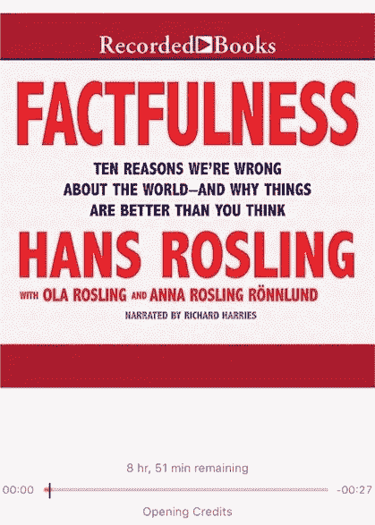

# 数据很重要——汉斯·罗斯林的真实性

> 原文：<https://medium.datadriveninvestor.com/data-matters-factfulness-by-hans-rosling-c03ecfa0925e?source=collection_archive---------4----------------------->

我喜欢保持清醒。我想知道这是怎么回事，为什么，未来会有什么变化。然而，最重要的是，我喜欢数据，我喜欢支持数据的数据，这些数据展示了真实的画面。尤其是生活在美国，人们很容易觉得世界上的其他地方都很遥远，但事实并非如此。如果我们愿意，我们可以对世界上任何地方产生影响。

我认为这对于人们来说非常有价值。观点就是观点。尽管事实很重要，但你不能争论事实，你可以争论事实的来源，但如果你的来源是可信的，只要你措辞得当，这应该足以向某人表明他们受到了误解。

 [## 面向 Noobs |数据驱动型投资者的数字身份

### 聪明人如何在增强现实中创造身份价值？我最近刚满 40 岁。作为一个生物…

www.datadriveninvestor.com](https://www.datadriveninvestor.com/2019/02/28/digital-identity-for-noobs/) 

如果你想让某人相信他们正遭受误解，根据数据测试他们的观点是非常有用的。

这是许多人的误解。差距已经缩小，现在，作者解释说，不应该再从发展中国家和发达国家的角度来看待世界。[比尔·盖茨在 2018 年 4 月也写了这本书](https://www.gatesnotes.com/Books/Factfulness)([此处链接](https://www.gatesnotes.com/Books/Factfulness))。相反，作者解释说，国家应该在 4 个级别中的 1 个级别中进行查看，大多数国家在发表时处于第 2 级。

低收入国家和高收入国家之间没有差距。

谈论巨大的进步。这是数十亿人摆脱极端贫困。

> 1997 年，29%的世界人口生活在极端贫困之中。
> 
> 2017 年，只有 9%的世界人口生活在极端贫困中。

我喜欢这句话的重要性。平均值有时很重要，但会误导人。例如，比尔和梅林达盖茨基金会决定向私立学校提供资金，因为他们被证明拥有最好的学校。然而，他们也有最差的学校。

**均价伪装价差。**

Photo by [Roman Kraft](https://unsplash.com/@romankraft?utm_source=medium&utm_medium=referral) on [Unsplash](https://unsplash.com?utm_source=medium&utm_medium=referral)

当思考当前的新闻事件时，这是作者建议我们做的。

问问你自己，“如果有一个同样大的积极改善，我会听到吗？”

这是一个非常重要的问题，总有其他的因素需要考虑，没有什么事情是看起来那样的，在表面之下有更多的东西。

直觉认为世界人口“只是”在增长，这是一个错误的想法。

人们被各种各样的事情吓坏了，但是通常没有必要觉得自己真的处于危险之中。正如作者所解释的，新闻中报道的许多事情(下面列出)确实很少发生。

# 恐惧与危险

> 恐怖事件:
> 
> 自然灾害—占所有死亡人数的 0.1%
> 
> 飞机失事——占所有死亡人数的 0.001%
> 
> 谋杀——占所有死亡的 0.7%
> 
> 核泄漏——死亡人数的 0%
> 
> 恐怖主义——占所有死亡的 0.05%
> 
> 令人恐惧——具有可感知风险的事物
> 
> 危险——构成真正风险的东西

我喜欢这里解释的数据。正如作者解释的那样，他们通常认为建造医院可以解决这个问题。然而，如果没有一定程度的教育和习惯培养，那么从长远来看，什么都不会改变。如果人们不能阅读药物说明书，他们可能不知道他们是否服用了正确的量。

# 数据显示，世界上儿童存活率增加的一半是因为母亲们会读书写字。

> 更多的孩子活了下来，因为他们一开始就没有生病。
> 
> 父母洗手，母亲可以阅读药瓶上的说明。
> 
> 投资改善 1 级或 2 级健康的资金应该用于小学、护士教育和疫苗接种。

同样，这是大多数人可能没有意识到的数据。对于任何想知道的人来说，索马里和阿富汗的婴儿死亡率最高，接近 10%。而在美国，婴儿死亡率为 5.8‰，高于邻国加拿大和古巴。婴儿死亡率最低的是日本和摩纳哥，这两个国家的婴儿死亡率不到千分之二。

> 1950 年，9700 万儿童出生，1440 万儿童死亡——婴儿死亡率 15%。
> 
> 2016 年，1.41 亿儿童出生，420 万儿童死亡——婴儿死亡率，3%。

人们，尤其是在这个时代，习惯于快速的信息和快速的变化。

真实就是认识到许多事物，包括人、国家、宗教和文化，看起来是不变的，只是因为变化发生得很慢。

> 即使是缓慢的变化，累积起来也会产生巨大的变化。
> 
> 要控制命运本能，记住有些变化还是变化。

我们需要做的下一件事是拥抱灰色地带。人们看待事物的角度不同，思考的事情也不同。与此同时，人们有不同的观点，但也有不同的数据点。复杂才是有价值的。

Photo by [Mika Baumeister](https://unsplash.com/@mbaumi?utm_source=medium&utm_medium=referral) on [Unsplash](https://unsplash.com?utm_source=medium&utm_medium=referral)

对其他领域的想法持开放态度。

没有数字就无法理解这个世界，只有数字也无法理解这个世界。

谨防简单，欢迎复杂。结合思路。在个案的基础上妥协和解决问题。

我们并不总是处于控制之中，但我们都试图处于控制之中。问题是，世界上有几十亿人都在试图控制自己的生活，但有几十亿人独立行动，那是不可能的。再加上上帝和他对我们生活的目的，我们真的没有我们所希望的那么多控制权。

我们愿意相信事情的发生是因为有人想要它们发生。人们拥有权力和影响力。否则，这个世界就显得扑朔迷离，令人恐惧。

总是更复杂，我喜欢。一切都是为了事业，我喜欢这样。这些是我在书中强调的最后的想法，也是我认为重要的。

不要责怪任何一个人或一群人，因为问题是当我们责怪坏人的时候，我们已经想好了。关于一个系统，它几乎总是比那更复杂。

忠诚是认识到替罪羊的存在，并记住指责一个人会转移其他可能解释的注意力，并阻碍我们预防未来类似问题的能力。

寻找原因，而不是坏人，接受不好的事情可能会在没有人希望的情况下发生。

Photo by [Nick Woods](https://unsplash.com/@fuzzllc?utm_source=medium&utm_medium=referral) on [Unsplash](https://unsplash.com?utm_source=medium&utm_medium=referral)

这本书拓展了我的视野，我很喜欢它。我爱爱爱所有超越所有事实的数字，这些数字显示而不仅仅是告诉我们。当我继续前进时，我会拥抱我天生的好奇心并提出问题。当我听到新的或未知的事情时，我不会简单地关闭我的思维，我会询问进一步的细节。当我听到一些新的东西时，我会表现得好像其他人所说的是完全真实的，只有当我理解了他们的观点，进一步剖析它，并与他们一起确定哪些可以改进或缺少什么，正如书中所说，它几乎总是比我们想象的更复杂。

**我给这本书打了 4.5/5**

[要阅读这本书，请点击这里](https://amzn.to/2ljWe9A)