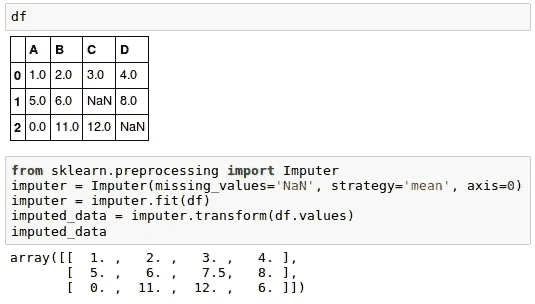
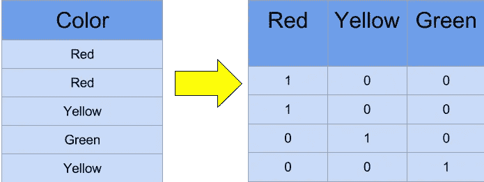

# Python 中的数据预处理

> 原文：<https://medium.datadriveninvestor.com/data-preprocessing-3cd01eefd438?source=collection_archive---------0----------------------->

## 一个实现

机器学习的核心是处理数据。你的**机器学习工具和你的数据质量**一样好。这个博客讨论了**清理数据**的各个步骤。你的数据需要经过几个步骤才能用于预测。


Machine Learning process diagram

这个博客的数据集可以从 [**这里**](https://github.com/afrozchakure/Internity-Summer-Internship-Work/tree/master/Blogs/Preprocessing) 访问。

# **数据预处理涉及的步骤:**

1.  导入所需的库
2.  导入数据集
3.  处理丢失的数据。
4.  编码分类数据。
5.  将数据集分为测试集和训练集。
6.  特征缩放。

因此，让我们一个接一个地看看这些步骤。

## **步骤 1:导入所需的库**

要继续学习，您需要下载这个数据集: [**Data.csv**](https://github.com/afrozchakure/Internity-Summer-Internship-Work/tree/master/Blogs/Preprocessing)

每次我们做一个新的模型，我们都会要求进口熊猫。Numpy 是一个包含数学函数的库，用于科学计算，而 Pandas 用于导入和管理数据集。

```
import pandas as pd
import numpy as np
```

这里我们导入 pandas 和 Numpy 库，并分别指定一个快捷方式“pd”和“np”。

## **第二步:导入数据集**

数据集可在中获得。csv 格式。CSV 文件以纯文本格式存储表格数据。文件的每一行都是一条数据记录。我们使用 pandas 库的 read_csv 方法来读取一个本地 csv 文件作为一个**数据帧**。

```
dataset = pd.read_csv('Data.csv')
```

仔细检查数据集后，我们将在数据集(X)中创建一个要素矩阵，并创建一个包含各自观察值的相关向量(Y)。为了读取列，我们将使用 pandas 的 iloc(用于固定选择的索引)，它有两个参数—[行选择，列选择]。

```
X = dataset.iloc[:, :-1].values
y = dataset.iloc[:, 3].values
```

## **第三步:处理缺失数据**



An example of Missing data and Imputation

我们得到的数据很少是同质的。有时数据可能会丢失，需要对其进行处理，以便不会降低我们的机器学习模型的性能。

为此，我们需要用整个列的平均值或中值来替换缺失的数据。为此，我们将使用 sklearn.preprocessing 库，其中包含一个名为 Imputer 的类，它将帮助我们处理丢失的数据。

```
from sklearn.preprocessing import Imputer
imputer = Imputer(missing_values = "NaN", strategy = "mean", axis = 0)
```

我们的对象名是**imputor。**估算器类可以接受如下参数:

1.  **missing_values** :缺失值的占位符。所有 missing_values 事件都将被估算。我们可以给它一个整数或“NaN ”,让它找到丢失的值。
2.  **策略**:这是插补策略——如果是“平均值”,则使用沿轴(列)的平均值替换缺失值。其他策略包括“中值”和“最频繁”。
3.  **轴**:可以赋值为 0 或 1，0 表示沿列插补，1 表示沿行插补。

现在我们将估算对象与我们的数据相匹配。

```
imputer = imputer.fit(X[:, 1:3])
```

现在，通过使用 transform 方法，用列的平均值替换缺失值。

```
X[:, 1:3] = imputer.transform(X[:, 1:3])
```

## **步骤 4:对分类数据进行编码**



Converting Categorical data into dummy variables

任何不是定量的变量都是分类的。例子包括头发颜色、性别、研究领域、所上大学、政治派别、疾病感染状况。

## 但是为什么要编码呢？

我们不能在模型的数学方程中使用“男性”和“女性”这样的值，所以我们需要将这些变量编码成数字。

为此，我们从“sklearn.preprocessing”库中导入“LabelEncoder”类，并创建 labelencoder 类的对象 labelencoder_X。之后，我们对分类特征使用 fit_transform 方法。

编码后，有必要区分同一列中的变量，为此我们将使用 sklearn.preprocessing 库中的 OneHotEncoder 类。

## **一键编码**

一种热编码将分类特征转换为更适合分类和回归算法的格式。

```
from sklearn.preprocessing import LabelEncoder, OneHotEncoder
labelencoder_X = LabelEncoder()
X[:, 0] = labelencoder_X.fit_transform(X[:, 0])onehotencoder = OneHotEncoder(categorical_features = [0])
X = onehotencoder.fit_transform(X).toarray()labelencoder_y = LabelEncoder()
y = labelencoder_y.fit_transform(y)
```

## **步骤 5:将数据集分成训练集和测试集**

现在，我们将数据分为两组，一组用于训练我们的模型，称为**训练集**，另一组用于测试我们的模型的性能，称为**测试集**。分成一般是 80/20。为此，我们导入“sklearn.model_selection”库的“train_test_split”方法。

```
**from** **sklearn.**model_selection **import** train_test_split
```

现在，为了构建我们的训练集和测试集，我们将创建 4 个集—

1.  **X_train** (特征矩阵的训练部分)，
2.  **X_test** (特征矩阵的测试部分)，
3.  **Y_train** (与 X 训练集相关的因变量的训练部分，因此也是相同的指数)，
4.  **Y_test** (与 X 测试集相关的因变量的测试部分，因此也是相同的指数)。

我们将为它们分配 test_train_split，它接受参数—数组(X 和 Y)，test_size(指定分割数据集的比率)。

```
X_train, X_test, Y_train, Y_test = train_test_split( X , Y , test_size = 0.2, random_state = 0)
```

## **第六步:特征缩放**

大多数机器学习算法在计算中使用两个数据点之间的**欧几里德距离**。因此，**高星等特征在距离计算**中将比低星等特征**权重更大**。为了避免这种特征，使用了标准化或 Z 分数归一化。这是通过使用“sklearn.preprocessing”的“StandardScaler”类来完成的。

```
from sklearn.preprocessing import StandardScaler
sc_X = StandardScaler()
```

此外，我们将转换我们的 X_test 集合，同时我们将需要拟合以及转换我们的 X_train 集合。

转换功能会将所有数据转换为相同的标准化比例。

```
X_train = sc_X.fit_transform(X_train)
X_test = sc_X.transform(X_test)
```

现在，你已经学会了数据预处理的基本步骤。

现在，您可以尝试将这些预处理技术应用于一些真实世界的数据集。