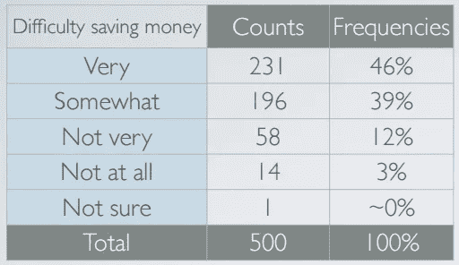
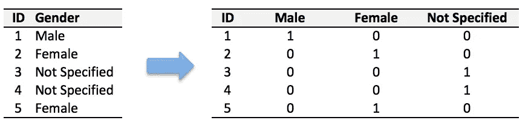
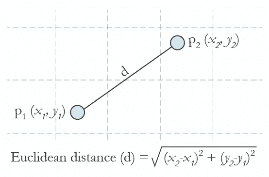
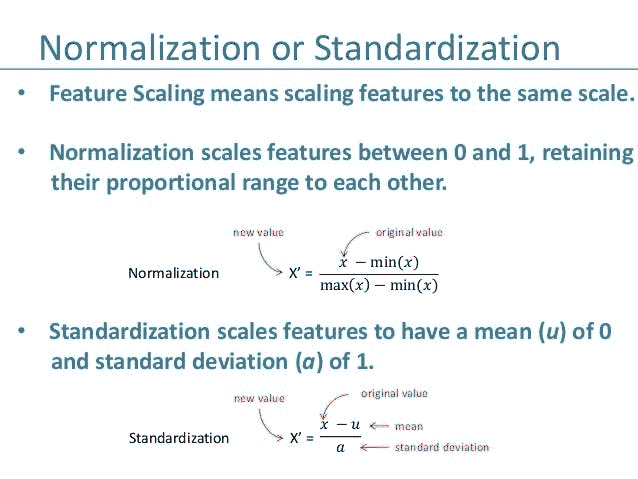

# 机器学习的数据预处理

> 原文：<https://medium.datadriveninvestor.com/data-preprocessing-for-machine-learning-188e9eef1d2c?source=collection_archive---------0----------------------->


机器学习是这十年最热门的事情。每个人都想跟上潮流，开始在他们的业务中部署机器学习模型。这个复杂过程的核心是数据。你的机器学习工具和你的数据质量一样好。复杂的算法无法弥补糟糕的数据。就像挖掘时发现的宝石要经过几个步骤的清理过程一样，数据也需要经过几个步骤才能被进一步使用。

在这篇文章中，我将尝试简化数据预处理的练习，或者换句话说，在它准备好用于机器学习模型之前，程序员通常遵循的仪式分为 6 个简单的步骤。

## 步骤 1:导入库

第一步通常是导入程序中需要的库。库本质上是可以被调用和使用的模块的集合。编程世界中的很多东西都不需要在需要的时候显式编写。它们有一些函数，可以简单地调用。这是数据科学领域最流行的 Python 库的列表。下面是我导入 pandas 库并指定一个快捷方式“pd”的片段。

```
import pandas as pd
```

## 步骤 2:导入数据集

很多数据集都是 CSV 格式的。我们首先需要定位 CSV 文件的目录(将数据集保存在与您的程序相同的目录中会更有效)，并使用名为 *read_csv* 的方法读取它，该方法可以在名为 *pandas* 的库中找到。

```
import pandas as pddataset = pd.read_csv('Medium.csv')
```

仔细检查数据集后，我们将在数据集(X)中创建一个要素矩阵，并使用各自的观测值创建一个相关向量(Y)。为了读取列，我们将使用 *pandas* 的 *iloc* (用于固定选择的索引)，它采用两个参数—【行选择，列选择】。

```
X = dataset.iloc[:, :-1].values
```

:作为参数选择全部。所以上面这段代码选择了所有的行。对于列，我们有:-1，这意味着除最后一列之外的所有列。点击可以了解更多关于*iloc*的用法。

## 步骤 3:处理数据集中缺失的数据

有时，您可能会发现数据集中缺少一些数据。当我们遇到问题时，我们需要做好处理问题的准备。显然，您可以删除整行数据，但如果您不知不觉地删除了关键信息，该怎么办呢？我们当然不想那样做。处理这个问题的一个最常见的想法是取同一列的所有值的平均值，并用它来替换缺失的数据。

我们将用于该任务的库称为 [Scikit Learn](http://scikit-learn.org/stable/index.html) 预处理。它包含一个名为*估算器*的类，可以帮助我们处理丢失的数据。

```
from sklearn.preprocessing import Imputer
```

很多时候，下一步，正如你将在本文后面看到的，是创建同一个类的对象来调用该类中的函数。我们将把我们的对象称为*估算器*。Imputer 类可以接受几个参数——I . missing _ values——我们可以给它一个整数或“NaN ”,让它找到丢失的值。
二。策略—我们将找到平均值，因此我们将它设置为*平均值*。我们也可以根据需要将其设置为*中值*或*最频繁*(模式用)。
三。轴-我们可以将其指定为 0 或 1，0 表示沿列估算，1 表示沿行估算。

```
imputer = Imputer(missing_values = "NaN", strategy = "mean", axis = 0)
```

现在我们将*使*估算对象适合我们的数据。拟合基本上是训练，或者换句话说，是将模型强加给我们的数据。

```
imputer = imputer.fit(X[:,1:3])
```

上面的代码将*使*估算对象适合我们的特征矩阵 x。由于我们使用了:，它将选择所有行，1:3 将选择第二和第三列(为什么？因为在 python 中索引从 0 开始，所以 1 意味着第二列和上限被排除。如果我们想包含第三列，我们应该写 1:4)。

现在我们将通过方法*转换*用列的平均值替换缺失值。

```
X[:, 1:3] = imputer.transform(X[:, 1:3])
```

## 步骤 4:编码分类数据

有时我们的数据是定性的，也就是说，我们有文本作为我们的数据。我们可以找到文本形式的类别。现在，机器理解和处理文本变得复杂起来，而不是数字，因为模型是基于数学方程和计算的。因此，我们必须对分类数据进行编码。



This is an example of categorical data. In the first column, the data is in text form. We can see that there are five categories — Very, Somewhat, Not very, Not at all, Not sure — and hence the name categorical data.

因此，按照我们的方法，我们将导入我们以前使用的 scikit 库。库中有一个名为 *LabelEncoder* 的类，我们将使用它来完成任务*。*

```
from sklearn.preprocessing import LabelEncoder
```

正如我之前提到的，下一步通常是创建该类的对象。我们将把我们的对象称为 labelencoder_X。

```
labelencoder_X = LabelEncoder()
```

为了完成我们的任务，LabelEncoder 类中有一个名为 *fit_transform* 的方法，我们将使用这个方法。再一次，就像我们之前做的那样，我们将传递 X 的两个参数—行选择和列选择。

```
X[:,0] = labelencoder_X.fit_transform(X[:,0])
```

上面的代码将选择第一列(因为 0)的所有行(因为:)，并使 LabelEncoder 适合它，然后转换值。这些值将立即相应地编码为 0，1，2，3……

如我们所愿，文本已被数字取代。但是，如果有两个以上的类别，我们可能会产生一个新的问题。由于我们一直将不同的整数分配给不同的类别，这可能会造成混乱。如果一个类别被指定为 0，另一个类别被指定为 2，并且因为 2 大于 0，我们是否试图暗示被指定为 2 的类别更大？我们当然没有！因此，这种策略可能会让自己的目的落空。

因此，我们将使用只有 1 和 0 的 n 列来表示类别是否出现，而不是一列有 n 个类别。



Example of a Dummy encoding

为了完成这项任务，我们将导入另一个名为 *OneHotEncoder* 的库。

```
from sklearn.preprocessing import LabelEncoder, OneHotEncoder
```

接下来，我们将像往常一样创建该类的一个对象，并将其分配给 onehotencoder。OneHotEncoder 采用一个名为*categorial _ features*的重要参数，它采用类别列的索引值。

```
onehotencoder = OneHotEncoder(categorical_features =[0])
```

上面的代码将选择第一列对类别进行编码。

正如我们对 LabelEncoder 使用 *fit_transform* 一样，我们也将对 OneHotEncoder 使用它，但还必须额外包括 *toarray()* 。

```
X = onehotencoder.fit_transform(X).toarray()
```

如果现在检查数据集，所有类别都将被编码为 0 和 1。

## 步骤 5:将数据集分成训练集和测试集

现在，我们需要将数据集分成两组—一组训练集和一组测试集。我们将在我们的训练集上训练我们的机器学习模型，也就是说，我们的机器学习模型将试图理解我们训练集中的任何相关性，然后我们将在我们的测试集上测试模型，以检查它可以预测的准确性。一般的经验法则是将数据集的 80%分配给训练集，剩余的 20%分配给测试集。对于这个任务，我们将从 scikit 的*模型选择*库中导入*测试 _ 训练 _ 分割*。

```
from sklearn.model_selection import train_test_split
```

现在，为了构建我们的训练和测试集，我们将创建 4 个集-X _ train(特征矩阵的训练部分)、X_test(特征矩阵的测试部分)、Y_train(与 X 训练集相关联的因变量的训练部分，因此也是相同的指数)、Y_test(与 X 测试集相关联的因变量的测试部分，因此也是相同的指数)。我们将为它们分配 *test_train_split* ，它接受参数——arrays(X 和 Y), test_size(如果我们给它值 0.5，表示 50%,它会将数据集分成两半。由于理想的选择是将数据集的 20%分配给测试集，因此通常将其指定为 0.2。0.25 就代表 25%，随便说说)。

```
X_train, X_test, Y_train, Y_test = train_test_split(X,Y, test_size=0.2)
```

## 步骤 6:特征缩放

数据预处理的最后一步是应用非常重要的特征缩放。



The formula and graphical representation of Euclidean distance

但是这是什么呢？
It 是一种用于标准化自变量范围或数据特征的方法。
**但是为什么有必要呢？**很多机器学习模型都是基于*欧氏距离。*例如，如果一列(x)中的值比另一列(y)中的值高得多，则(x2-x1)的平方将给出比(y2-y1)的平方大得多的值。很明显，一个平方差比另一个平方差占优势。在机器学习等式中，与大得多的值相比，具有较低值的平方差将几乎被视为不存在。我们不希望这种情况发生。这就是为什么有必要将我们所有的变量转换成相同的尺度。有几种方法可以缩放数据。一种方法叫做*标准化*可以使用。对于所选列的每个观察值，我们的程序将应用标准化公式，并将其拟合到一个刻度。



为了完成这项工作，我们将从 *sckit 预处理*库中导入类 *StandardScaler* ，并照常创建该类的一个对象。

```
from sklearn.preprocessing import StandardScaler
sc_X = StandardScaler()
```

现在，我们将拟合和转换我们的 X_train 集合(重要的是要注意，当在我们的训练和测试集合上应用标准标量对象时，我们可以简单地转换我们的测试集合，但是对于我们的训练集合，我们必须首先拟合它，然后转换集合)。这将把所有的数据转换成相同的标准化比例。

```
X_train = sc_X.fit_transform(X_train)
X_test = sc_X.transform(X_test)
```

这些是在将数据用于机器学习之前预处理数据的一般 6 个步骤。根据数据集的情况，您可能需要也可能不需要完成所有这些步骤。

谢谢你。