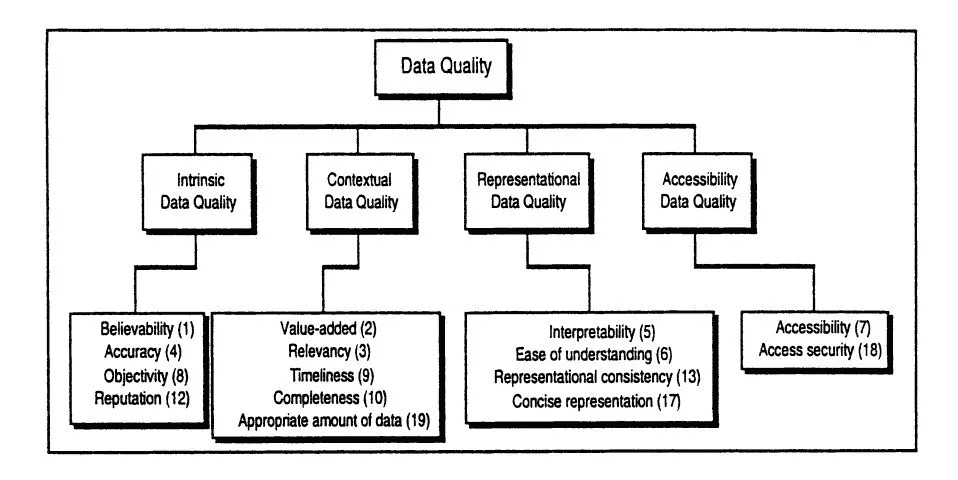
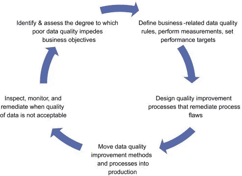
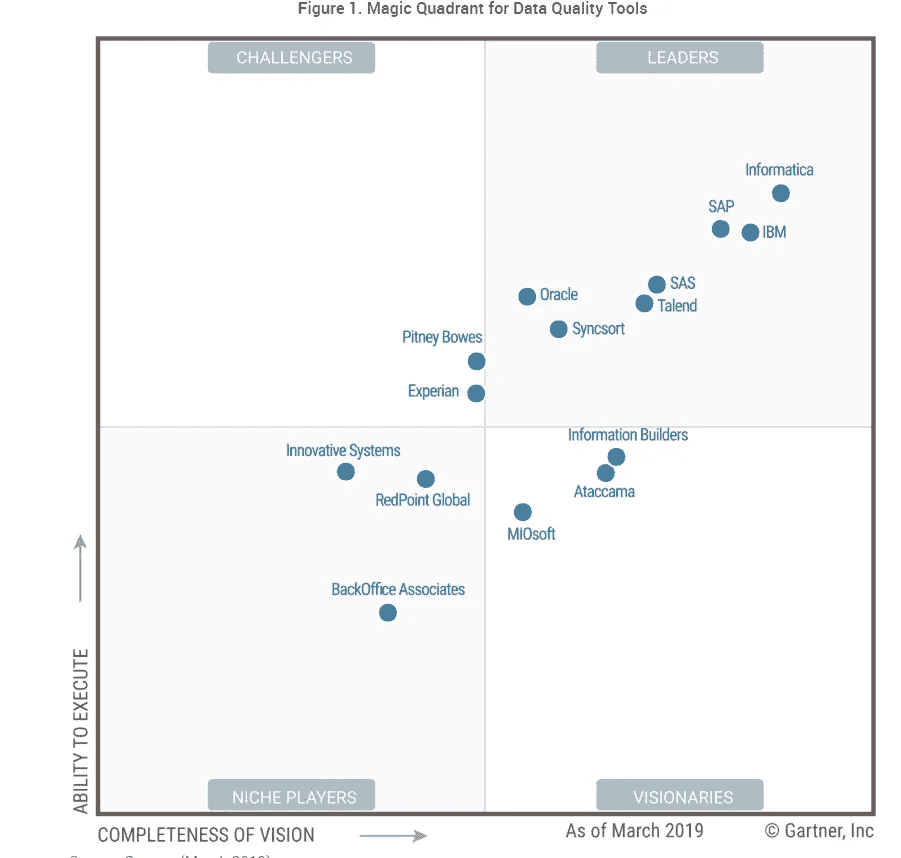

# 数据质量管理:角色、过程、工具

> 原文：<https://medium.datadriveninvestor.com/data-quality-management-roles-processes-tools-3c912e8e1db6?source=collection_archive---------1----------------------->

数据是组织及其商业成功的命脉。你可能从会议讲师那里听到过这些话，或者在网上看到过类似的标题。但事实就是这样:你需要依靠准确的信息来完成一项任务或提供一项服务，无论是[规划一条最佳路线](https://www.altexsoft.com/blog/data-quality-management-and-tools/?utm_source=MediumCom&utm_medium=referral&utm_campaign=shares)向众多顾客递送寿司，还是发送定制的时事通讯。在第一种情况下，您需要的是准确的订单细节。在第二种情况下，您必须根据客户的活动和兴趣对他们进行细分。为此，您需要收集和分析适当的数据，这需要一些时间和精力。

数据中的缺陷会导致不同的结果。例如，Skyscanner 的客户 James Lloyd 被建议在从新西兰克赖斯特彻奇飞往伦敦的途中，在曼谷停留 413，786 小时或 [47 年](https://www.huffpost.com/entry/skyscanner-47-year-layover_n_57c588fae4b0664f13ca6723?guccounter=1&guce_referrer=aHR0cHM6Ly93d3cuZ29vZ2xlLmNvbS8&guce_referrer_sig=AQAAADekipz8DChOHDX0L6FSacNNL5v4lEN2Qy0VpESu4jMF-vWtwqzHSVvsoYxFvRxeuPMr63hwyli5BeKblb-qT_nwletw1R9sx3Mi8dK0iizLodmpuwiSRe_DAocrVBOOsyx43N4Vd2KeHx_ZOIhmlBrVYwWPhtakwVPFTYcmIcbN)。这个故事像病毒一样传播开来，这要归功于 Skyscanner 社交媒体经理 Jen 在回答詹姆斯关于这些年他能做什么的问题时表现出的幽默感:

*A witty reply to James Lloyd’s question on Facebook. Source: Skyscanner Facebook*

使用错误的数据可能会导致悲剧事件，尤其是在医学领域。大卫·洛辛在[的《从业者数据质量改进指南](https://www.elsevier.com/books/the-practitioners-guide-to-data-quality-improvement/loshin/978-0-12-373717-5)中提到了 2003 年杰西卡·桑蒂兰的案例，她死于拙劣的心肺移植。一名外科医生使用了血型不合的捐赠者的器官。不准确的血型信息导致手术并发症，导致死亡。

低质量的数据还会阻碍和减缓[商业智能](https://www.altexsoft.com/blog/business/complete-guide-to-business-intelligence-and-analytics-strategy-steps-processes-and-tools/?utm_source=MediumCom&utm_medium=referral&utm_campaign=shares)和 ML 驱动的预测分析的集成。参与普华永道[数据信任脉搏](https://www.pwc.com/us/en/services/consulting/cybersecurity/data-optimization/pulse-survey.html)调查的美国公司高管指出，不可靠的数据是数据货币化的障碍之一。“*一家公司的许多历史数据都是随意获取的，可能缺乏使用* [*AI 和其他高级自动化*](https://www.pwc.com/us/en/services/consulting/library/artificial-intelligence-predictions-2019.html#section4) *所需的细节和可论证的准确性，”*调查称。

由于运营效率以及有时人们的生活取决于公司使用可靠还是不可靠的信息，因此公司必须考虑并引入控制数据质量的策略。

 [## 为什么数据将改变投资管理|数据驱动的投资者

### 有人称之为“新石油”虽然它与黑金没有什么相似之处，但它的不断商品化…

www.datadriveninvestor.com](https://www.datadriveninvestor.com/2019/01/25/why-data-will-transform-investment-management/) 

我们几次提到数据质量的概念，所以让我们充分地探索它。在本文中，我们将讨论哪些专家参与数据质量活动，以及他们如何为该计划做出贡献。此外，我们将探索技术和工具，以改善数据的健康状况，并将其维护在允许公司实现其业务目标的水平上。

# 什么是数据质量？数据质量维度

数据质量显示数据满足用户的优秀标准或期望的程度。高质量的数据可以很容易地进行处理和解释，用于各种目的，如计划、报告、决策或执行经营活动。

但是什么样的数据才能算高质量呢？关于什么样的特征构成高质量的数据的观点不仅在不同的行业会有所不同，在公司层面也会有所不同。专家还建议对数据方面和特征的不同组合进行质量评估。这些可测量的类别被称为**数据质量维度。**

1996 年，王城星和黛安·斯特朗教授在《超越准确性:数据质量对数据消费者意味着什么？》**中描述了他们的数据质量概念框架。*研究作者考虑了四个数据质量类别:内在、上下文、表示和可访问性。每个类别包括几个维度，总共 15 个。*

**

**Data quality categories and their dimensions. Source:* [*Beyond Accuracy: What Data Quality Means to Data Consumers*](http://courses.washington.edu/geog482/resource/14_Beyond_Accuracy.pdf)*

*[国际货币基金组织(IMF)的数据质量评估框架(DQAF)](https://dsbb.imf.org/dqrs/DQAF) 考虑了五个[数据质量维度](https://unstats.un.org/unsd/dnss/docs-nqaf/IMF-dqrs_factsheet.pdf):*

*   ***完整性** —根据客观性原则收集、处理和传播统计数据。*
*   ***方法合理性** —使用国际公认的准则、标准或良好实践创建统计数据。*
*   ***准确性和可靠性** —用于编制统计数据的源数据是及时的，从考虑到各国具体情况的综合数据收集计划中获得。*
*   ***可维护性** —统计数据在数据集中保持一致，随着时间的推移，与主要数据集保持一致，并定期进行修订。统计的*周期性*和*及时性*遵循国际公认的传播标准。*
*   ***可访问性** —数据和元数据以可理解的方式呈现，统计数据是最新的且容易获得。用户可以得到及时和有知识的帮助。*

*数据质量框架包括七个数据集专用框架，用于评估和维护统一的质量标准(国民账户、价格指数、货币、政府金融统计和其他类型的统计)。)*

**

**Critical data quality dimensions and features of data that meet their criteria**

*数据质量专家 Laura Sebastian-Coleman 在 [*测量持续改进的数据质量*](https://www.sciencedirect.com/book/9780123970336) 中指出，数据质量维度的功能就像长度、宽度和高度功能一样，可以表达物理对象的大小。*“一组数据质量维度可用于定义对所需数据集质量的预期(衡量标准)，以及衡量现有数据集的状况，”*Sebastian-Coleman 解释道。*

*数据质量维度还允许监控存储在各种系统和/或跨部门的数据质量如何随时间变化。这些属性是任何数据质量计划的组成部分之一。一旦您知道将根据哪些数据质量维度来评估数据集，您就可以定义指标。例如，重复记录的数量或百分比将表明数据的唯一性。*

*现在让我们讨论在组织中实现数据质量计划的路线图。*

# *数据质量管理:如何实现及其工作原理*

*数据质量管理(DQM)是一套旨在提高和维护公司业务部门数据质量的实践。数据管理专家 David Loshin 强调了 DQM 的持续性。该专家指出，这一过程包括一个“良性循环”，即不断观察、分析和改进信息。这种循环的目的是在控制数据健康方面变得主动，而不是在发现缺陷后修复缺陷并处理这些缺陷的后果。*

**

**The virtuous cycle of data quality management. Source:* [*Business Intelligence*](https://www.sciencedirect.com/book/9780123858894/business-intelligence#book-description)*

*让我们来探究这五个阶段中的每一个，以及在每个阶段发生的过程。*

## *1.通过数据质量评估确定不良数据对性能的影响*

*首先，数据质量分析师审查数据，以发现导致特定操作延迟并因此减少收入和影响利润的潜在问题。定性数据审查提供了对哪些数据缺陷对业务流程有重大影响的基本理解。然后，专家概述公司的数据质量要求和关键数据质量维度。*

*接下来，团队通过*自上而下*和*自下而上*的方法开始数据质量评估。**自上而下**的方法允许了解员工如何创建和使用数据，以及他们在此过程中面临哪些与数据相关的问题，以及哪些是最关键的。数据评估还有助于定义受低质量数据影响最大的操作。*

*数据质量分析师可能会检查数据库中数据的组织方式，亲自采访用户，或者组织用户可以记录问题的调查。*

***自下而上**方法使用统计和数据分析工具和技术，例如*数据剖析*。**数据分析**采用各种统计和分析算法以及业务规则来探索数据集的内容及其数据元素的特征。有三种类型的数据分析:*

*   ***结构发现**(结构分析)用于了解数据是否一致，格式是否正确。模式匹配是探索数据记录结构的方法之一。分析师还可以检查数据中的统计数据，如最小值和最大值、中值、平均值或标准偏差，以了解数据的有效性。*
*   ***内容发现**需要检查数据库中的单个数据记录，以发现空值或错误值(格式不正确)。*
*   ***关系发现**是关于理解数据集、数据记录、数据库字段或单元之间的相互联系。关系发现从元数据审查开始。这种分析允许发现和消除在未对齐的数据集中可能出现的重复等问题。*

*然后，分析师可以向领域专家咨询发现的数据问题。*

## *2.定义数据质量规则和指标*

*首先，数据质量分析师汇编数据评估结果，重点关注基于特定用户需求的关键数据元素。*“实证分析的结果将提供一些类型的方法，可用于评估特定业务环境中的数据质量水平，”【David Loshin 在*数据质量改进从业者指南*中指出。**

*然后，DQ 分析师通过定义的业务规则将业务影响与数据缺陷关联起来。通过这种方式，专家定义他们将使用的指标，以确保数据足够准确，并可用于运营或分析需求。他们就度量分数的可接受性阈值与数据用户进行协商。指标得分低于可接受水平的数据不符合用户预期，必须加以改进以避免对运营产生负面影响。将可接受性阈值与测量方法相结合，可以制定数据质量指标。*

## *3.定义数据标准、元数据管理标准、数据验证规则*

*一旦确定了劣质数据的影响，检查了数据，明确了数据质量规则和度量标准，就到了引入质量改进技术和活动的时候了。因此，这一阶段的目标是在整个数据生命周期中记录数据和元数据使用的统一规则。*

***数据标准**。数据质量标准是在整个组织中使用的关于数据输入、表示、格式化和交换的协议。*

***元数据管理标准。**关于元数据创建和维护的政策和规则是成功的数据分析计划和数据治理的基础。元数据管理标准可以分为三类:*

*   *商业——在不同的商业环境中使用商业术语和定义，使用缩略语；数据安全级别和隐私级别设置。*
*   *技术—存储数据的结构、格式和规则(即数据库、数据模型中索引、表格和列的格式和大小)*
*   *操作—在 ETL 过程中使用描述事件和对象的元数据的规则(即 ETL 加载日期、更新日期、置信度指示符)*

*请注意，一些从业者认为操作元数据是一种技术类型。*

***数据有效性规则。**数据有效性规则用于评估数据的不一致性。开发人员编写数据有效性规则并集成到应用程序中，这样工具甚至可以在数据输入过程中识别错误。数据有效性规则支持主动的数据质量管理。*

*决定如何跟踪数据问题也很重要。数据质量问题跟踪日志提供关于缺陷、缺陷状态、关键程度、负责员工的信息，并包括报告注释。不列颠哥伦比亚大学的数据治理和 BI 主任乔治·菲利坎写了一篇信息丰富而简洁的文章，他在文章中[建议](https://www.lightsondata.com/the-ultimate-guide-to-a-data-quality-issues-log/)将属性包含在日志中。*

*另一个需要考虑和批准的方面是如何改进数据。我们将在下一节讨论它们。*

## *4.实施数据质量和数据管理标准*

*在此步骤中，数据质量团队实施之前记录的数据质量标准和流程，以便在数据的整个生命周期中管理数据的可靠质量。*

*团队可能会组织会议，向员工解释新的数据管理规则或/和介绍业务术语表，这是一个由利益相关者和经理批准的通用术语文档。*

*此外，数据质量团队成员可以培训员工如何使用数据质量工具来执行补救，无论是定制的还是现成的解决方案。*

## *5.数据监控和补救*

*数据清理(补救、准备)需要检测数据中的错误或不完整记录，删除或修改它们。执行[数据准备](https://www.altexsoft.com/blog/datascience/preparing-your-dataset-for-machine-learning-8-basic-techniques-that-make-your-data-better/?utm_source=MediumCom&utm_medium=referral&utm_campaign=shares)的方式有很多种:手动、使用数据质量工具自动、通过脚本进行批处理、通过数据迁移，或者结合使用这些方法。*

*数据修复包括许多活动，例如:*

*   ***根本原因分析** —确定错误数据的来源、错误发生的原因、隔离导致问题的因素，并找到解决方案。*
*   ***解析和标准化** —根据定义的模式、语法和表示法检查数据库表中的记录，以识别错误的数据值或错误字段中的值，并对其进行格式化。例如，数据质量分析师可能会对不同公制(lbs 和 kg)、地理记录缩写(CA 和 US-CA)的值进行标准化。*
*   ***匹配**——识别数据集中相同或相似的实体，并将它们合并成一个。数据匹配涉及*身份解析*和*记录联动*。当连接数据集时，以及当来自多个源的数据被集成到一个目的地(ETL 过程)时，可以应用该技术。一种方法是在包含个人记录的数据集中使用身份解析来创建客户的单一视图。记录链接处理可能涉及或可能不涉及公共实体(即数据库关键字、社会保险号、URL)的记录，这可能是由于记录形状、存储位置或管理人风格或偏好的不同。*
*   ***增强** —添加来自内部和外部来源的额外数据。*
*   ***监控** —在给定的时间间隔内评估数据，以确保数据能够很好地服务于其目的。*

*现在，我们需要找出哪些专家将定义度量和标准，以获得如此之好的数据，使其值得在完美主义者的天堂中占有一席之地，谁将评估数据，培训其他员工的最佳实践，或者谁将负责战略的技术方面。*

# *数据质量团队:角色和职责*

*数据质量是数据治理的一个方面，数据治理的目的是以一种能够从中获得最大价值的方式来管理数据。在公司层面负责数据使用和治理的高管是 ***首席数据官(CDO)*** 。CDO 必须召集一个数据质量团队。*

*数据质量团队中的角色数量取决于公司的规模，因此也取决于公司管理的数据量。通常，具有技术和业务背景的专家在一个数据质量团队中一起工作。可能的角色包括:*

***数据所有者** —控制和管理给定数据集或多个数据集的质量，指定数据质量要求。数据所有者通常是代表团队业务方面的高级管理人员。*

***数据消费者** —定义数据标准、向团队成员报告错误的普通数据用户。*

***数据生产者** —捕获数据，确保数据符合数据消费者的质量要求。*

***数据管家** —通常负责数据内容、上下文和相关的业务规则。该专家确保员工遵守记录的数据和元数据生成、访问和使用标准和指南。数据管理员还可以就如何改进现有的数据治理实践提出建议，并可能与数据保管人分担责任。*

***数据保管人** —管理数据维护和存储的技术环境。数据保管人确保 ETL(提取、转换和加载)活动期间数据的质量、完整性和安全性。数据保管员的常见职位是数据建模师、数据库管理员(DBA)和一名 [ETL 开发人员](https://www.altexsoft.com/blog/datascience/who-is-etl-developer-role-description-process-breakdown-responsibilities-and-skills/?utm_source=MediumCom&utm_medium=referral&utm_campaign=shares)，你可以在我们的文章中读到*

***数据分析师** —探索、评估、总结数据，并向利益相关者报告结果。*

*由于数据分析师是数据质量团队中的关键角色之一，我们来分析一下这个人的概况。*

## *数据质量分析师:多任务者*

*数据质量分析师的职责可能有所不同。专家可能履行数据消费者的职责，如数据标准定义和文档，在数据加载到数据仓库之前维护数据的质量，这通常是数据保管人的工作。根据阿肯色大学小石城分校的副教授 Elizabeth Pierce 对招聘信息的分析以及我们在网上找到的职位描述，数据质量分析师的职责可能包括:*

*   *监控和审查用户输入公司系统的数据的质量(准确性、完整性),以及提取、转换和加载到数据仓库的数据*
*   *确定数据问题的根本原因并解决它们*
*   *衡量并向管理层报告数据质量评估结果和持续的数据质量改进*
*   *建立和监督服务水平协议、与数据供应商的通信协议以及数据质量保证政策和程序*
*   *记录数据质量活动的投资回报率。*

*公司可能会要求数据质量分析师组织并向员工提供数据质量培训，建议增强数据适用性的措施。该专家还可能负责确保遵守公司的数据隐私政策。*

*如何在数据质量团队中分配职责取决于您。然而，任何团队都必须包括管理整个过程的人、进行质量检查的人、管理数据质量规则的人、开发数据模型的人，以及维护整个组织中的数据流及其存储的技术人员。*

# *数据质量工具*

*现成的数据质量工具通过配置、匹配、元数据管理或监控等功能自动进行补救和质量控制。企业有多种选择。Gartner 在其[数据质量工具魔力象限](https://www.gartner.com/doc/3905769)中纳入了 15 家提供商，其中 7 家成为领导者。让我们从 Gartner 的角度来探讨一下由最佳供应商提供的几种解决方案。*

**

**Gartner includes 15 data quality tool providers into its Magic Quadrant**

## *用于数据质量的 IBM InfoSphere Information Server:用于持续数据监控和清理的端到端*

*[IBM info sphere Information Server for Data Quality](https://www.ibm.com/us-en/marketplace/infosphere-info-server-for-datamgmt/details)是供应商提供的四种 DQ 产品之一。它提供自动数据监控和可定制的批量或实时清理。该解决方案可检测数据质量缺陷，并根据符合用户业务目标的指标制定补救计划。因此，公司可以定义自己的数据质量规则。*

**IBM InfoSphere Information Server for High Quality overview**

*该工具的核心功能包括:*

*   *数据剖析*
*   *DQ 变换:清理、匹配、验证(例如，数据验证规则、排序和影响分析的灵活输出表配置)*
*   *可定制的数据标准化(即数据丰富和数据清理)*
*   *数据沿袭维护—用户可以看到数据在其生命周期中发生了哪些变化*
*   *数据集成*
*   *数据分类(即，使用三十多个预定义的定制数据类来识别列中包含的数据类型)*
*   *Hadoop 集群中的数据质量评估和清理活动*

*客户还可以从 FlexPoint 许可中受益——灵活访问 IBM 统一治理和集成平台。*

*该解决方案可以部署在内部或云中。按需定价。IBM 提供信息(视频和交互式演示电子书)来帮助用户了解该解决方案的功能。*

## *信息数据质量:机器学习和人工智能的自动化数据质量管理*

*[Informatica 数据质量](https://www.informatica.com/products/data-quality/informatica-data-quality.html#fbid=UhHOq4EqruJ)使用元数据驱动的基于机器学习的方法进行数据质量管理。提供商强调的一个功能是该工具在工作负载(web 服务、实时、批处理和大数据)、用户角色(各种业务和 IT)、数据类型(交易、物联网、第三方、产品或供应商数据)和用例方面的灵活性。用例包括数据治理、分析、主数据管理、企业数据湖等。*

*Informatica 数据质量的其他关键特征是:*

*   *通过 CLAIRE 引擎实现 DQ 关键任务(数据发现)的自动化，该引擎使用 ML 和其他人工智能技术*
*   *数据剖析*
*   *DQ 变换:标准化、匹配、丰富、验证*
*   *数据集成*
*   *面向[业务分析师](https://www.altexsoft.com/blog/business-analyst-role-responsibilities-skills/?utm_source=MediumCom&utm_medium=referral&utm_campaign=shares)的规则构建器(在没有 IT 成员帮助的情况下进行构建和测试)*
*   *预先构建的、可重复使用的通用 DQ 业务规则和加速器(即，一个规则可用于不同的工具)*
*   *管理异常(不符合数据质量规则条件的记录)。*

*Informatica 数据质量支持公共云(即 AWS 和 Microsoft Azure)和内部部署。需要联系供应商以获得价格细节。*

## *延龄草 DQ:灵活且可扩展的数据质量平台，适用于各种使用案例*

*[Trillium DQ](https://www.syncsort.com/en/products/trillium-dq) 是一套用于数据质量监控和管理的企业级工具。这是 Syncsort 的六种数据质量解决方案之一。它提供批量数据质量，但也可以扩展到实时和大数据。Trillium DQ 在用户角色方面也很灵活，为数据管理员、业务分析师和其他专家提供自助服务功能。该平台支持众多计划，如数据治理、迁移、主数据管理、单一客户视图、电子商务、欺诈检测等。*

*延龄草 DQ 的主要[功能](https://www.syncsort.com/CMSPages/GetFile.aspx?guid=2c1342bd-5fbe-43d3-80ee-de7f3c579345)包括:*

*   *数据剖析*
*   *预建或定制的 DQ 转换:数据解析、标准化、验证、匹配、丰富*
*   *数据链接*
*   *数据发现(针对内部和外部来源)*
*   *通过开放标准 API 与定制和第三方应用程序集成*
*   *与分布式架构集成，如 Hadoop 和 Spark、Microsoft Dynamics、SAP、Amazon EMR 服务以及任何分布式平台的混合环境*
*   *预建的报告和记分卡*

*用户可以在内部部署和云部署之间进行选择。按需定价。*

*您可以随时考虑 Oracle、SAS、Talend 和 SAP 等其他领先提供商或魔力象限中其他供应商的解决方案。你也可以通过像 [G2](https://www.g2.com/categories/data-quality) 或 [Capterra](https://www.capterra.com/data-quality-software/) 这样的点对点评论网站来搜索列表。*

*对这些打包解决方案的需求正在增长，尤其是在[每天产生](https://www.visualcapitalist.com/how-much-data-is-generated-each-day/)大量数据的情况下，这些数据必须进行协调。根据 Gartner 的数据，2017 年数据质量软件工具[的市场规模达到 16.1 亿美元](https://www.gartner.com/en/documents/3882363)，比 2016 年增长 11.6%。*

# *一锤定音*

*专家们普遍认为数据质量管理策略是人、过程和工具的结合。一旦人们能够理解在他们的特定行业和组织中是什么造就了高质量的数据，必须采取什么措施来确保数据可以货币化，以及什么工具可以补充和自动化这些措施和活动，该计划将带来预期的业务成果。*

*数据质量维度是构建数据质量规则、指标、定义数据模型和标准的参考点，所有员工在将记录输入系统或从第三方来源提取数据集时都必须遵循这些数据质量规则、指标和标准。*

*对数据的持续监控、解释和增强是另一个基本要求，它可以将被动的数据质量管理转变为主动的数据质量管理。既然一切都在循环，那就让这个循环成为管理高质量、有价值的数据的循环。*

**最初发布于 AltexSoft "* [*数据质量管理:角色、流程、工具*](https://www.altexsoft.com/blog/data-quality-management-and-tools/?utm_source=MediumCom&utm_medium=referral&utm_campaign=shares) *"**