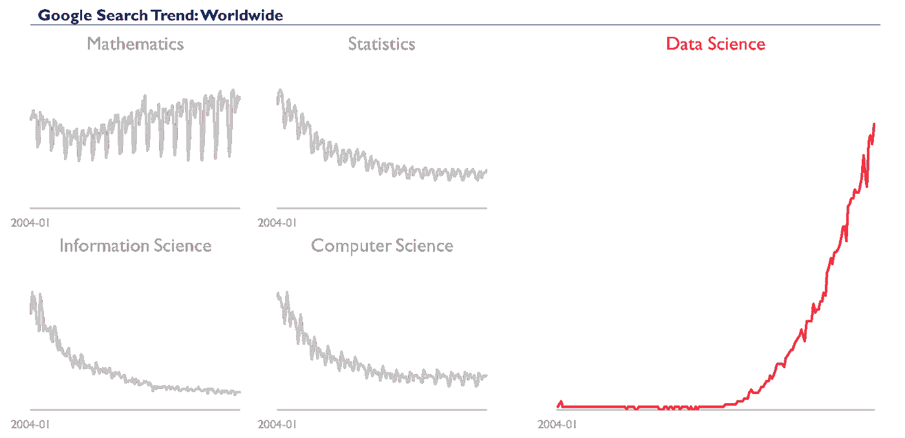

# 数据科学:新领域还是老把戏？

> 原文：<https://medium.datadriveninvestor.com/data-science-a-branding-story-67bf08ccdde5?source=collection_archive---------3----------------------->

数据科学是一个炒作出来的品牌或几个预先存在的领域和技术

Photo by [Austin Chan](https://unsplash.com/@austinchan?utm_source=medium&utm_medium=referral) on [Unsplash](https://unsplash.com?utm_source=medium&utm_medium=referral)

在[之前的帖子](https://medium.com/@julienlauret/tech-dirty-secret-ai-is-like-santa-claus-9e61e0aa9942)中，我们讨论了人工智能，并解释了它在很大程度上是一个品牌故事。有趣的是，数据科学也发生了类似的事情。

一个没有仔细关注人工智能技术的外行人可能会认为，那里有人工智能专家，他们拥有人工智能博士等学位和人工智能总监等职位。这将是错误的——至少直到最近。在简历上看到“人工智能”的字样是一个巨大的危险信号——申请人是个庸医。事情正在慢慢改变，但大多数业内人士仍然对任何自称为人工智能专家的人保持警惕——他们大多是男性。

 [## 数据科学和软件工程哪个更有前途？数据驱动的投资者

### 大约一个月前，当我坐在咖啡馆里为一个客户开发网站时，我发现了这个女人…

www.datadriveninvestor.com](https://www.datadriveninvestor.com/2019/01/23/which-is-more-promising-data-science-or-software-engineering/) 

如果人们不称自己为人工智能专家，那么他们的职称是什么？最常见的是数据科学家。

那么，除了行业认可的描述人工智能相关人员的方式之外，数据科学是什么？

简而言之，数据科学是另一种巧妙的品牌重塑。

最长的答案是，数据科学作为一个科学领域，直到最近才真正存在。当我在大学时，没有数据科学家，也没有选择数据科学专业毕业。技术本身已经存在；只是不叫那个名字。我的课程包括概率论与统计、数值分析、算法与数据结构、控制系统、信号处理、傅立叶变换与分布、运筹学、生产与运营管理、计量经济学以及许多其他课程。看不到数据科学。

在我读 MBA 期间，同样的事情又发生了。其中一门核心课程叫做不确定性、数据和判断。其他课程是简单的经济学、金融学和运营管理课程——仍然没有数据科学。

然而，在 2010 年代初，数据科学大受欢迎，我发现我一直都是数据科学家，只是我不知道而已。看看下面的图表，看看谷歌搜索量的突然上升。

计算机科学家和图灵奖获得者吉姆·格雷通常被认为是发明了范式，如果不是术语数据科学本身的话。Jim Gray 指出，许多科学领域正在使用数据密集型方法和统计学作为科学发现的方法。来自统计物理、电子工程、经济学、市场营销、生物学，当然还有计算机科学等领域的科学家都在使用相关的概念和方法。与其用单独的行话和约定来分隔不同的领域，为什么不将重叠的方法统一到一个总体领域中呢？于是数据科学诞生了。

Gif from giphy.com

然后有趣的事情发生了。数据科学在大数据热潮的顶峰时期变得流行起来。企业刚刚在 CRM、ERP、数据仓库、数据湖和其他云计算技术上投入了数十亿美元。现在老板们开始考虑如何处理这些数据。数据科学似乎是完美的解决方案。突然间，数百家从未考虑过雇佣统计学家的公司争相雇佣数据科学家。

一夜之间，拥有计算语言学学位的人发现，他们拥有一项有市场的高薪技能。至少对我来说，更令人困惑的是，直到现在，数学、计算机科学，尤其是统计学都被认为是愚蠢、无聊的话题。然而，数据科学很快成为学生和年轻专业人士的热门话题。2012 年，《哈佛商业评论》将数据科学评为“21 世纪最性感的工作”。

现在在校园和网上有许多学习数据科学好资源。大多数领先的大学都有数据科学课程和项目。有专门学习这门手艺的流行网站，大多数 MOOC 平台都充斥着数据科学课程。Python 是数据科学中最常用的计算机语言，它很快成为最流行的计算机语言，现在被教授给大多数初学者。

明确地说，我赞成这种趋势。我认为数据科学是一个回报丰厚的领域。这些问题既有挑战性又有趣。对企业和社会的影响是真实的。我很惊讶有多少聪明的年轻人认为编码、解决数学问题和查看数据是他们最好的职业选择。我想这就是品牌的魔力。

gif from giphy.com

你怎么想呢?数据科学是合法的科学还是仅仅是炒作？你同意数据科学是 21 世纪最性感的职业吗？