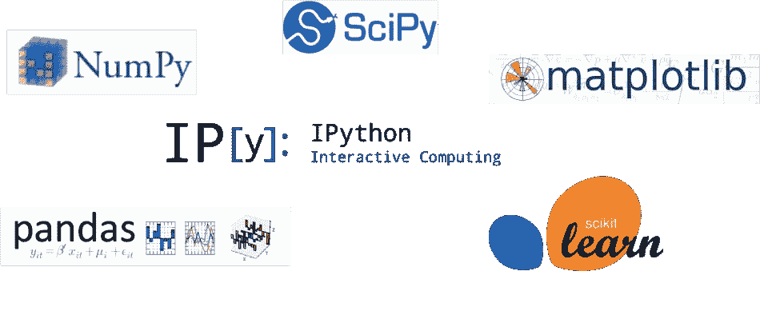
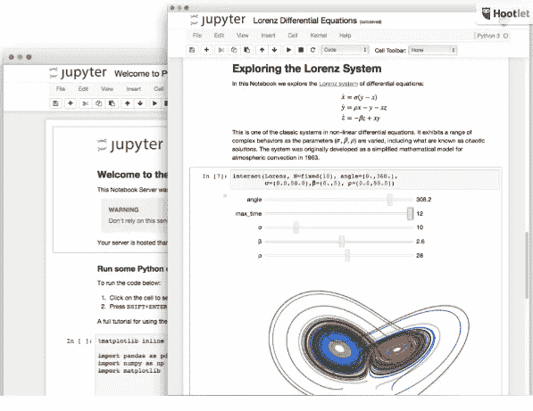
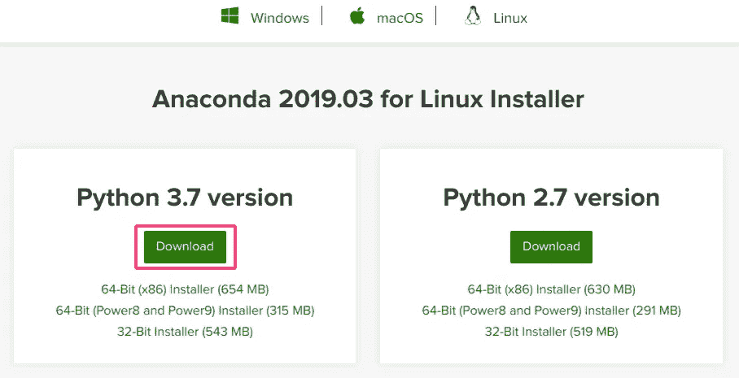
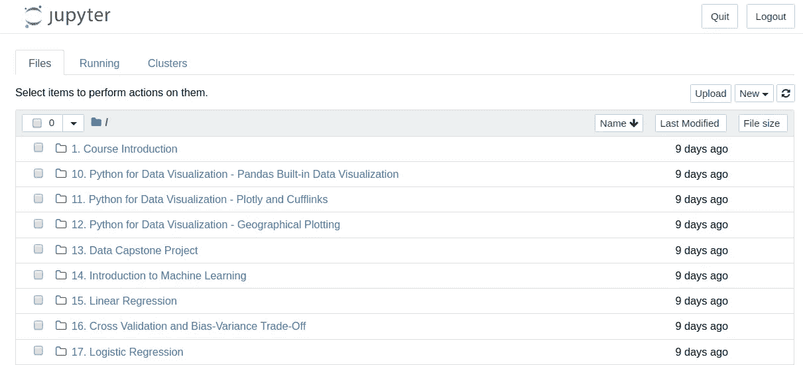
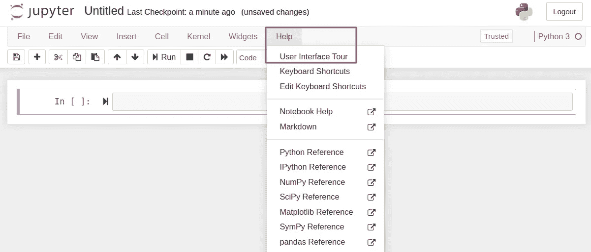

# 数据科学和人工智能之旅:第 1 部分

> 原文：<https://medium.datadriveninvestor.com/data-science-ai-journey-part-1-f81ba77d5f42?source=collection_archive---------4----------------------->

## 快速开发环境设置，开始学习数据科学

Photo from [SeattleDataGuy on Hackernoon](https://hackernoon.com/learning-data-science-our-favorite-python-resources-from-free-to-not-877fca5c92f0)

对于数据科学或机器学习的新手来说，建立开发环境可能是一项棘手的任务。有了所有可用的选项，你可以花很多时间在网上搜索合适的教程，摆弄不同的命令。

在本教程中，您将学习如何使用 Anaconda 在本地快速建立一个稳定的 Python 开发环境。您还将发现一些在云中免费设置环境的选项。

# 这是给谁的？

我们最近在阿克拉成立了一个实用数据社区。在我们的第一次聚会中，我们有来自不同背景的与会者，其中一些人对数据科学或人工智能完全陌生。在介绍和简短讨论之后，我们和 [Funsho Olaniyi](https://medium.com/u/5cbd373dd798?source=post_page-----f81ba77d5f42--------------------------------) 进行了第一次练习，带领我们快速了解 Python 和熊猫。我们意识到，很多机器上没有安装 Python 的与会者花了几分钟来设置他们的环境，并跟随会议进行。这篇文章的目的是为第一次做 Python 开发的人提供一个建立 Python 开发环境的过程。

 [## 成为数据科学家所需的 8 项技能——数据驱动型投资者

### 数字吓不倒你？没有什么比一张漂亮的 excel 表更令人满意的了？你会说几种语言…

www.datadriveninvestor.com](https://www.datadriveninvestor.com/2019/02/07/8-skills-you-need-to-become-a-data-scientist/) 

# 我们最喜欢和推荐的环境

Jupyter Notebook

如果您在网上做自己的研究，您应该不会花太多时间发现 Jupyter Notebook 是数据科学家最喜欢的本地开发环境。作为[项目 Jupyter](https://jupyter.org/) 的一部分，Jupyter Notebook 是一个开源的网络应用程序，允许你创建和分享包含实时代码、公式、可视化和叙述性文本的文档。这意味着您可以轻松地编码和记录您的项目，在同一个界面中查看输出，并将其保存为易于与其他人共享的格式。

# 使用 Anaconda 发行版进行安装

如果您是一个有经验的用户，并且您的计算机上已经安装了 Python 的一个版本，您可能希望根据您拥有的 Python 版本，使用以下命令之一使用 [pip](https://pypi.org/project/pip/) 来安装 Jupyter:

> *pip 安装 jupyter*
> 
> *或*
> 
> *pip3 安装 jupyter*

对于新用户，**强烈推荐**使用 [Anaconda 发行版](https://www.anaconda.com/distribution/)安装 Jupyter。它使这一过程变得更加容易和快速，因为它包括 Python、Jupyter Notebook 和其他常用于科学计算和数据科学的包。

要使用 Anaconda 安装 Jupyter，请转到 https://jupyter.org/的，向下滚动到“Jupyter 笔记本”部分，点击“安装笔记本”想的话可以先在网上试试。

在接下来的页面上，您应该会看到一个到[下载 Anaconda](https://www.anaconda.com/distribution/) 的链接。按照它，选择您的操作系统和您想要安装的 Python 版本。

e.g: install with Python 3.7 for Linux

安装完成后(按照说明操作即可；它的安装应该不会很复杂)，只需进入您的终端，在任意目录下键入以下命令:

> *jupyter 笔记本*

几秒钟后，它应该会在您的默认浏览器上打开一个新标签。

[http://localhost:8888/tree](http://localhost:8888/tree)

你完了！点击右上角的“新建”,创建您的第一个笔记本。熟悉直观的界面，然后开始编码，或者跟随教程，或者开始自己的项目。“用户界面之旅”非常方便，可以快速掌握你能做的一切；你也可以点击“帮助”来获得快捷方式，甚至是特定库的帮助。

Follow the User Interface Tour

如果您需要任何进一步的帮助来开始，或者如果您认为我应该写一篇关于“Jupyter 概述”的文章，请随时告诉我

# 额外收获:云中的 Python 笔记本

这个故事的目的主要是帮助您在本地快速建立一个 Python 环境，开始学习数据科学。希望到现在为止，您应该已经在本地机器上运行了一个 Jupyter 笔记本服务器，并且您应该能够直接从浏览器选项卡上进行编码。

随着您继续学习数据科学和机器学习，您可能会发现自己需要更快或更好的替代方案。其中之一可能是你想更快地训练一个模型。与其依赖你的 **CPU** (中央处理单元)来训练复杂的模型，你可能会想切换到**GPU**(图形处理单元)或者 **TPUs** (张量处理单元)来加速训练过程。由于当前可用的 GPU 板的高成本，一个好的选择可能是在云中训练你的模型。

幸运的是，他们有很多选项可以做到这一点，其中许多选项将允许您获得一些免费的处理能力积分。关于这个话题的详细文章，请查看由 [Kwadwo Agyapon-Ntra](https://medium.com/u/d40d8537c7ca?source=post_page-----f81ba77d5f42--------------------------------) 撰写的[这个故事](https://towardsdatascience.com/an-ai-story-part-3-python-notebooks-in-the-cloud-f7d4d62af1ae)。以下是一些选项的列表:

[谷歌合作实验室](https://colab.research.google.com/notebooks/welcome.ipynb)(或简称谷歌实验室)

[Kaggle 内核](https://www.kaggle.com/kernels)(来自 Kaggle)

[Azure 笔记本](https://notebooks.azure.com/)(来自微软)

[CoCalc](https://cocalc.com/)

[数据资料](https://datalore.io/)

[活页夹](https://mybinder.org/)

来自数据学院的这篇文章详细比较了这些平台。

我希望这有助于您快速开始数据科学学习之旅。我打算发表类似的故事来记录我自己的学习历程，并帮助其他学习者。随意鼓掌分享。你也可以在 Medium、Twitter 或 LinkedIn(T21)上关注我。

#价值#学习#分享