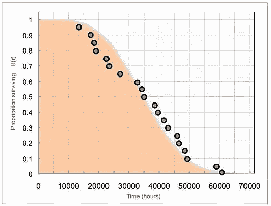
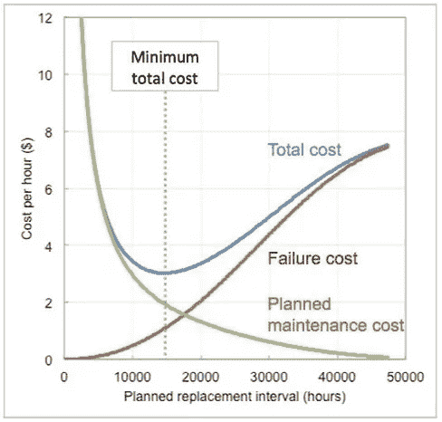
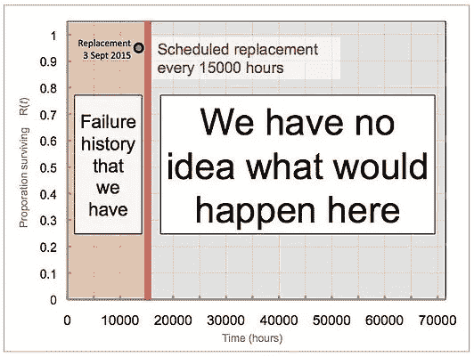

# 数据科学是给无关紧要的失败准备的——马克·霍顿博士

> 原文：<https://medium.datadriveninvestor.com/data-science-are-for-failures-that-dont-matter-dr-mark-horton-1dadacbf1136?source=collection_archive---------9----------------------->

这难道不奇怪吗？就“大数据”而言，ERP 中的故障和计划维护记录就像它们出现时一样多。每年我们都会增加几万或几十万个。结果是数十亿字节的数据等着被哄骗而泄露秘密:这是提高盈利能力、安全性、环境完整性和更好的工作生活的关键。

但现实却大相径庭。让我们从讨论一个案例开始，到最后你会明白为什么“数字化转型”可能是一个昂贵的冒险，而没有为工程维护的资产管理领域的企业提供解决方案。事实上，越来越多的公司出售数据科学支持的解决方案的承诺，但这真的是明确的吗？

# 根据故障历史进行最佳维护

您希望为化工厂中使用的产品干燥器设置一个计划维护策略。你期望实施某种预防任务。轴承应该多久更换一次？以下是活动计划:

1.  下载故障历史记录——很简单。对所有干燥机轴承的快速查询产生总共 20 个故障记录。一点算术就能给出每个轴承的失效年龄。
2.  画一张生存图——下图中的每个圆圈代表一次失败，失败时的年龄沿着 x 轴绘制。y 轴是任何给定年龄的轴承的存活比例。最短的轴承寿命约为 13000 小时，最长的仅超过 60000 小时，一半的轴承寿命约为 35000 小时
3.  拟合威布尔曲线-橙色曲线代表数据的最佳拟合威布尔生存曲线。(图 1)
4.  计算出最佳的计划维护时间间隔——知道计划维护的成本和计划外故障的成本以及威布尔曲线和一些数学知识，你就可以计算出最佳的维护时间间隔。在下图中，您可以看到意外故障和计划维护的每小时成本是如何随着轴承更换间隔的变化而变化的。最小总成本是计划外故障风险和计划内维护成本之间的最佳折衷。

Fig 1

大约在 14000 小时更换轴承的总成本最低，约为每小时 3 美元。维护历史和成本，最佳维护:这是一个完美的结果。(图二)

Fig 2

# 今天的工作—检查干燥机轴承的计划维护周期

1.  下载故障历史记录—登录您的 ERP 并下载轴承的故障记录。
2.  画一张生存图表——有一个记录，在这里……在它所有的辉煌中！(图 3)

Fig 3

# 这就是为什么你不能使用你的历史失败数据

那是因为你没有！

当干燥机首次安装时，计划每 15000 小时更换一次轴承。为什么？因为运行中的故障很重要:每次发生故障的成本约为 25 万美元。最初的维护计划旨在通过在轴承出现故障之前更换轴承来防止运行中的故障，并假设轴承至少能运行 15000 小时。

事实证明，这种假设是错误的:一个轴承确实过早出现故障。但是预定的替换意味着你在梦里看到的其他 19 个失败记录，红线右边的那些，从来没有发生过。

他们不在的地方有一大片空白。维护数据库中记录的每个事件仅适用于使用时间不到 15000 小时的设备。您希望使用记录的历史来设置最佳的维护策略，但是只有一条记录可用。你不知道如果设备在那个地区出现故障会发生什么。完全没有。

根据单一故障的证据，无法预测轴承在 20000 小时、40000 小时或任何其他时间的可靠性。由于随机失败，生存曲线可能优雅地向下倾斜。它可能会从悬崖边掉下来，显示出突然磨损。可能会有一个平台期；记录的单一故障可能是制造缺陷、误操作或运气太差的结果。

在不了解故障发展的物理过程的情况下，对 15000 小时以下的一个数据点的分析无法告诉我们什么。即使我们能找到一个物理故障模型，达到任何程度的确定性的机会似乎也微乎其微。这就是失败记录的悖论。有很多记录无关紧要:那些具有琐碎后果的记录，如指示灯熄灭和泄漏造成轻微不便的密封。

除非出现非常严重的问题，否则数据库中不会有很多涡轮机在使用中发生灾难性故障、压力容器爆炸或关键管道被腐蚀的记录。如果失败很重要，那么很可能已经有一个主动的任务来防止失败。 ***如果预防了故障，则没有故障历史，也没有用于分析可靠性趋势的数据。***

因此，您可能没有历史数据来优化真正重要的故障的基于年龄的更换间隔。需要明确的是，如果以下一个或多个条件适用于失败，则失败“真的很重要”:

*   修理起来会很贵
*   这将导致大量代价高昂的停机时间
*   该故障可能导致安全或环境事故

# 雷斯尼科夫已经知道了

这些都不是新的。

如果可靠性分析有诚实奖的话，这个奖应该颁给霍华德·L·雷斯尼科夫。他在 1978 年发表的扩展论文《以可靠性为中心的维护的数学方面》是斯坦利·诺兰和霍华德·西普著名的以可靠性为中心的维护的姊妹篇。Resnikoff 甚至在开始主要部分之前就在他的介绍中说了这些:

> “以可靠性为中心的维护计划最重要的贡献之一是明确认识到，迄今为止作为维护活动的产品积极寻求的某些类型的信息在原则上以及在实践中是无法获得的。”

在涵盖了生存分布统计、风险率、推理、贝叶斯定理和系统可靠性建模的六个章节之后，你可能会期望他在结束时强调彻底的统计分析对 RCM 决策的重要性。不是 H L .雷斯尼科夫。相反，他是这样描述现实世界中数据的可用性的:

> [现有维护]计划越有效，发生的严重故障就越少，相应地，维护策略设计者可获得的有关操作故障的信息也就越少。最佳策略必须在缺乏关键故障信息的情况下设计，仅利用组件测试的结果和相关但不同的复杂系统的先前经验，这显然是一种矛盾的情况。
> 
> 此外，可靠性统计理论对实践中通常遇到的大规模复杂系统的极少数群体的适用性是值得怀疑的，需要进行一些讨论。每一个不同的观点都导致了一个结论，即维护政策的设计必然是在极其有限的信息下进行的，而这些信息的再现性是可疑的，我们必须考虑为什么这是可能的，以及如何去做。"

换句话说:“你可能认为你有可用的信息，但你没有，你很可能得不到它”。

# 结论

雷斯尼科夫的难题与机器学习非常相关。

ML 只在数据中寻找相关性，并把它们表达成一系列函数。ML 系统确定我们提供的输入和给定的输出(通过/失败、失败/正常、失败概率)之间的相关性，无论它可能是什么。如果 ML 算法的学习输入必须包含输入和已知输出，那么为了预测故障，我们必须同时拥有输入数据和故障记录。Resnikoff 告诉我们，我们会有许多无关紧要的失败经历，但重要的失败记录却很少。

因此，我们的学习数据集要么太空，要么太稀疏，没有用，除非我们可以从成千上万的用户那里聚集数据，而获得所需的数据需要时间(几个月、几年或更长)。数字化转型需要时间，非常长的时间。然而，我们已经开发了一个解决方案，从第一天开始就对您的实物资产起作用。

联系我们，以便我们可以讨论如何最大限度地提高您的资产正常运行时间，同时提高对完全可控的成本和风险的合规性。

[kenneth.shakesby@relmar.co.uk](http://kenneth.shakesby@relmar.co.uk)

contact@relmar.co.uk