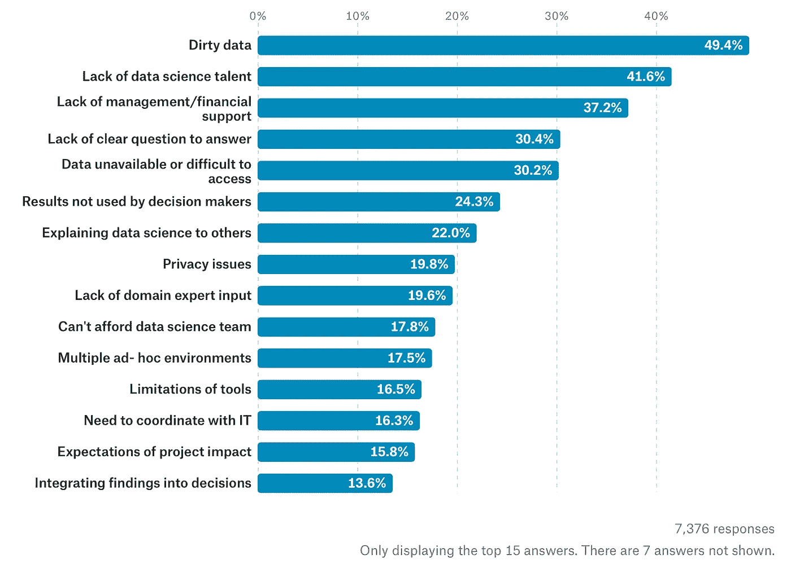

# 数据科学挑战

> 原文：<https://medium.datadriveninvestor.com/data-science-challenges-b7622b85b807?source=collection_archive---------2----------------------->

据估计，70%到 85%的数据科学项目会失败。为了试图解释我们观察到如此高失败率的原因，我们看了 Kaggle 在 2017 年 8 月 7 日至 8 月 25 日进行的一项调查的结果。他们调查了他们的用户，有 16716 人回复。这里可以看到完整的报道[。调查中与本文相关的部分是关于公司在数据科学方面所面临的挑战。下图显示了 15 大挑战。](https://www.kaggle.com/surveys/2017)

对于任何熟悉数据科学项目的人来说，看到数据质量被称为最大的挑战可能不会感到惊讶。大多数数据科学家花费大量时间准备和清理数据。数据的其他方面，如访问、隐私和与问题的相关性也是重要的问题。

我们可以将这些挑战分为以下几大类:

*   协作(76%)
*   数据(68%)
*   人才(42%)
*   工具(36%)
*   预算(27%)

如果我们将协作和才能归入“人的因素”这一类，这将成为最大的挑战，82%的受访者提到了这一点。

**协作和组织问题**

在公司内部，数据科学项目通常涉及三个主要利益相关方:业务、数据科学和 IT。该调查显示，这些参与者之间存在明显的协作和沟通问题:缺乏支持、问题定义不明确且业务输入很少、结果未被业务使用或实施、难以部署和协调 IT、难以解释数据科学。

对这些沟通和组织问题的一个可能的解释是，公司雇佣了越来越多的专业人才。这是一个大问题的原因是:

*   专家往往有自己的语言，不善于与他人交流。
*   为了能够清楚地用数学形式表达问题，需要领域和建模知识。业务很少涉及，因为他们不知道如何制定问题，更不用说思考如何解决它。数据科学家希望问题能得到清晰的表述。
*   你知道的数学方法越多越好，因为你想避免专家偏见，比如“如果你只有一把锤子，那么一切看起来都像钉子”。
*   为了最大限度地缩短将模型投入生产所需的时间，需要良好的软件设计技能。您不希望您的开发团队不得不重写科学家已经产生的代码数据。

因此，如果公司希望最大限度地减少不同职能部门之间的摩擦，他们需要增加懂业务、数据科学和 IT 的多面手。对利益相关者说不同的语言将有助于打破隔阂。

**工具**

提到了与工具相关的三个挑战:它们的异构性、它们的局限性以及机器学习算法的局限性。当数据集的规模增大时，这些挑战会变得更大。

大多数工具相对较快地达到了极限，需要编写专门的代码来优化运行模型所需的计算时间。我们在机器学习算法方面也有类似的问题:大多数高级算法都不能很好地适应数据集的大小。这也是你需要确保拥有适量数据的另一个原因:永远不要先验地假设你需要大数据集来解决你的问题。有些需要大数据，但大多数不需要。

你使用的数据的大小通常与成本正相关(数据越大，成本越高):更昂贵的技术堆栈、更昂贵的人才、更强的计算能力、更简单的算法，这些可能会限制你的发现。如果所有这些成本都高于项目的预期结果，那么做这个项目就没有意义，除非几个项目可以使用相同的数据，分摊成本。这就把我们带到了最后一个话题:预算。

**预算**

预算会影响项目的方方面面，比如雇佣合适的人才或购买外部数据和工具。解决人才问题的一个方法是采用不同的商业模式和组织结构。通才，需要做最初的问题解决，更有经验，是罕见的，也更昂贵。为了更好地利用他们，他们可以被临时雇佣或者在几个项目中共享。他们可以在过程的每一步做出贡献:从战略到雇佣和管理年轻专家团队，再到执行。

**结论**

人为因素是数据科学项目成功的最大威胁。这并不奇怪，因为技术人才往往更内向，倾向于使用自己的专业语言。为了改善专业人才之间的沟通和协作，公司需要雇用多面手，他们可以帮助打破孤岛，从概念到执行管理一个项目。

预算限制正在影响数据科学的大多数方面:数据、人才和工具。为了解决这些预算问题，我们需要在项目的生命周期中更好地分配和管理我们的资源。我们需要根据项目阶段进行思考，并确定每个阶段所需的人才。我们需要更有创造力，想出新的商业模式和组织框架。

最后，我们需要更加严格地管理数据科学项目。许多公司在没有明确的数据科学战略的情况下，开始着手数据科学项目。我们需要使用更加量化和系统化的方法来进行投资组合管理。我们需要识别、选择和管理数据科学项目，并构建多样化的投资组合，同时考虑它们对公司底线的影响，以及它们的风险，如成本、持续时间和结果不确定性。具有讽刺意味的是，我们希望企业在制定决策时使用基于证据的方法，但数据科学部门很少使用这种方法来管理自己的业务。

*夏羽是 Prometheus Ax 的创始人兼首席执行官，该公司帮助首席执行官们优化数据科学项目的成功率和投资回报率。*

*本文原载* [*此处*](http://www.prometheus-ax.io/index.php/2018/10/04/data-science-challenges/) *。*