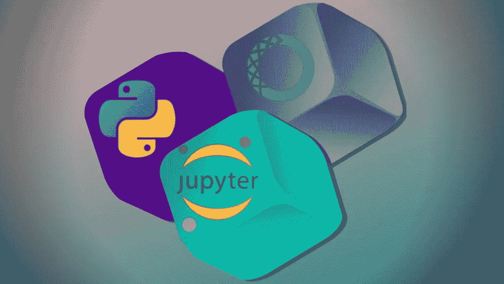

# 数据科学环境设置

> 原文：<https://medium.datadriveninvestor.com/data-science-environment-setup-59326181b12?source=collection_archive---------11----------------------->

您最终决定踏上成为数据科学家的旅程。还有，你已经开始看教程，做在线课程了。当你在在线互动环境中解决问题时，你会得到很多乐趣。除此之外，你还想安装自己的电脑，这样即使没有网络环境，你也能玩得开心。对吗？但是你被所有你必须安装和设置的东西弄得不知所措。那么，这篇文章将帮助你为数据科学和机器学习设置你的计算机。

# 本指南将涵盖哪些内容？

1.  **安装 Python**
2.  **安装蟒蛇**
3.  **设置虚拟环境**
4.  **设置 Jupyter 笔记本**
5.  **安装所需的 Python 包**

这篇文章将涵盖以上所有的 Windows 设置。所以，如果你是 Mac 或 Linux 用户，那么我强烈建议你从其他教程中获得帮助。但是，您可以继续阅读这篇文章。学习其他系统的工作方式从来都没有坏处，你也许可以在这方面帮助其他 Windows 用户。

 [## 成为数据科学家所需的 8 项技能——数据驱动型投资者

### 数字吓不倒你？没有什么比一张漂亮的 excel 表更令人满意的了？你会说几种语言…

www.datadriveninvestor.com](https://www.datadriveninvestor.com/2019/02/07/8-skills-you-need-to-become-a-data-scientist/) 

# 安装 Python

Python 已经成为数据科学和机器学习的首选编程语言。显然，像 R 这样的其他语言也被广泛使用，但是 python 库的广泛可用性使它如此特别。所以，第一步， [**安装 Python**](https://www.python.org/downloads/release/python-372/) 。我强烈建议获得最新版本。你可以在这里 下载[**Windows Installer**](https://www.python.org/ftp/python/3.7.2/python-3.7.2-amd64.exe)[**。如果在安装时勾选“将 Python <版本>添加到路径”会更省事。这样，您就不必在安装后手动操作了。**](https://www.python.org/ftp/python/3.7.2/python-3.7.2-amd64.exe)

# 安装 Anaconda

[**Anaconda**](https://www.anaconda.com/) 是 Python 和 r 的数据科学发行版。它也是一个包管理器，它还将帮助您创建自己的数据科学环境，您将在本文后面看到。还有，Anaconda 是 [**安装 Jupyter 笔记本**](https://jupyter.org/) 的推荐方式。

点击 [**这里**](https://www.anaconda.com/) 进入 Anaconda 官方网站下载安装程序。

# 设置虚拟环境

Anaconda 预装了许多必需的数据科学包。但是您将创建一个新的虚拟环境( *virtual env* )并自己安装所有需要的包来帮助您开始。

# 什么是虚拟环境？

有时，您可能需要某个库的特定版本。在其他时候，您可能需要特定版本的 Python。此外，您可能并不总是需要所有的库和模块。那么，为什么不构建一个单独的目录，只安装您需要的库和模块呢？建立一个虚拟环境就能做到这一点。

一个虚拟环境将会有你在一个特定项目中需要的所有包，以及一些其他的包。所以，让我们建立一个。遵循您的 windows 命令行。

`C:\Users> conda create -n envname python=3 anaconda`

在上面的代码中，envname 是您想要给定的环境的名称，请注意，它将在 C 驱动器的 Users 目录下创建。此外，您可以给出您喜欢的任何版本的 python。如果出现提示，按下`y`继续。

现在，要检查环境是否已创建，请键入

`conda env list`

您应该会看到已创建环境的列表。现在，要激活一个环境，只需输入

`conda activate envname`

并且去激活，

`conda deactivate`

# 设置 Jupyter 笔记本

Jupyter Notebook 是一个交互式的环境，在这里你可以编写所有的代码，创建文件和进行可视化。如果你打算第一次使用 [**Jupyter 笔记本**](https://jupyter.org/index.html) ，那么我推荐你访问 [**网站**](https://jupyter.org/index.html) 了解更多关于它能做什么的信息。

在命令行中键入`jupyter notebook`启动 Jupyter Notebook。如果您收到一条错误消息，指出 jupyter notebook 未安装，请键入以下命令进行安装，

`python3 -m pip install jupyter`

现在一切都准备好了。你可以从命令行启动 jupyter 笔记本。现在，您只需安装数据科学日常使用的最常见的软件包。

# 安装所需的 Python 包

要开始，你必须安装一些数据科学的 python 包，这是最常用的。

激活环境后键入以下命令，并在出现提示时键入`y`。

`conda install numpy`

`conda install pandas`

`conda install matplotlib`

`conda install seaborn`

`conda install scipy`

`conda install scikit-learn`

随着您的发展，将来您可能需要更多的包。您必须了解它们，并在需要时安装它们。现在，上面的包应该足够了，一定要谷歌一下它们。

如果你觉得这个帖子有用，别忘了评论，分享，点赞。你可以关注我的 [**Twitter**](https://twitter.com/SovitRath5) 来定期更新我的帖子。

标签:[数据科学](https://debuggercafe.com/tag/data-science/)，[机器学习](https://debuggercafe.com/tag/machine-learning/)，[编程](https://debuggercafe.com/tag/programming/)， [Python](https://debuggercafe.com/tag/python/)

*原载于 2019 年 3 月 3 日 debuggercafe.com**的*[T22。](https://debuggercafe.com/data-science-environment-setup/)