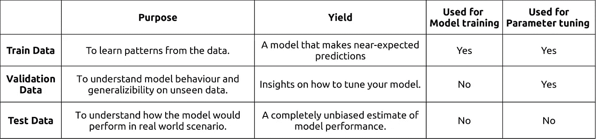
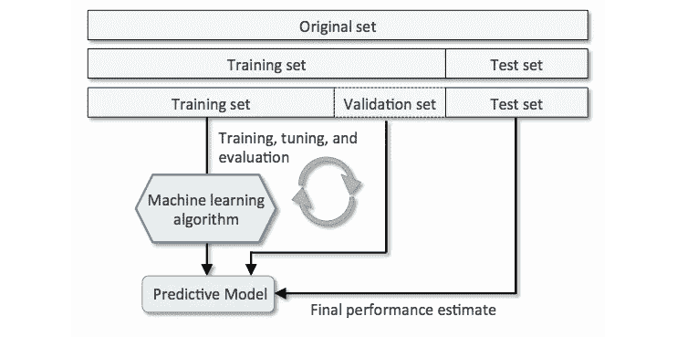

# 数据科学精要:为什么要训练-验证-测试数据？

> 原文：<https://medium.datadriveninvestor.com/data-science-essentials-why-train-validation-test-data-b7f7d472dc1f?source=collection_archive---------6----------------------->

想知道为什么我们把数据分成训练-验证-测试吗？

**这是总结所有这些的表格**

**这是建筑的样子……**

# 需要注意的要点…

1.  **验证数据是迭代循环的一部分。**我们经常从验证错误中获得洞察力来调整我们的模型。因此，我们正在将验证数据中的信息隐式地泄露给我们的模型。
2.  **先进的验证方法掩盖了单次分割验证数据的重要性。K-fold 交叉验证非常健壮，可能是模型性能验证和参数调整的当前行业标准。**因此，如果您在分析中使用交叉验证技术，您可能会忽略验证数据分割。****
3.  测试数据的主要目的是给出模型准确性的无偏估计。它应该在最后使用，并且只使用几次。**如果你在查看测试准确度后调整你的模型，你在技术上泄露了信息，从而作弊。**
4.  出于与上述*(信息泄露)*完全相同的原因，尽管编程方便，但我们不应该将训练-验证-测试数据集组合起来，以形成通用的预处理流程。有些人可能会争辩说，根据基本假设，训练-验证-测试数据来自相同的总体分布，因此将它们组合成一个通用的预处理流程应该没有什么害处。这在理想的场景中是正确的，但是现实生活远非如此，因为你永远不知道你的实时生产系统何时开始获得不断发展的数据(*其分布与训练数据略有不同)*。**作为一名优秀的数据科学家，无论未来数据的不确定性如何，您都应该努力构建一个可推广且性能良好的模型流*(无任何额外更改)*。**
5.  我们应该开发 2 个独立的预处理管道。(A)用于训练数据，以及(B)用于验证和测试数据。但是应该注意的是，这些管道并不是完全独立的。**您从训练数据中学习转换特征*(均值/范围/标准差)*，并使用它来转换您的验证和测试数据。**
6.  最后最重要的事情*(以听起来很傻为代价)* **永远不要犯在验证或测试数据上训练你的模型的错误。当我为我的项目编码时，我确保我的验证和测试数据框架远离 model.fit()函数。> _ <**

作为一名数据科学家顾问和学术培训师，我听说过许多这样的故事:对以上几点缺乏理解已经变成了项目灾难。希望这篇文章能帮助你避免这些陷阱。如果你有什么要补充或改正的，请随意评论。

萨加尔·帕特尔([电子邮件](mailto:sagarpatel.exe@gmail.com) | [LinkedIn](https://www.linkedin.com/in/codesagar/)