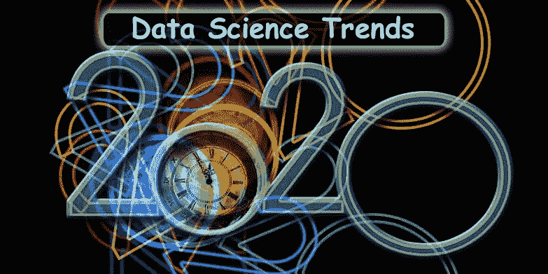

# 2020 年数据科学预测

> 原文：<https://medium.datadriveninvestor.com/data-science-forecast-2020-78e0898b9464?source=collection_archive---------5----------------------->

## 2020 年，我们可以从数据科学中期待什么？

***数据科学已经上升到数据生态系统的前沿*** ，不可否认的是，目前人工智能的各种表现形式在企业中得到了认可。

它代表了预测分析能力的核心，以及数据文化在整个现代组织中的扩展。因此，数据科学趋势比其他数据管理领域的趋势更有效，这就是其不断扩展的消费化可能是当今整个 IT 领域最重要的载体的原因。

[***学习 R 编程——数据科学的必备要素***](https://techvidvan.com/tutorials/why-r/)

作为著名的流媒体服务和内容制作商，网飞凭借其原创节目《纸牌屋》达到了目前的成就。这个主流电视节目富有成效的创作的奥秘在于广泛的数据研究。

 [## 成为数据科学家所需的 8 项技能|数据驱动型投资者

### 数字吓不倒你？没有什么比一张漂亮的 excel 表更令人满意的了？你会说几种语言…

www.datadriveninvestor.com](https://www.datadriveninvestor.com/2019/02/07/8-skills-you-need-to-become-a-data-scientist/) 

该平台利用数据科学，利用其积累的海量数据来识别关键元素——视觉元素、屏幕上的人物和主题。这些元素的加入使得这部剧在观众和评论家中获得了胜利。

数据科学家帮助企业做出这样的决定。它们包括位于商业和技术交汇处的激励。

随着我们进入 2020 年，数据科学领域已经形成了一个事实。我们探索数据科学的年轻领域如何在第四次工业革命之后前进。专家应该记住这些模式，当在这个领域塑造职业生涯时。

# 2020 年前五大数据科学职业趋势:

## 1.大多数组织都是由洞察力驱动的:

德勤的研究显示，组织的数据成熟度有所提高。同样数量的 70%的协会目前认为分析对于满足其业务需求非常重要。解释是围绕云计算、大数据、机器学习和人工智能的上升模式，这些被视为做出明智战略决策的关键，从而可以提高收入。

## 2 数据科学家收入丰厚，但是…

组织对数据科学热情高涨的不可否认的后果？出口利益的增加。备受关注的 Glassdoor 调查将数据科学家列为 10 大最具采购能力的专业人士之一。尽管如此，新的迹象表明，这份工作的薪酬水平正在下降，正如 Glassdoor 在其新的研究中指出的那样。

这种拉直背后的解释在于比以前有更多的数据分析师可用。Stack Overflow 的数据科学家 Julia Silge 表示，这种平衡背后的另一个目的是数据科学领域的一点标准化和专业化正在进行。

数据科学专家和有志之士，这意味着采取更深刻的投入，增加更高层次的业务理解，并对产品和服务的价值比例进行分析解释。

尽管如此，Glassdoor 高级经济学家丹尼尔·赵(Daniel Zhao)指出，“*数据科学家仍然是美国最赚钱、满意度最高的工作之一*”他们带回家**95，459** 美元的中等年薪。

## 3.对“决策者”和专家的要求:

麻省理工学院技术评论(MIT Technology Review)公布的 2018 年 Vantage Partners 新调查显示，尽管有 97%的公司投资于大数据和人工智能，但约有一部分分析从未投入生产。目前，这是一个理想的机会，可以从试验阶段进入部署、实施、监控和预测阶段。

为了在数据科学职业生涯中保持适用性，专业人员可以选择发送高级分析能力，以提高业务决策的可信度，这一点非常重要。

## 为职业提供动力的 4 个技能——Python 为王！

Glassdoor 分发了**数据科学家必备的 10 项编程技能——Python、R、Hadoop、SQL、Spark、Java、SAS、Tableau、Hive 和 Matlab** 。在所有这些当中，如果分析和人工智能是未来的发展方向，Python 作为一系列技能将承担最重要的工作角色。

[***掌握 Python 编程成为下一个数据科学家***](https://techvidvan.com/tutorials/python-tutorial/)

此外，定量能力和实验分析的艺术将支持专家。尽管如此，数据科学专家目前需要扩大整个组织的数据战略，并实施机器学习。选择一个全面合法、供应商中立的认证，如 DASCA、Cloudera 等提供的认证，可以帮助专家建立数据科学能力范围的技能。

## 5.行政影响——令人钦佩地使用信息！

随着政府围绕数据保护建立管理系统，例如欧盟的《通用数据保护条例》( GDPR ),数据科学专家将需要不仅了解数据治理方面的持续改进，还可以选择为企业翻译法律并推进相关安排。

[***用 R 编程语言弄脏你的手***](https://techvidvan.com/tutorials/category/r/)

# 谷歌首席决策科学家需要陈述什么？—数据科学职业发展

凯西·科兹尔科夫(Cassie Kozyrkov)被任命为 2018 年谷歌的首席决策科学家。她的职业道路为数据科学专家提供了很多东西。起初，她是谷歌云的首席数据科学家，后来成为首席决策科学家。科济尔科夫有经济学学位；后来研究了统计学、神经科学和心理学的奇怪结合。她将数据和行为科学与人类决策结合在一起。

Kozyrkov 不仅仅是谷歌的数据科学家。她认为人工智能和大数据不是科幻小说中的宏伟标准，而是人们可以利用的新工具。她讨论了作为决策智能学科的数据科学——与应用数据科学、人工智能和分析相遇。

数据科学家不仅能预见未来，还能帮助企业创造未来。你准备好了吗？