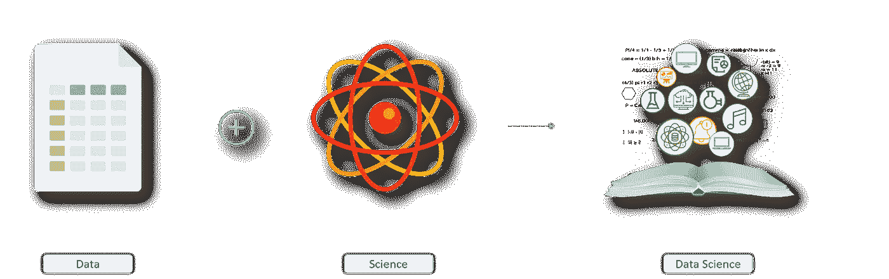

# 5 分钟内的数据科学—第 1 部分

> 原文：<https://medium.datadriveninvestor.com/data-science-in-5-minutes-part-1-d170f94aa881?source=collection_archive---------6----------------------->

数据科学是关于“数据”和“科学”的。让我们黑掉它！

# 数据科学简介:

所以，数据科学是一个常用的时髦词。

这个领域的工作太理想化了。你可能会在日常生活和职业生活中经常听到它…

你不太确定那些数据是什么。

对吗？

让我们投入进去吧！

Data Science !

今天，我们将学习数据科学的定义。

# 这是什么意思？

Data + Science = Data Science

所以，数据科学是对“数据”的研究。数据是原始信息。你可以称之为未使用的信息。

当你用科学来研究那些未使用的数据的行为时，你就是在做“数据科学”。

从更专业的角度来说，我们可以说数据科学实际上是一种从杂乱和未使用的数据中获得洞察力的方法。

如果我们按部就班地定义，那么数据科学包括:

-存储和收集数据
-清理和探索数据
-可视化数据
-为机器学习模型的实施准备数据

你可能还有另一个问题…

# 它是从哪里来的？

Pattern identification has been there for years

数据科学并不是一个新领域。通过不同的统计方法识别数据中的模式已经存在多年了。

那……为什么现在大家都这么过分炒作数据科学？

这有三个主要原因:

第一个是功能强大的计算机的可用性，现在普通人都可以使用。

第二个是关于大型开源数据集，这也使得每个人都可以轻松使用。

第三，我认为是强大的数据操作包和库的可用性，这在 15 年前是没有的，比如 Pandas 和 Python 中的 NumPy。

# 它如何能帮助我？

Applications of Data Science can be found in every field

因此，数据科学真正发光的部分是识别数据中的不同模式，如人类的购买行为。对一个电商店铺可能会有帮助。

也可能是汽车司机的驾驶行为。交通管理部门或打车公司可能有兴趣了解这一点，以确保他人的安全。

除此之外，现实世界中还有许多数据科学的应用。谷歌一下它们，你就会知道数据科学是如何改变世界的！

# **结论:**

数据科学将改变世界。据说，除此之外，对相关人才的需求也很大。所以，如果你现在开始学习数据科学，对你真的会很有帮助。

**敬请关注我的下一篇文章！**

**你是数据科学的初学者吗？
你对数据科学如何改变世界感到好奇吗？
你想从事数据科学方面的职业吗？**

一定要问我。我是来帮你的。

你喜欢这篇文章吗？

如果你的答案是肯定的，按下拍手按钮👏尽可能多的跟我来 [**这里**](https://medium.com/@saeeddev) **(上中等)**。你也可以在 [**Linkedin**](https://www.linkedin.com/in/saeeddev/) 上关注我或者在那里和我联系。

如果答案是否定的，你仍然可以点击“鼓掌”按钮👏但是请在这里留下您的评论，让我知道我将来如何为您改进。

我叫 **Saeed Ahmad** ，是一名数据科学家、机器学习工程师和全栈开发人员。我研究 JavaScript、Python 和所有相关的东西。我喜欢写这个行业的新技术和趋势。

因此，如果你有关于数据科学、机器学习或全栈开发的事情要与我讨论，请联系我。我很乐意帮助你。