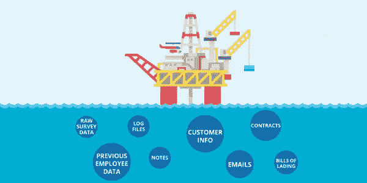
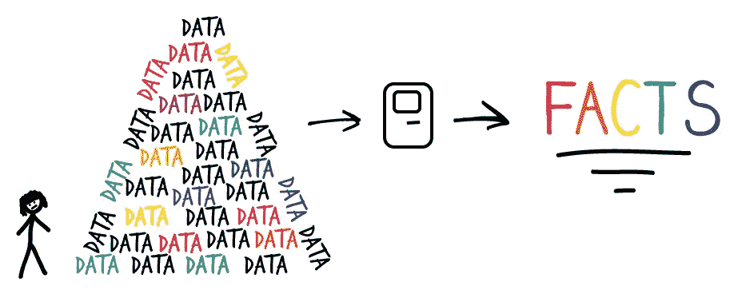
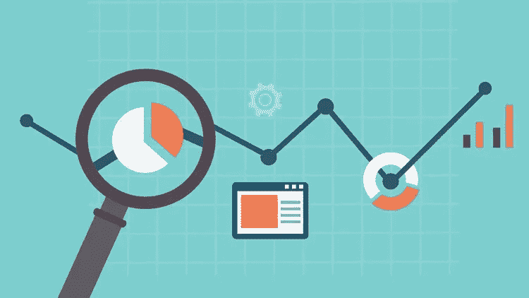

# 五分钟数据科学—第二部分

> 原文：<https://medium.datadriveninvestor.com/data-science-in-5-minutes-part-ii-ee844bece2ed?source=collection_archive---------10----------------------->

让我们理解为什么数据是新的“石油”

本文是数据科学系列文章的一部分。如果你还没有看过这个系列的第一部分，那么你可以通过 [***点击这里***](https://medium.com/datadriveninvestor/data-science-in-5-minutes-part-1-d170f94aa881?source=friends_link&sk=b9500b12885e6bcbe817bfd691e4b05a) ***来阅读。***

Data is the new oil!

你可能最近在科技圈听到了一句新的名言:“数据是新的石油！”。今天，我们将了解这一事实，并构建我们的思维过程，以理解它与问题的关系。然后，我们将继续讨论解决方案:

 [## 成为数据科学家所需的 8 项技能|数据驱动型投资者

### 数字吓不倒你？没有什么比一张漂亮的 excel 表更令人满意的了？你会说几种语言…

www.datadriveninvestor.com](https://www.datadriveninvestor.com/2019/02/07/8-skills-you-need-to-become-a-data-scientist/) 

# 问题:

We have lots of data now

在第一部分中，我们了解到世界上有大量的封闭和开源数据集形式的数据。这意味着我们有大量的数据。

你可能会想，如果我们有这么多数据，那就好了。那是什么问题呢？

问题是，目前存在的大部分数据都存储在孤岛中。它仅用于分析目的，大多数人使用它来通过商业智能和数据分析工具获得一些见解。

# 解决方案:

Get facts out of your data

你有问题吗？

对…

让我们构建解决方案…

您知道数据是未使用的。解决办法很明显。去使用它。
数据处于孤岛状态。它是孤立的。解决方案是将它带到流程中。
数据不参与决策。解决办法就是给数据赋权。
数据利用不足。解决方案是利用它来做决策。

这就是数据的力量所在。

# 下一步是什么？

在这个阶段，我们对数据科学有了很好的理解。现在让我们再向前迈进一步。

众所周知，世界上的每个领域都有一些经过测试的准备过程。例如，如果你想做比萨饼，它有很好的配方，你可以稍加调整，但基本过程保持不变。

因此，为了处理数据科学问题，我们遵循一个称为“数据科学流程”的流程。

Data Science Process

数据科学流程由以下步骤组成:

1.  商业理解
2.  数据理解
3.  数据探索
4.  建模
5.  估价
6.  部署

让我们逐一回顾一下:

## 一、业务理解:

Business Understanding is must

业务理解是数据科学家最需要的技能。这并不意味着你需要成为那个领域的大师，而是应该发展对那个特定领域的基本理解，以防止任何误解。

## 二。数据理解:

Data Understanding is crucial

理解您的数据也很重要。这意味着你不应该对你的数据集做任何假设。大多数情况下，数据是嘈杂的，你必须使用不同的技术手动清理，所以要小心。

## 三。数据探索:

EDA — your best friend in DS

在这一步中，您将尝试通过不同的统计方法和可视化来理解数据的行为。它通常也被称为探索性数据分析(EDA)。

## 四。建模:

Predictive modelling

这一部分包括将适当的数据科学模型应用于您的问题。数据科学模型的选择取决于问题的性质、数据的性质、数据中的噪声、数据的行为和其他因素。

## 动词 （verb 的缩写）评估:

Evaluation is key to measure performance of model

评估步骤包括根据一组用于衡量模型性能的指标来量化您的数据科学模型。这种方法告诉我们，根据业务需求和其他因素，我们的模型有多可行。如果此处模型失败，则从头开始重复整个过程。

## 不及物动词部署:

Deployment enables you to show your model to the world

如果您的数据科学模型通过了评估步骤，那么它将被部署进行实时测试。同样，使用不同的指标来评估它。根据需要输入更多的数据，如此循环下去。