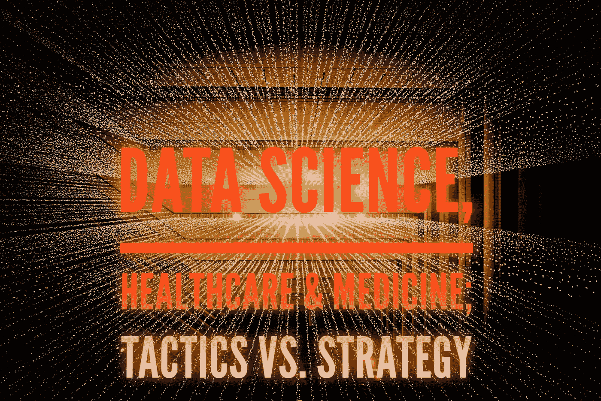

# 数据科学，医学；战术与战略:无主领域的开始

> 原文：<https://medium.datadriveninvestor.com/data-science-medicine-tactics-vs-strategy-the-commencement-of-unclaimed-domain-abdbe8f60195?source=collection_archive---------6----------------------->

Data Science, Medicine; Tactics vs. Strategy: the commencement of unclaimed domain

T 今天，数据科学更多的是关于企业战略，而不是战术服务计划。它仅仅是为了服务于一个行业的财政利润物流。我记得在 2011 年，福布斯说，“每家公司都是软件公司。”截至 2019 年，这一点仍然得到认可。软件应用对企业来说已经变得至关重要。监控绩效已经从战术解决转移到战略需求的满足。

 [## 大技术入侵——数据驱动型投资者塑造了医疗保健的未来

### 在过去的十年里，全球经济的所有部门都经历了大规模的数字颠覆，而卫生部门现在……

www.datadriveninvestor.com](https://www.datadriveninvestor.com/2018/11/02/the-future-of-healthcare-is-being-shaped-by-a-big-tech-invasion/) 

如今，出色的应用程序执行等同于出色的客户体验。然而，如果我们不通过确保用户的最高成就来尊重他们，客户体验将别无选择，只能遭受损失。这适用于所有行业。如今，研究报告依赖于不断变化的数据集，从而影响了它们的分析导数。我们不再认为数据会给出答案，而是认为这是一种过于可信的方式，可以绕过企业正在寻找的反驳。

计算机软件所使用的程序和其他操作系统的不断发展导致了各种解决方案的出现，如软件即服务(SaaS)。这在历史上一直是商业模式概念的一个基本目的，能够说服指向卫生信息商业化的战略改革，因此对其战术含义的应用表现出极大的忽视。

# 回顾历史

历史上的重大创新，如网络公司和微软视窗系统，都是解决方案，旨在以比我们今天意识到的小得多的数量级，在更短的时间内，对眼前的问题提供全面的解决方案。这种战术解决方案需要有限的条例，涵盖了较小但精确的效用范围。90 年代初，微软推出了 Windows 用户界面(UI)和用户体验现代化(UX)，将软件技术的潜力释放给了外行人。这标志着市场开始采用一种工具，这种工具使行业变得非常高效和高度竞争。

网络空间的诞生是走向解决信息分散和获取自由数据的界限的脚步。用户界面、网络和对万维网的访问为开发软件即服务系统创造了一个完美的利基市场。技术革命给千禧一代带来了新的竞争优势。因此，搜索引擎被禁止降低可及性和为企业创造网络流量，激励企业探索作为“在线商店”的网络存在。

社交媒体范式在通过兴趣、特质和生活方式建立虚拟社区和网络方面相对成功，这是战略市场分析和渗透的一个极好工具。

智能手机等移动创新彻底改变了信息技术的便携性、访问、交换和效用。对于要在互联网上共享的数据，为应用程序设计了一组功能和过程，这些应用程序可以轻松地访问操作系统、应用程序或其他服务的功能或数据。随着时间的推移，随着企业集中式数据孤岛(大数据)增长到巨大的数量级，他们向市场引入了人工智能、机器学习和计算机系统进化的概念。他们这样做是为了执行通常需要人类智能的任务，如视觉感知、语音识别、决策和语言之间的翻译。

必须认识到，信息技术的每一个目的，从基本软件到社交媒体和 SAAS 系统到机器学习，都是由大数据产业推动和传播的。因此，大公司将数据挖掘变成了由大公司主导的数万亿美元的市场。

随着时间的推移，软件技术的进步包括有限的互操作性、非专业人员的用户体验的差异，以及通常负责存储和操作数据的内部应用系统(也称为后端功能)的复杂和不透明的性质，导致了数据垄断。中央大数据银行的持有者在金融、政治和社会方面占据上风。

# 软件技术革命和战略变革

随着软件技术的进步，特别是竞争激烈的市场中的大数据，战术解决方案被颠覆，并被过分强调的业务战略所取代，这些战略专门关注其组织的长期财务成功。

实体的秘密生存使命开始包含一个更广泛的范围目标手段，以区分长期利益和旨在实现它们。战略革命是由精心设计和规划引导的，以服务于特定的集体功能或年份。尽管数据分析的战术和战略用途各不相同，但区分它们在医疗保健领域的用途具有明确的重要性。

数据科学、商业策略和病人护理利益冲突医学的异步优势是一门变化科学。个人健康的条件、标准和决定因素总是在变化的。因此，人们可以估计提取和利用信息和统计数据来代表预定决策的影响的大小和性质。我必须说，是的，就在我们说话的时候它正在发生！事实上，与我们的健康相关，我们应该担心如何实现一个结论吗？现在，让我们更进一步！我们应该信任一个不透明的算法程序来完成我们的诊断工作吗？或者由公司数据策略师分析的数据，这些数据策略师的董事会首席执行官相信“如果我们的电子表格不准确，这有关系吗，只要它能给我们提供我们正在寻找的答案？”

# 主导竞争市场的战略捷径

在高度竞争的市场中，垄断只是占上风者的便利问题。毕竟，在企业界，金钱就是一切，对吗？！从金融领域到房地产，再到约会应用，每个行业都变成了软件技术公司。医疗保健不可避免地成为这场改革的一部分，但有一个显著的不同。医疗保健，更准确地说，医生群体，在适应他们的技术领域方面的转变最为缓慢。部分原因是公司和政府实施的战略方法的伪造结果导致医生之间的严重不信任，但主要原因是他们不愿意控制医疗保健领域的战略领导权。

医学界的这种态度造成了一个真空，导致公司的商业战略转移到医生的实践空间。虽然相互关联，但数据业务和科学业务是两种不同的现象。他们决不是由一个非医学的人来研究的，尽管是一个实体。

通过医生和医疗保健提供者明确定义的持续合作，医疗技术行业有可能使医疗实践在更大程度上具有预测性、预防性、精确性和个性化，从而明确定义医疗业务和医疗实践的边界。这将促进医疗保健数据科学摆脱有偏见的主张和验证，否则会有被定制以支持已经错误做出的决策的倾向。

# 战术和战略需要定义和平衡。

平衡医疗保健中的战略和战术，并针对每一个患者案例逐一加以利用，对于避免陷阱和收购不道德的千篇一律的企业医药是必要的。提供个性化护理需要细致的长期和持续的战略规划，为希波克拉底之路铺平道路，同时不断进行战术更新，确保每位患者都能获得最新的定制医疗护理。大数据的概念及其战略和货币价值对大公司来说是不可抗拒的，因为它使它们能够对抗其他竞争对手。但是病人的生命危在旦夕。

# 避免有缺陷的战略，提高生产力

分散健康信息或由任何个人合法拥有数据对于实现和维护合理的安全性是必要的。首先，把属于病人的东西还给他们，将决定他们有价值的信息将如何被使用。这也确保了它对他们的福祉的效用，而不是通过商业垄断的实质来反对他们。

滥用患者数据，特别是在健康信息中，是健康保险便携性和责任法案(HIPAA)规定的目的与真实健康信息隐私之间的差异的产物。

遗憾的是，人们对加密和 HIPAA 如何保护患者数据有很大的误解。它们可能部分用于禁止“第四方”的网络盗窃，但绝不是指“如果您的身份被密封，第三方可以在未经您同意的情况下与另一方共享您的信息。

或者人们也可以假设，只要大数据行业不直接将一个人的识别信息与健康信息相关联，就没有担心的地方。

如果大数据行业通过制定策略来设计一个机器学习算法程序，以识别和连接个人提取的健康数据与 IP 地址、使用全球定位系统的物理地址和使用社交媒体的社交标准等公分母，会怎么样？

> 随着人工智能技术和大数据的进步，不这样想就太天真了。

数据自由和访问未经过滤的信息海洋是互联网背后的最初概念，但这也在发生变化。政治、垄断和企业贪婪正在改变信息技术的面貌，以及未来几年我们获取信息的方式。换句话说，具有选定公司标准的用户可以访问选定的数据。

通过去中心化、个人所有、算法透明和医疗保健领域内各个领域所有者的技术验证来分离数据，尤其是健康信息，对于维护我们医疗保健系统的主权至关重要。个性化的医疗保健交付模式是确保患者安全、优质医疗保健和无国界医疗保健的最终解决方案。