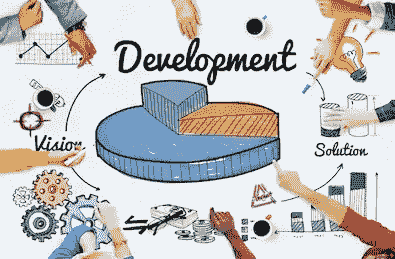
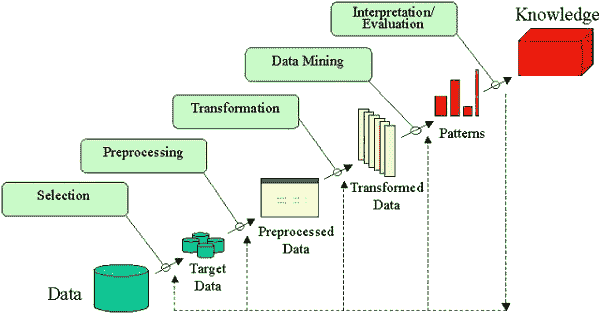
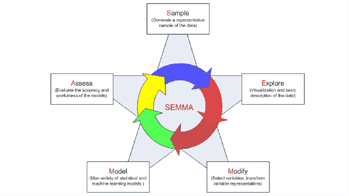
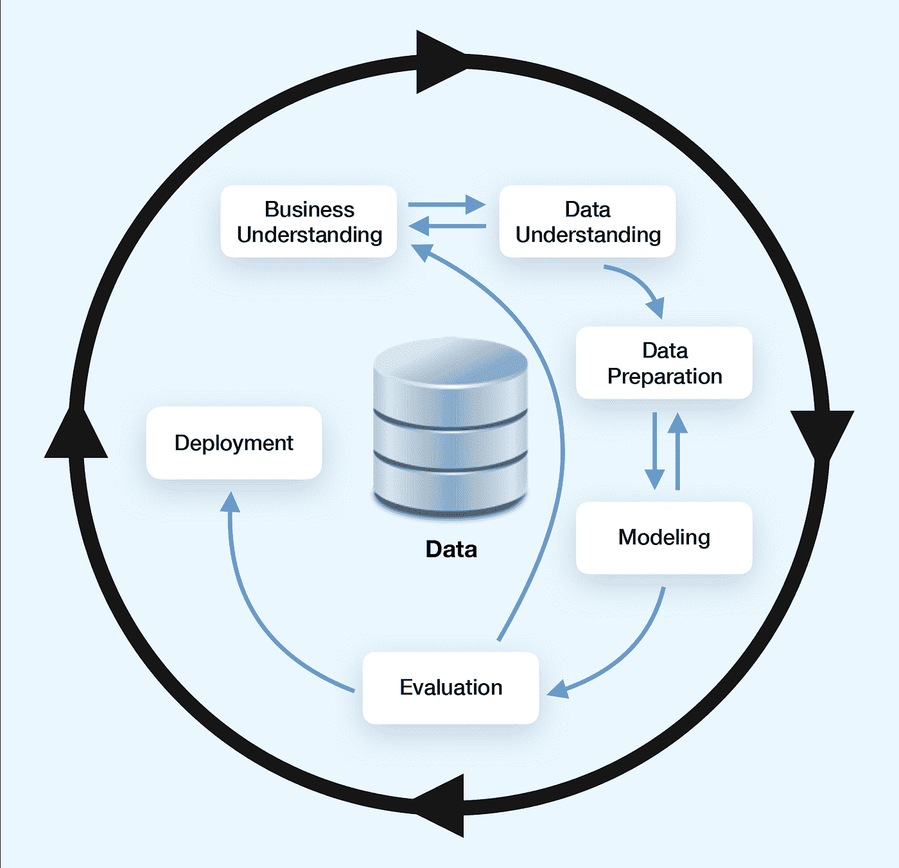
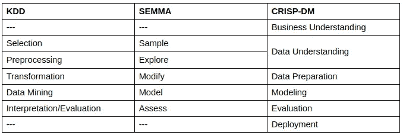

# 数据科学项目管理方法

> 原文：<https://medium.datadriveninvestor.com/data-science-project-management-methodologies-f6913c6b29eb?source=collection_archive---------0----------------------->

# 现有方法概述

有几种数据挖掘过程可以应用于现代数据科学项目。其中最常见的是克里斯普-DM，塞马，KDD。在这篇文章中，我们将回顾和比较它们。

# KDD

数据库中的知识发现，简称 KDD，是一种专家如何从数据中提取模式和/或所需信息的方法。它包括五个阶段—选择、预处理、转换、数据挖掘和解释/评估:

[http://www2.cs.uregina.ca/~dbd/cs831/notes/kdd/kdd.gif](http://www2.cs.uregina.ca/~dbd/cs831/notes/kdd/kdd.gif)

# KDD 的阶段

让我们仔细看看每个阶段。每个阶段都由一组要执行的预定操作组成:

 [## 成为数据科学家所需的 8 项技能|数据驱动型投资者

### 数字吓不倒你？没有什么比一张漂亮的 excel 表更令人满意的了？你会说几种语言…

www.datadriveninvestor.com](https://www.datadriveninvestor.com/2019/02/07/8-skills-you-need-to-become-a-data-scientist/) 

*   **选择** —创建目标数据集，或者关注需要进一步探索的变量或数据样本的子集；
*   **预处理** —目标数据预处理，获得一致的数据；
*   **转换** —使用降维或转换方法的数据转换；
*   **数据挖掘** —根据数据挖掘目标(例如预测)以特定的表示形式搜索感兴趣的模式；
*   **解释/评估** —对挖掘出的模式进行解释和评估。

在循环完成并且所有阶段都完成后，专家具有*评估*信息，该信息指示是否确实获得了*知识*。如果没有，则从使用更新目标的任何阶段开始重复循环，直到达到目标。

# 塞姆马

SEMMA 是下一个流程，我们将对此进行回顾。它的结构与 KDD 类似，但由于它不太专注于特定数据阶段，因此更容易应用于一般的数据科学任务。此外，它有严格的循环性质，不像 KDD。SEMMA 是首字母缩写，代表取样、探索、修改、建模和访问:

[https://slideplayer.com/slide/11825381/](https://slideplayer.com/slide/11825381/)

# 塞马的阶段

**样本** —获取一个大数据集的一部分，该数据集大到足以提取重要信息，小到足以快速操作。

**探索** —数据探索有助于获得理解和想法，并通过搜索趋势和异常来完善发现过程。

**修改** —数据修改阶段侧重于变量的创建、选择和转换，以关注模型选择过程。这个阶段还可能寻找异常值并减少变量的数量。

**模型** —目前有不同的建模技术，每种类型的模型都有其长处，并且适合于数据挖掘的特定目标。

**访问** —这是最后一个阶段，重点是评估调查结果的可靠性和有用性，并评估绩效。

同样，就像在 KDD 一样，SEMMA 不断重复，直到达到设定的目标。

# CRISP-DM

最后但同样重要的是，CRISP-DM。它代表数据挖掘的跨行业标准过程。这种方法最初是在 IBM 为数据挖掘任务开发的，但是我们的数据科学部门发现它对几乎所有的项目都有用。

这个模型与 KDD 和塞马具有相同的循环性质。该结构的关键区别在于阶段之间的转换可以颠倒。因此，如果在建模阶段，专家发现数据不足以解决项目的目标，他们可以返回到数据准备阶段，选择不同的目标变量，生成特征等，而不必返回到周期的开始。

# CRISP-DM 的阶段

下面你可以找到 CRISP-DM 的所有 6 个阶段，如上图所示，它们的子流程，以及每个子流程的输出。

## 商业理解

这一阶段旨在对客户的业务有一个总体的了解。在大多数情况下，理解要开发的产品的应用是至关重要的。如果跳过这一步，你可能会得到一个训练有素的大型神经网络，它必须被部署到手机上并实时工作。

1.  **确定商业目标
    -** 背景
    -商业目标
    -商业成功标准
2.  **评估情况
    -** 资源清单
    -要求、假设和约束
    -风险和意外事件
    -术语
    -成本和收益
3.  **确定目标
    -** 数据挖掘目标
    -数据挖掘成功标准
4.  **制定项目计划
    -** 项目计划
    -工具和技术的初步评估

## 数据理解

第二阶段包括收集和浏览输入数据集。使用输入数据可能无法求解设定的目标，您可能需要使用公共数据集，或者甚至为设定的目标创建一个特定的数据集。

1.  **收集初始数据
    -** 初始数据收集报告
2.  **描述数据
    -** 数据描述报告
3.  **探索数据
    -** 数据探索报告
4.  **验证数据质量
    -** 数据质量报告

## 数据准备

众所周知，不良输入必然导致不良输出。因此，无论你在建模过程中做了什么——如果你在准备数据时犯了重大错误——你最终都会回到这个阶段，从头再来。

1.  **选择数据
    -** 包含/排除的理由
2.  **清洗数据
    -** 数据清洗报告
3.  **构造数据
    -** 派生属性
    -生成记录
4.  **整合数据
    -** 合并数据
5.  **格式化数据
    -** 重新格式化的数据

*   **数据集**
*   **数据集描述**

## 建模

这一阶段是对前一阶段所有发现的执行。您已经知道了模型的输入，您可以判断哪些模型与目标平台兼容。现在是时候让这一切变得鲜活起来了。

1.  **选择建模技术
    -** 建模技术
    -建模假设
2.  **生成测试设计
    -** 测试设计
3.  **建立模型
    -** 参数设置
    -模型
    -模型描述
4.  **评估模型
    -** 模型评估
    -修改参数设置

## 估价

这一阶段旨在评估所获得的结果。我们需要检查业务目标是否实现，并计划项目的进一步步骤。

1.  **评估结果
    -** 根据业务成功标准评估数据挖掘结果
    -批准的模型
2.  **评审流程
    -** 评审流程
3.  **确定后续步骤
    -** 可能行动列表
    -决策

## 部署

如果前面的阶段是成功的，并且做出了部署模型的决定，那么这个阶段将被激活。您可能需要将您的模型放入现有的管道中，创建自己的模型或部署到云计算服务中。

1.  **计划部署
    -** 部署计划
2.  **计划监控和维护
    -** 监控和维护计划
3.  **生成最终报告
    -** 最终报告
    -最终演示
4.  **评审项目
    -** 经验文档

您可能已经注意到，很多输出都是报告。看起来项目的一半时间将花在提交这些报告上，但是这些输出仅仅是建议。你可以做的是在每个阶段创建一份报告，总结调查结果，并让客户跟上进度。

# 方法比较

KDD 和塞马几乎是相同的，KDD 的每一个阶段都直接对应着塞马的一个阶段；CRISP-DM 过程将选择-预处理(KDD)或样本-探索(SEMMA)阶段结合到数据理解阶段。它还包括业务理解和部署阶段。

CRISP-DM 与其他两种方法之间的一个重要区别是，CRISP-DM 中各阶段之间的转换可以颠倒。当你处理真实数据时，这很有帮助——任何失误都可以修复，而不必完成整个循环，如果你明白，选择的目标数据不会导致任何知识。

# 结论

在我看来，如果你只关注数据和建模，你就不能只见树木不见森林。为了摆脱简单的培训模型，并开始为您的客户提供解决方案，我建议在您的项目中使用 CRISP-DM 流程。它不同于其他两个经过审查的数据挖掘过程，增加了业务理解和部署阶段，使该过程看起来不太像*研究*，而更像*现实生活中的产品开发*。

# 链接

您可以在这里找到有关该主题的更多详细信息:

*   [KDD](https://www.google.com/url?q=https://ieeexplore.ieee.org/document/4443341&sa=D&ust=1566293942947000)
*   [塞马](https://www.google.com/url?q=http://support.sas.com/documentation/cdl/en/emcs/66392/HTML/default/viewer.htm%23n0pejm83csbja4n1xueveo2uoujy.htm&sa=D&ust=1566293942948000)
*   CRISP-DM 指南[*FTP://public . dhe . IBM . com/software/analytics/SPSS/documentation/modeler/18.0/ru/modelercrispdm . pdf*]
*   [CRISP-DM](https://www.google.com/url?q=https://www.the-modeling-agency.com/crisp-dm.pdf&sa=D&ust=1566293942948000)

*撰稿* [*纳迪亚皮沃瓦尔*](https://www.linkedin.com/in/nadiia-pyvovar/) *校对* [*克莱姆扬科维奇*](http://www.linkedin.com/in/kyamkovyi)**马里亚纳韦奇科**