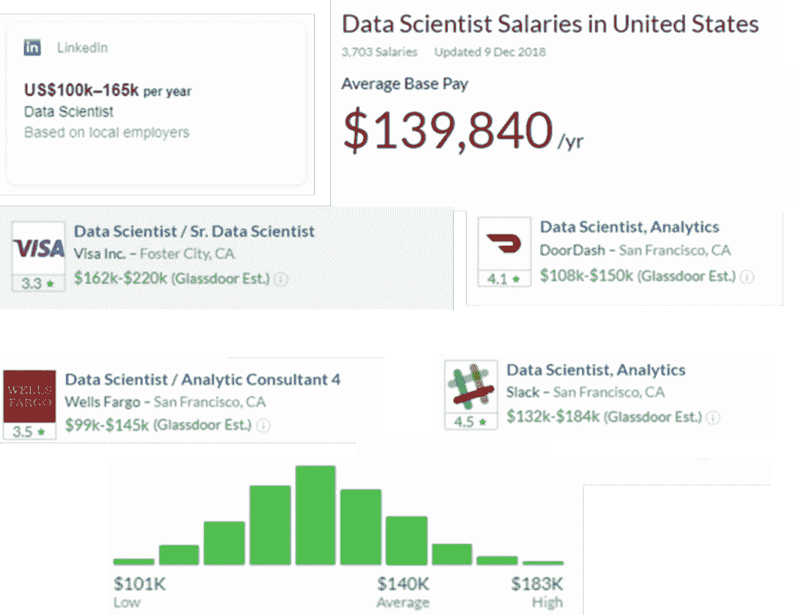

# 数据科学家:为什么雇佣他们这么贵？

> 原文：<https://medium.datadriveninvestor.com/data-scientists-why-are-they-so-expensive-to-hire-9bb4dbcee8f7?source=collection_archive---------36----------------------->

当你听到“数据科学家”这个职位时，你会想到什么？可能不是一脸严峻的寒酸白领。对吗？

也许这就是为什么《哈佛商业评论》将“数据科学家”称为“21 世纪最性感的工作”。他们写道，“如果‘性感’意味着拥有非常抢手的稀有品质，那么数据科学家已经在那里了。雇佣他们很难，而且成本很高，考虑到他们的服务市场竞争非常激烈，留住他们也很困难。”

数据科学家是受过培训的技术专业人员，他们有好奇心在数据世界中进行发现。尽管“数据科学家”一词最近在 Linkedin 上成为任何从事数据工作的人的热门选择，但这个领域本身并不新鲜。在 HBR 发表这篇文章时，数千名数据科学家已经在创业公司和公司工作。此外，让计算机像人类一样智能的目标已经追求了近四分之一世纪。数据科学家最近变得如此受欢迎有多种原因。首先，自从开始流行以来，公司一直在收集越来越多的数据，这在很大程度上是由于大型科技公司成功地从他们收集的数据中获利，其次是由于技术的进步使这种数据收集变得经济。

# 大量的数据现在随时可用，只等着分析:

各行各业的大多数大公司现在都可以获得大量的数据，但许多公司并没有以高效和多产的方式使用这些数据。然而，公司现在开始意识到，他们需要利用目前可以通过公司数据库访问的大量数据。多少数据？44 万亿千兆字节，而 2013 年仅为 4.4 万亿。

数据的数量和种类为有技能利用数据的人和收集数据的企业创造了机会。然而，该行业正面临技能和专业知识的短缺，这些技能和专业知识是处理寻求利用其丰富数据的公司不断增长的需求所必需的。以至于即使是在大学学习计算机科学和技术课程的人也被迫在工作场所从事高要求的数据分析工作。

# 具有数据科学技能的人员结构性短缺:

根据加州大学河滨分校的统计数据，1/3 的美国新闻&世界报道全球 100 强大学提供数据科学学位。在这 29 所大学中，只有 6 所大学在本科阶段提供数据科学课程；剩下的都是研究生学历。这些数据科学项目的平均班级规模只有 23 名学生。加州大学预测，在数量已经有限的提供数据科学课程的大学中，小班教学不太可能“在缩小全球数据科学人才缺口方面产生有意义的影响”。用简单的经济学术语来说，需求超过了供给，在这种情况下，远远超过了供给。2017 年，IBM 预测，到 2020 年，每年对新数据科学家、数据开发人员和数据工程师的需求将达到近 70 万个空缺。因此，一所大学仅有 23 名学生，所有提供数据科学课程的大学大约有 700 名毕业生，这无法满足对数据科学技能人才快速增长的需求。

2018 年，初级数据科学家的平均工资为 11.5 万美元，管理 10-15 人团队的人可以要求高达 35 万美元的工资。与此同时，数据科学家的平均工作年限从 2014 年的 9 年降至 2015 年的 6 年。到 2019 年，全球对数据科学家的需求预计将超过供应 50%以上。超过 40%的公司认为他们无法招募数据科学家，这阻碍了他们的竞争力，难怪超过 60%的企业在内部培训员工。

Andrew Ng Promoting Coursera

# 填补空白的两种解决方案:

有两种主要方法可以帮助缓解这种技能短缺。首先，人工智能超级明星吴恩达(Andrew NG)倡导的一项措施是利用 MOOCs(大规模开放在线课程)等非传统方法培养更多的数据科学家。虽然对于当前的开发人员和其他以数据为中心的员工来说，这是一个“提高技能”的好方法，但它还不是更大问题的解决方案。我说“还”是因为这从根本上要求行为的改变。雇主还没有足够重视这种类型的教育；许多雇主在招聘时仍然只关注名牌大学。虽然这种心态正在慢慢改变，但还不足以在中短期内解决问题。

第二种方法是让更多没有数据科学技能的人能够轻松地将这些复杂的技术应用于公司数据。本质上，让人工智能和机器学习解决自己的问题。通过使用过去几年开发的技术(包括这里的 [MindsDB](http://mindsdb.com) ),有可能模仿数据科学家，这样即使是非技术人员也可以通过几行代码或几次点击来执行数据分析。

这两种解决方案并不相互排斥，它们将协同帮助公司以更有意义的方式使用数据，从而节省成本和/或推动增长和收入。为了有效地实现这一点，组织内部需要进行文化变革，从而制定更好的招聘政策，并更好地利用工具和软件来解决他们面临的许多数据问题，而无需增加员工人数和聘请昂贵的数据科学家。

*亚当·卡里根是* [*MindsDB*](http://mindsdb.com/) *的联合创始人，这是一个易于使用的工具，可以将机器学习添加到您的项目和数据挑战中。关注我的* [*推特*](https://twitter.com/adammcarrigan)

*您也可以关注我们项目上的*[*GitHub*](https://github.com/mindsdb/mindsdb#mindsdb)*和* [*Twitter*](https://twitter.com/MindsDB)