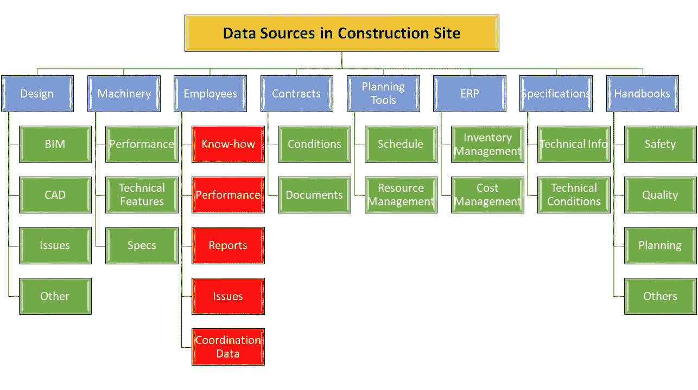

# 建筑项目中的数据源

> 原文：<https://medium.datadriveninvestor.com/data-sources-in-a-construction-project-fac6b952c453?source=collection_archive---------5----------------------->

我想你听说过数据是新的石油。像谷歌、脸书、亚马逊这样的公司是以数据为中心的公司的好例子。但你不应该认为数据只是在线业务中的重要因素。数据扰乱了所有部门。

**数据 vs 经验**

我总是在思考经验的模型化。在我职业生涯的最初几年，我在一家建筑公司工作，高级工程师根据他们的经验做出一些估计。是的，这些估计相当不错。当我分析它时，它基本上是关于多年来收集的数据。例如，在我的硕士论文中，我试图在不同类型的建设项目中建立成本-工期关系模型。因此，我使用历史数据构建了项目成本和持续时间之间的经验关系。

另一方面，一次经历可能会有偏差。不好的经历会对评估产生重要的影响。人们喜欢用一小部分数据和对过去经历的感受来做结论。这种方法可能是实用的，但同时也会造成误判。

数据分析对于做出更好的决策至关重要。当然，在这一点上还有其他一些问题。你怎么收集数据，数据的分类，哪个算法比较好。

对于一个糟糕的决定，你可以责怪一个人，但你怎么能责怪一个算法呢？谁来负责？

如今，我们可以更容易地获取数据。我们也有足够的技术和算法来分析这些数据。所以这种体验开始成为数据分析的基准。

**建筑行业数据**

一个建设项目一般是混乱的，生产是暂时的。因此，防止错误和提高生产率并不容易。再者，经验在施工现场起着至关重要的作用。如果体验是关键的，我们必须找到一种方法来模拟这种体验。

由于新的软件技术，设计、文件和规划逻辑的数字化已经实现。尤其是建筑信息模型(BIM)将数据收集从设计带到了一个新的阶段。

项目的主要数据来源包括设计、机械、员工、合同、计划工具、ERP、规范和手册。当然，这些来源的数量可能会因项目而异。

正如我提到的，在 BIM 和文档管理软件等技术的帮助下，设计信息已经变得可以访问。

机器信息可以借助物联网实时到达。此外，高层次的数据流可以通过机器人技术实现。

合同、规范、手册可以通过文档管理软件进行搜索管理。

规划和 ERP 已经建立在结构化数据系统之上。这些系统中的数据很容易分析。

在我看来，最关键的一点是到达员工产生的数据。不幸的是，我们对这些数据的访问非常有限。

**员工产生哪些数据？**

基本上，他们产生关于经验、知识、绩效、他们面临的问题、他们找到的解决方案和协调问题的数据。扇区中有一个数据流，仅由报告和注释组成。因此，该部门在每个项目中都失去了一些经验和专门知识。

Short presemtation about Data Sources in Construction Sector

我们作为[伯特莫尔科技](http://www.botmore.co.uk)正在研究解决这个问题的方案。如果你想了解更多，请联系我。

【aydin.ozcekic@botmore.co.uk 