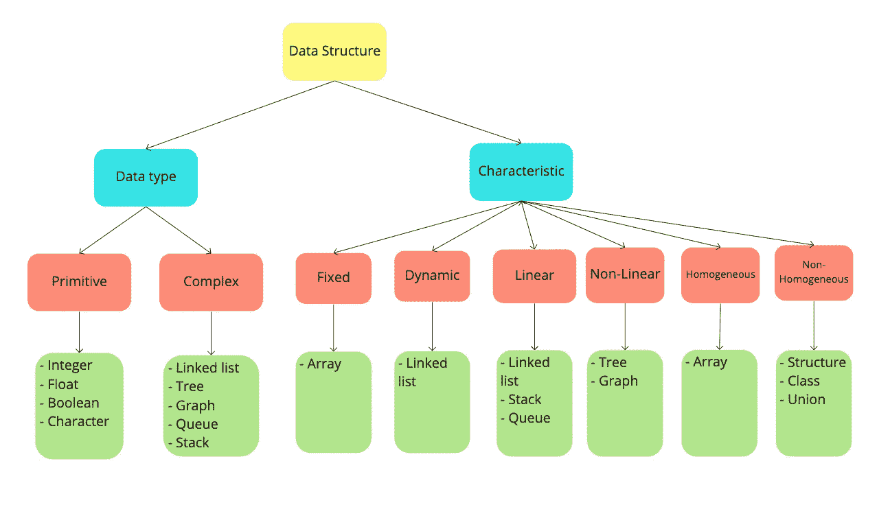

# 数据结构和算法

> 原文：<https://medium.datadriveninvestor.com/data-structure-and-algorithms-96127cc1b09f?source=collection_archive---------8----------------------->

数据结构和算法，我们通常听说过这些术语，我们知道它们对于成为更好的软件工程师、问题解决者或其他什么人来说很重要，但是大多数时候，我们使用的语言为我们提供了内置的方法和对象，使实现一切对我们来说都很容易，我们没有机会了解在数据结构和算法对每一步都很重要的场景背后发生了什么，或者有时为了解决一个问题， 我们需要在不使用内置方法的情况下实现我们的解决方案，因为这将提高性能，或者适应我们系统中的数据量，同样，数据结构和算法将帮助我们实现这一点。 对我来说，我认为学习数据结构和算法是很重要的，即使你使用一种强大的语言，如 C++、Java 或任何其他强大的语言，因为学习它们有助于你理解代码中发生的一切的机制，并为你提供代码性能的指标，我喜欢与你分享我对数据结构和算法的想法以及我对它们的所有了解，让我们开始吧。

 [## 2019 年最值得学习的编码语言|数据驱动的投资者

### 在我读大学的那几年，我跳过了很多次夜游去学习 Java，希望有一天它能帮助我在…

www.datadriveninvestor.com](https://www.datadriveninvestor.com/2019/02/21/best-coding-languages-to-learn-in-2019/) 

**数据结构，**我们可以将定义为一种在内存中收集和组织数据的方式，这种方式将使得对数据执行操作更加高效和容易。

因此，我们可以对任何可以存储数据的东西说数据结构，我认为对数据结构进行分类将有助于我们更好地理解它。

**数据结构可以根据以下两点进行分类:-**

1-数据类型。

2-数据结构本身的特征。

**数据结构(根据数据类型):-**

*   原始数据结构，如整数、浮点、布尔、字符等
*   **复杂的数据结构**如链表、树、图、队列、堆栈等

**数据结构(根据其特点):-**

*   **线性，**数据以线性顺序排列(例如:数组)
*   **非线性，**数据以非线性顺序排列(例如:树)
*   **同质，**其中所有数据元素都来自同一类型(例如:数组)
*   **非同质，**其中所有数据元素都来自不同的类型(例如:结构)
*   **固定**数据占用固定数量的内存位置(例如:数组)
*   **动态**根据执行过程中的需要，数据占用可变数量的内存位置(例如:链表)

现在，我们对什么是数据结构有了一个概念？，算法呢？

我们可以将任意**算法**定义为一组有限的指令，只代表核心逻辑，而不是整个代码，用来解决预先定义的任务或问题。

现在，我想我们需要问几个问题

**任何算法都有哪些组成部分？**

*   输入:算法应该有零个或多个输入。
*   输出:算法应该有一个或多个输出。
*   步骤:任何算法都有一组有限的步骤，每一步都必须定义明确，并有清晰正确的输出。

**什么时候可以认为算法高效？**

如果该算法在其执行期间直到完成时消耗更少的时间和更少的存储器位置，则该算法被认为是高效的并且具有高性能，并且这突出了术语“**时间复杂度**和“**空间复杂度**”，并且使它们浮出水面以理解任何算法的性能。

接下来:[渐近注释和算法复杂性](https://medium.com/datadriveninvestor/asymptotic-annotation-and-algorithm-complexity-8825eec87d24)