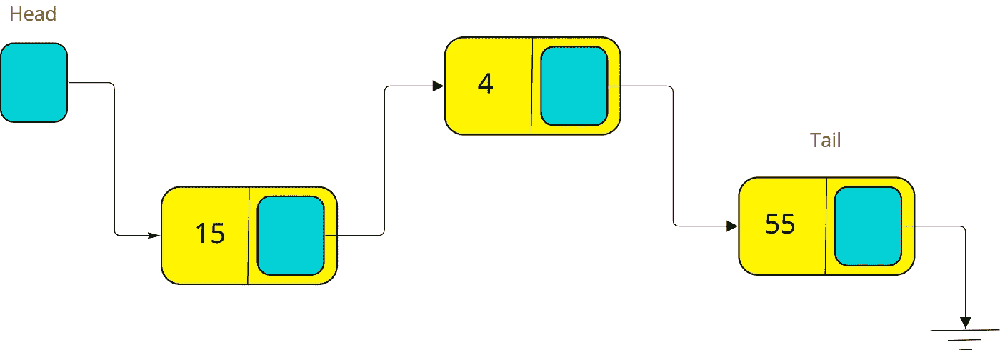
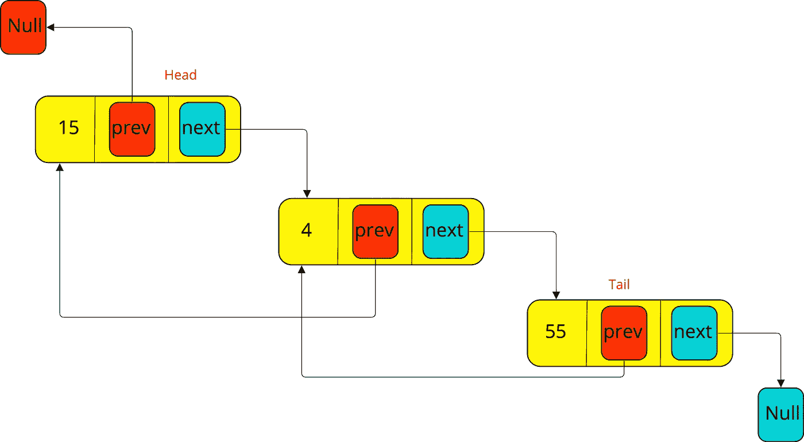
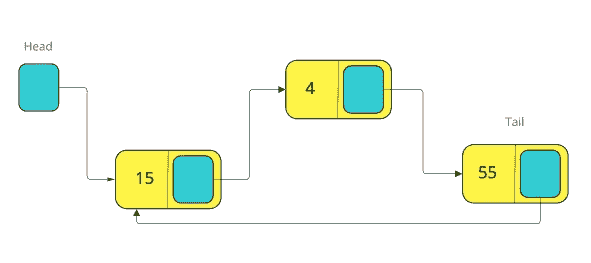
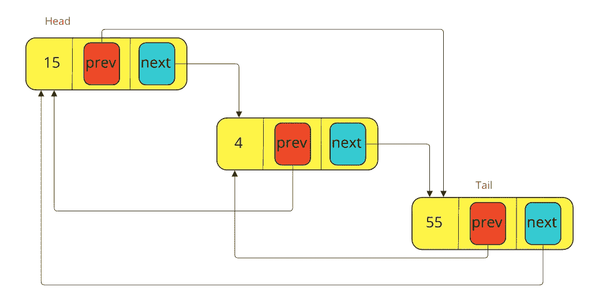

# 数据结构—链表

> 原文：<https://medium.datadriveninvestor.com/data-structure-linked-list-6007ab2cbe9b?source=collection_archive---------2----------------------->

在这篇文章中，我们将讨论链表作为一种数据结构，我将尝试将其作为一个问题和答案，让我们开始。

 [## 2019 年最值得学习的编码语言|数据驱动的投资者

### 在我读大学的那几年，我跳过了很多次夜游去学习 Java，希望有一天它能帮助我在…

www.datadriveninvestor.com](https://www.datadriveninvestor.com/2019/02/21/best-coding-languages-to-learn-in-2019/) 

**什么是链表？**

我们可以将一个链表定义为一个对象的集合，这些对象被动态随机地存储在内存中。

链表中的每个对象称为**节点**。

**每个节点由两部分组成:-**

*   **数据:**可以包含原始数据类型(int，float，…等。)或对象，数据被认为是我们想要存储的实际信息。
*   **链接:**它是一个指针，指向或包含下一个节点的地址。

如前所述，链表节点以随机和动态的方式存储在内存中，它们通过每个节点内部的链接部分链接在一起。

**链表的大小是多少？**

链表的大小是动态的，取决于内存大小。

链接列表不能包含空节点。

**任何链表都有两个主节点:-**

*   **头**节点:链表中的第一个节点。
*   **尾**节点:链表中的最后一个节点。

**为什么要用链表而不是数组？**

链表克服了数组的缺点，这些缺点是

*   必须知道并定义数组的大小。
*   数组的大小是固定的，不能改变。
*   数组元素按顺序存储在内存中。

**链表有哪些类型？**

*   单向链表。
*   双向链表。
*   循环链表。
*   循环双向链表。

# 单链表:-

单链表是元素或节点的有序集合。

节点，正如我们以前说过的，它由两部分组成:-

*   数据部分。
*   链接部分。

在单链表中，节点只向一个方向移动，因为每个节点中的链接部分只有下一个节点的地址，最后一个节点有一个指向下一个节点的空指针。

**可以在单链表上完成的操作:-**

*   在开头插入。
*   插在最后。
*   在特定节点后插入。
*   从头删除。
*   从末尾删除。
*   删除特定节点后。
*   搜索一个节点。

# **双向链表:-**

双向链表和单向链表是一样的，但是双向链表中的每个节点由三部分组成，而不是两部分。

**双向链表中节点的组成:-**

*   数据部分:我们想要存储的实际信息。
*   下一个指针部分:下一个节点的地址。
*   **前一个指针**部分:前一个节点的地址。

双向链表和单向链表一样，有头节点和尾节点。

*   头节点有一个空的前一个指针。
*   尾节点的下一个指针为空。

由于每个节点中的前一个指针，双向链表比单向链表消耗更多的内存位置。

**可以在双向链表上完成的过程:-**

*   在开头插入。
*   插在最后。
*   插入特定的节点。
*   从头删除。
*   从末尾删除。
*   从特定节点删除。
*   搜索一个节点。

# **循环单链表:-**

循环单链表在所有方面都与单链表相似，除了:-

*   单链表中的最后一个节点有一个指向下一个节点的空 next 指针，但是在循环单链表中，最后一个节点的 next 指针将指向链表中的第一个节点。

在循环单链表中，没有空的 next 指针，也没有开始或开始节点，这意味着一个链表可能有多个开始节点，对于每个开始，都有一个拥有 next 指针的结束节点拥有他的开始节点的地址。

循环单链表的内存管理与单链表相同。

**可以在循环单链表上完成的过程:-**

*   在开头插入。
*   插在最后。
*   从头删除。
*   从末尾删除。
*   搜索一个节点。

# **循环双向链表:-**

循环双向链表在所有方面都与双向链表相似，除了

*   双向链表中的最后一个节点有一个指向下一个节点的空 next 指针，但是在循环双向链表中，最后一个节点的 next 指针会指向链表中的第一个节点。
*   双向链表中的第一个节点有一个指向前一个节点的空 previous 指针，但是在循环双向链表中，第一个节点中的 previous 指针将指向链表中的最后一个节点。

在循环双向链表中，没有空的下一个指针或空的上一个指针。

循环双向链表的内存管理与双向链表相同。

**可以在循环双向链表上完成的进程:-**

*   在开头插入。
*   插在最后。
*   从头删除。
*   从末尾删除。
*   搜索一个节点。

请随意查看这个 git 存储库[以了解我们如何使用 Java 中的类(不是内置函数)实现不同类型的链表。](https://github.com/hebatarek1989/data_structure_algorithms/tree/master/src/LearnDataStructureLinkedList)

先前:[数据结构—数组](https://medium.com/datadriveninvestor/data-structures-array-796f39412d24)

接下来:[数据结构—堆栈](https://medium.com/datadriveninvestor/data-structure-stack-53a40abfc8f4)