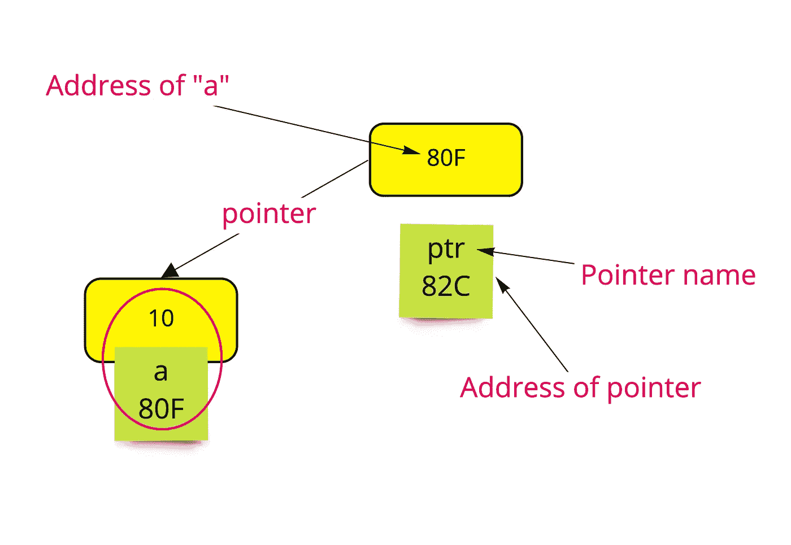

# 数据结构—指针

> 原文：<https://medium.datadriveninvestor.com/data-structure-pointers-b75b0d04169?source=collection_archive---------1----------------------->

在本文中，我们将讨论一种类型的数据结构，它被称为“**指针**，我们将重点了解它是什么以及它的特征。

**指针**在 C 和 C++这样的语言中非常重要，因为它们有助于提高一些任务的性能，比如动态内存分配。

[](https://www.datadriveninvestor.com/2019/03/25/a-programmers-guide-to-creating-an-eclectic-bookshelf/) [## 创建折衷书架的程序员指南|数据驱动的投资者

### 每个开发者都应该有一个书架。他的内阁中可能的文本集合是无数的，但不是每一个集合…

www.datadriveninvestor.com](https://www.datadriveninvestor.com/2019/03/25/a-programmers-guide-to-creating-an-eclectic-bookshelf/) 

我们可以通过回答“**什么是指针”这个问题来定义它们**

我们处理的任何变量都有一个内存位置(地址)来存储它的值，而指针就像是一个变量，它保存着该变量的内存地址。

如果我们有一个变量“**a**”→它的地址将表示为“ **& a** ”。

指向变量地址的指针是“ **p** ”。

```
p=&a; //the variable "**p"** stores the address of variable "**a"**
```

如果我们想使用地址访问变量" **a** "的值，如下所示:-

```
***(&a)** or ***p**
```

strike ( ***** )用于访问变量( **a** )地址中的值。

下一张图可以让你明白指针的意思。



在 C 语言中，当我们声明一个指针时，它遵循以下格式:-

```
type *var-name;
```

码头:-

*   **类型**是指针访问的数据类型。
*   **var_name** 是指针的名称
*   敲击( ***** )表示我们将访问指针中存储的地址的值。

**例如:-**

```
int a = 10;int *p;p=&a; //p holds the address of a// *p will equal to *(&a) which equals (10)
```

# **空指针:-**

最好在我们初始化的时候把 **null** 赋给指针，这个指针可以访问的值就会是**零**。

```
int *p = null;// here the pointer (p) points to nowhere in memory, so the value that can be accessed by it is zero.
```

现在，我们可以用指针做什么？

*   我们可以使用指针作为函数的参数或者返回值。
*   我们可以创建一个指针数组，这个数组将像普通数组一样，但是它的元素来自指针类型。
*   我们可以使用指针的指针，意思是:-

```
int a = 10;int b = &a;int p = &b;
```

**其中:-**

( ****p)** 的值如下:-

```
**P = *(*p) = *(*(&b)) = *(&a) = 10;
```

请随意查看[这个 git 库](https://github.com/hebatarek1989/DS_pointers)来了解我们如何使用指针。

上一篇:[排序算法—第 3 部分](https://medium.com/datadriveninvestor/sorting-algorithms-part-3-979a0c9fd935)

接下来:[数据结构—数组](https://medium.com/datadriveninvestor/data-structures-array-796f39412d24)