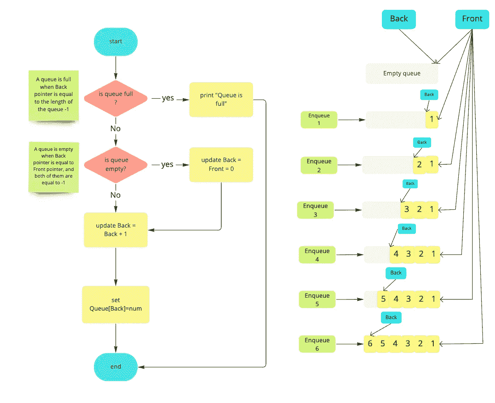
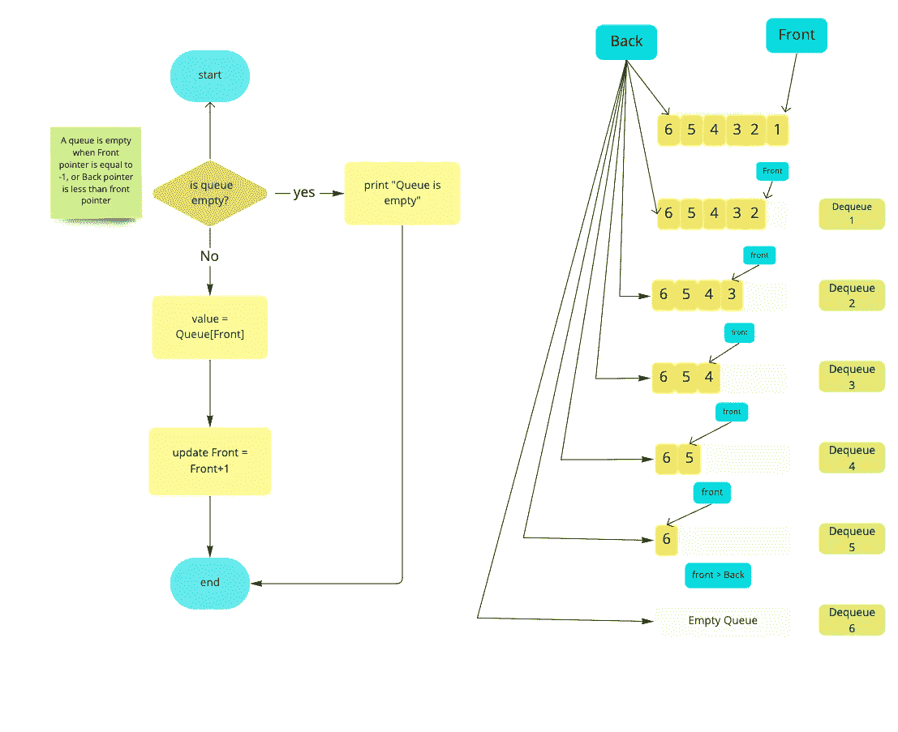
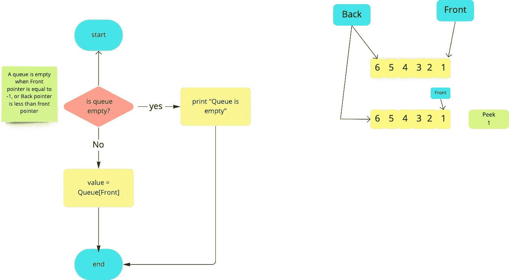

# 数据结构—队列

> 原文：<https://medium.datadriveninvestor.com/data-structure-queue-5636a9ee7237?source=collection_archive---------8----------------------->

在本文中，我们将把队列作为一种数据结构来讨论，并且我们将知道如何实现它。

**队列**可以定义为数据的有序列表，和栈一样。

[](https://www.datadriveninvestor.com/2019/03/25/a-programmers-guide-to-creating-an-eclectic-bookshelf/) [## 创建折衷书架的程序员指南|数据驱动的投资者

### 每个开发者都应该有一个书架。他的内阁中可能的文本集合是无数的，但不是每一个集合…

www.datadriveninvestor.com](https://www.datadriveninvestor.com/2019/03/25/a-programmers-guide-to-creating-an-eclectic-bookshelf/) 

此外，队列被定义为**先进先出列表(FIFO)，**，这意味着添加到队列中的第一个元素将是从队列中移除的第一个元素。

**一个队列**有两个指针指向它的两端:-

*   前指针将第一个元素的地址添加到队列中。
*   **反向指针**将最后一个元素的地址添加到队列中。

对队列的插入操作称为“ **Enqueue** ”，从后指针的末端开始执行，在这个操作中，后指针将被更新。

从队列中删除的操作称为“**出列**”，从前端指针的末尾开始执行，在这个操作中，前端指针将被更新。

下图可以解释入队/出队操作以及后指针和前指针:-

**可以对队列执行哪些操作？**

*   **Enqueue:** 向队列中添加一个元素，从后指针的末尾开始做，后指针将被更新。
*   **出列:**从队列中删除第一个元素，从前端指针的末尾完成，前端指针将被更新。
*   **Peek:** 返回添加到队列中的第一个元素，但不删除它，在这种情况下，前端指针不会更新。

我们怎样才能实现队列？

*   **使用数组**:如果队列大小固定。
*   **使用链表:**如果队列的大小是动态的。
*   **使用栈**(我们会在接下来的文章中讲到)。

**入队操作的伪代码:-**

```
**Step 1:** IF BACK = MAX — 1 #MAX is length of the queue
Write "Queue is Full"
Go to step 4
[END OF IF]**Step 2:** IF FRONT = -1 and BACK = -1 # empty queueu
SET FRONT = BACK = 0 
ELSE
SET BACK = BACK + 1 
[END OF IF]**Step 3:** Set QUEUE[BACK] = NUM**Step 4:** EXIT
```



**出列操作的伪代码:-**

```
**Step 1:** IF FRONT = -1 or FRONT > BACK
Write "Queue is empty"
Go to step 2
ELSE 
SET VAL = QUEUE[FRONT]
SET FRONT = FRONT + 1 
[END OF IF]**Step 2:** EXIT
```



**扫视操作的伪代码:-**

```
**Step 1:** IF FRONT = -1 or FRONT > BACK
Write "Queue is empty"
Go to step 2
ELSE 
SET VAL = QUEUE[FRONT]
RETURN VAL
[END OF IF]**Step 2:** EXIT
```



请随意查看这个 git 库，了解如何以不同的方式实现堆栈。

先前:[数据结构—堆栈](https://medium.com/datadriveninvestor/data-structure-stack-53a40abfc8f4)