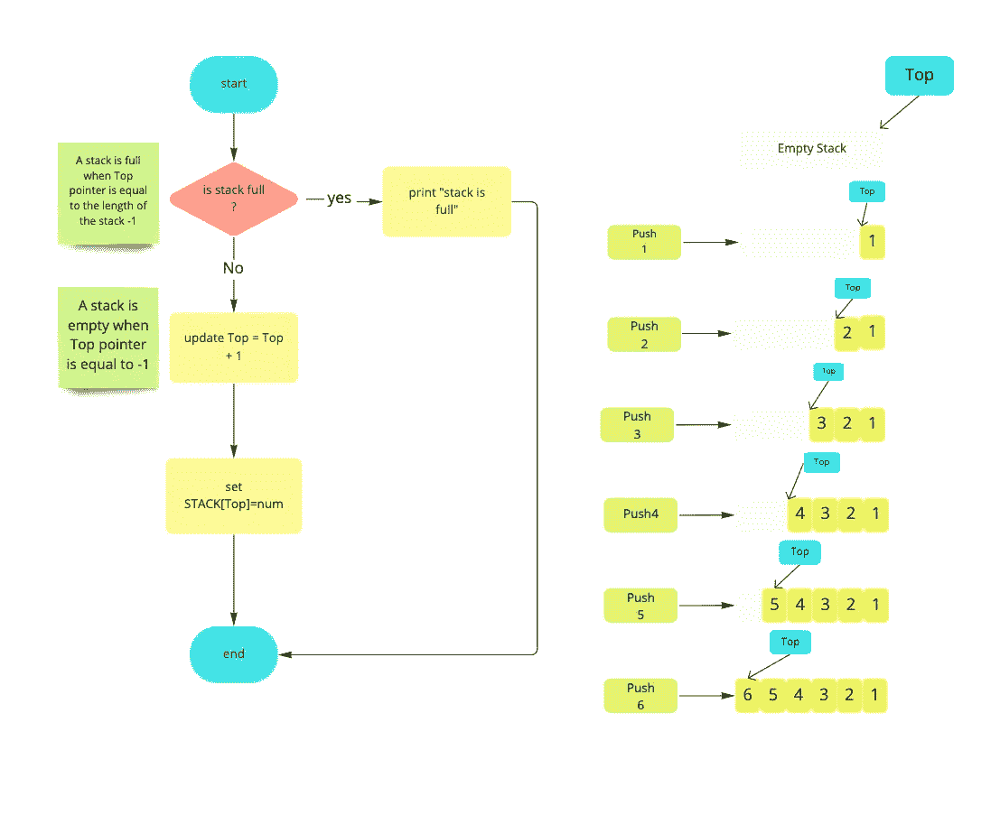
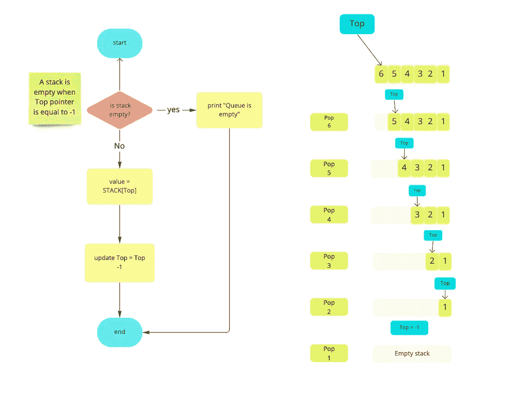
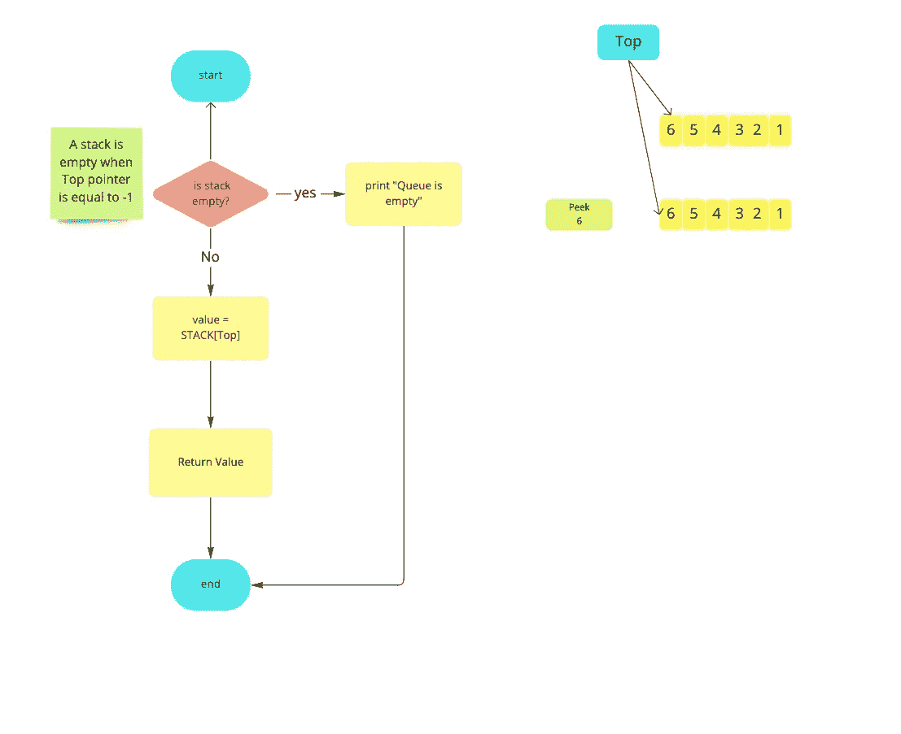

# 数据结构—堆栈

> 原文：<https://medium.datadriveninvestor.com/data-structure-stack-53a40abfc8f4?source=collection_archive---------11----------------------->

在本文中，我们将把堆栈作为一种数据结构来讨论，我们将知道如何实现它。

**堆栈**可以定义为数据的有序列表。

此外，堆栈被定义为**后进先出列表(LIFO)，**，这意味着添加到堆栈中的最后一个元素将是从堆栈中移除的第一个元素。

[](https://www.datadriveninvestor.com/2019/02/21/best-coding-languages-to-learn-in-2019/) [## 2019 年最值得学习的编码语言|数据驱动的投资者

### 在我读大学的那几年，我跳过了很多次夜游去学习 Java，希望有一天它能帮助我在…

www.datadriveninvestor.com](https://www.datadriveninvestor.com/2019/02/21/best-coding-languages-to-learn-in-2019/) 

一个堆栈有一个指针，指向最后插入堆栈的元素的地址，我们称之为“**顶指针**”。

在堆栈中，插入和移除操作可以在其中的最后一个元素上执行，因为顶部指针指向它。

元素插入到栈顶称为“ **push** ”，元素从栈顶移除称为“ **pop** ”。

顶部指针的值随着 push 操作(值增加)和 pop 操作(值减少)而更新。

下图可以解释推动/弹出操作和顶部指针:-

**栈上可以执行的操作有哪些？**

*   **推送:**在顶部添加一个元素。
*   **弹出:**从顶部移除一个元素。
*   **Peek:** 返回添加到堆栈中的最后一个元素，但不删除它，在这种情况下，顶部指针不会更新。

**我们如何实现堆栈？**

*   **使用数组**:如果栈的大小是固定的。
*   **使用链表:**如果栈的大小是动态的。
*   **使用队列**(我们会在接下来的文章中谈到)。

**推送操作的伪代码:-**

```
**STEP 1: IF** TOP = MAX -1 
PRINT "stack is full";
GO to STEP 4;
**END IF
STEP 2:** TOP = TOP + 1; // top is the top pointer
**STEP 3:** STACK[TOP] = NUM; **STEP 4: EXIT**
```



**弹出操作的伪代码:-**

```
**STEP 1: IF** TOP = -1
PRINT "stack is empty";
GO to STEP 4;
**END IF
STEP 2: VAL =** STACK[TOP];
**STEP 3:** TOP = TOP - 1; **STEP 4: EXIT**
```



**扫视操作的伪代码:-**

```
**STEP 1: IF** TOP = -1
PRINT "stack is empty";
GO to STEP 4;
**END IF
STEP 2: VAL =** STACK[TOP];
**STEP 3:** RETUEN VAL; **STEP 4: EXIT**
```



请随意查看这个 git 库，了解如何以不同的方式实现堆栈。

上一页:[数据结构—链表](https://medium.com/datadriveninvestor/data-structure-linked-list-6007ab2cbe9b)

接下来:[数据结构—队列](https://medium.com/datadriveninvestor/data-structure-queue-5636a9ee7237)