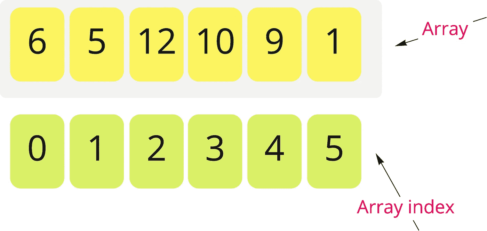
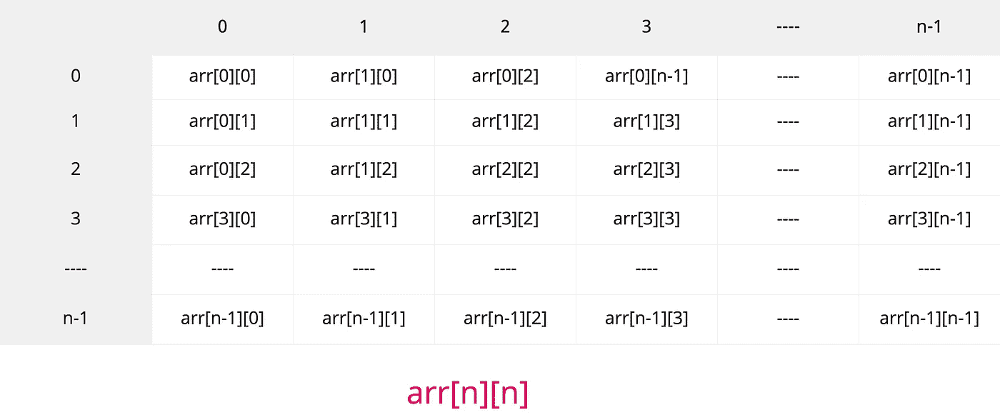
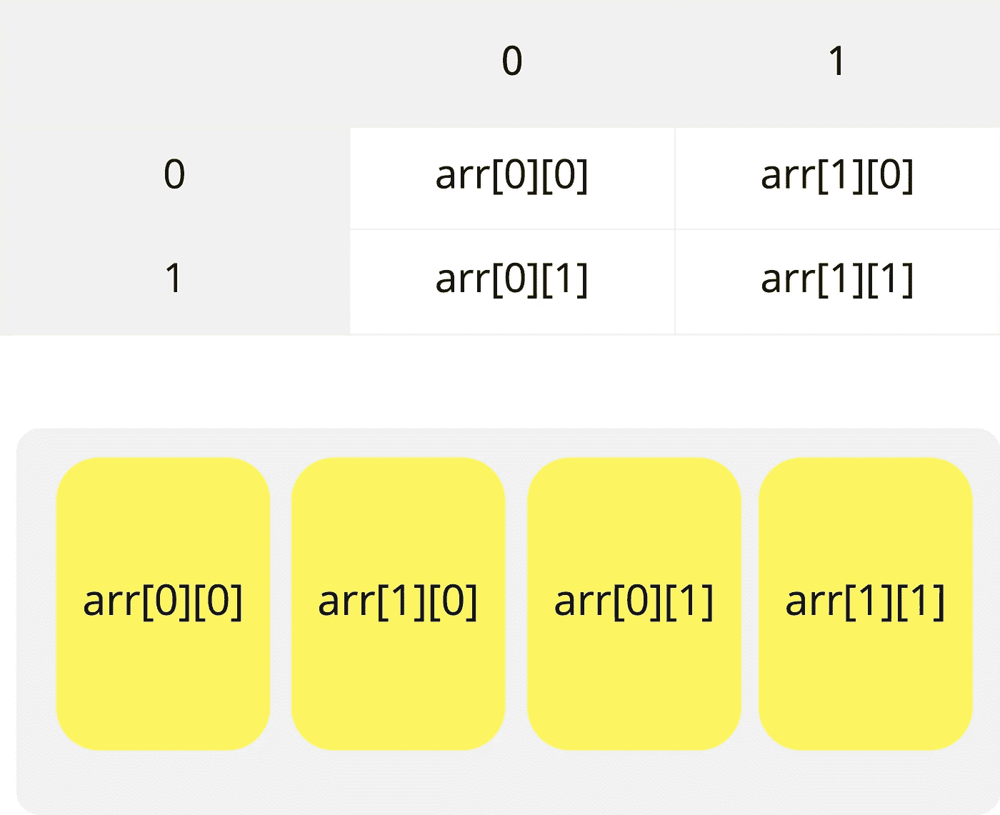

# 数据结构—数组

> 原文：<https://medium.datadriveninvestor.com/data-structures-array-796f39412d24?source=collection_archive---------10----------------------->

在本文中，我们将把数组作为我们可以处理的最简单的数据结构来讨论。

**数组**是一种数据结构，用于存储相似类型的数据。

我们需要一个数组，以防我们有大量相同类型的数据，并希望将它们存储在内存中。在正常情况下，我们需要大量的变量来存储这些数据。

但是**使用数组**将帮助我们将所有数据存储在一个变量中。

**数组元素**存储在一系列内存位置中，数组中的第一个元素将存储在最低的内存位置，并被称为**基址**。

在大多数编程语言中，数组是零索引的，这意味着如果数组有 n 个元素，第一个元素将在索引中，第二个元素将在索引中，直到最后一个元素在索引中。

## 我们如何声明一个数组？

声明一个数组取决于编程语言是否是严格类型，但是假设它是一种严格类型编程语言:-

```
type array_name[size];
```

示例:-

```
int arr[3]
//“arr” -> array_name
// 3 -> array with size
//int -> means that that array will have only integers
```

## 我们如何访问数组内部的元素？

我们可以通过索引来访问数组中的元素。

示例:

```
var = arr[1]
/*
we want to access the second element, because “arr” is zero index array.
*/
```



下面是一段 Java 代码，可以解释如何在数组中设置数据，以及如何恢复它们以便以后使用。

```
private static void setArrayElements(int[] arr, int n) {
   for(int i=0;i<n;i++){
      arr[i] = i+5;
   } 
}private static void printElemnt(int[] arr, int n) { 
   for(int i=0;i<n;i++){ 
      System.out.printf("element index = %d, element value =%d\n",i,arr[i]); 
   } 
}
```

# 二维**数组:-**

二维数组可以定义为数组的数组，这意味着 2D 数组有点像矩阵，数据将按行和列排序。

2D 数组是数据库表的人工表示。

我们如何声明一个 2D 数组？

```
type array_name[rows size][columns size]; 
```

示例:-

```
int arr[3][5]
//“arr”->array name
//3 -> number of rows
//5 -> number of columns
//int -> data type is integer
```

## 如何访问数组内部的元素？

我们可以通过行索引和列索引来访问数组中的元素。

示例:-

```
var = arr[0][1]
/*
we want to access an element in the first row and second column because rows of the array and columns of the array are 0-index
*/
```

下图更能说明 2D 阵列:-



我们通常需要将 2D 数组映射到 1D 数组，这可以基于行或列来完成。

## 基于行的映射:-

在这个映射中，我们将把第一行的元素，然后第二行的元素，放到第 N-1 行，并把它们存储在一个 1D 数组中



## 基于列的映射:-

在这个映射中，我们将把第一列的元素，然后第二列的元素，放到第 N-1 列，并把它们存储在一个 1D 数组中


这里有一段代码可以解释如何在 2D 数组中设置数据，以及之后如何使用它们

```
private static void setArrayElements(int[][] arr,int r, int n) {
   for(int i=0;i<r;i++){ 
      for(int j=0;j<n;j++){
         arr[i][j] = j*i+5; 
      } 
   } 
} private static void printElemnt(int[][] arr, int r, int n) { 
   for(int i=0;i<r;i++){ 
      for(int j=0;j<n;j++){ 
         System.out.printf("element row index = %d, element column index = %d , element value =%d\n",i,j,arr[i][j]); 
      } 
   } 
}
```

请随意查看这个 [git 库](https://github.com/hebatarek1989/data_structure_algorithms/tree/master/src/LearnDataStructureArray)以了解如何实现和使用 1D 和 2D 阵列。

先前:[数据结构—指针](https://medium.com/datadriveninvestor/data-structure-pointers-b75b0d04169)

接下来:[数据结构—链表](https://medium.com/datadriveninvestor/data-structure-linked-list-6007ab2cbe9b)

*原载于 2019 年 9 月 1 日*[*【https://www.datadriveninvestor.com】*](https://www.datadriveninvestor.com/2019/09/01/data-structures%e2%80%8a-%e2%80%8aarray/)*。*