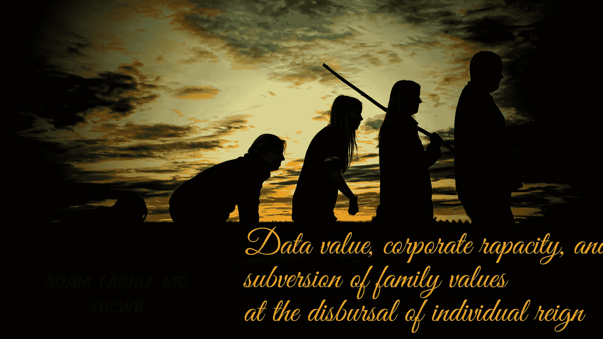

# 数据价值，企业贪婪

> 原文：<https://medium.datadriveninvestor.com/data-value-corporate-rapacity-and-subversion-of-family-values-at-the-disbursal-of-individual-c6a3e7da09d5?source=collection_archive---------8----------------------->

## 和个人统治的支出对家庭价值的颠覆

family genes

人类亚种与许多角色联系在一起——一些是独特的，一些是普遍的，大多数是其他物种共有的。其中最重要的是自我保护和希望将基因沿着家族遗传线传递下去。即便如此，在这些共有属性的人群中，“人”决心将自私的本能向前迈一步，如果不能生育，就通过收养承担起照顾与血缘顺序无关的孩子的责任。在过去的数百年里，人类已经找到了替代的方式来满足父母的内在需求，同时努力支持这种承诺带来的生理和心理满足。尽管如此，成功的实现，人类的本性并没有被父母的奖赏所束缚。

人类好奇的想了解他们的过去和祖先血统。大多数情况下，那些以生物出生和已知家谱为前提的人太介意了。尽管如此，在这种情况下，包括精子捐献和收养，最基本的细节可能会引发后代寻找亲生父母的本能好奇心。

一般来说，一方面，收养父母的愿望被视为真正的父母，儿童寻求血缘关系的本能好奇心，捐精者的匿名性，以及接受父母都是利益冲突的无可挑剔的原因。几十年来，法律和道德标准确保所有各方的个人权利。但是，随着新兴技术、千禧一代思维模式的改变以及新的企业商业战略的出现，维护传统的法律和道德标准的任务变得极其发人深省。尽管千禧年概念上的挑战仅仅是为了披露精子捐献者的身份，特别是在同性婚姻的家庭中，但分享这些信息的风险仍然有可能超出泄露生物学亲子关系的范围。相反，很大一部分非亲生父母希望被视为单亲，希望保持孩子另一半基因构成的匿名性。如前所述，除非实现真正的解决方案，否则父亲匿名的时代将会结束。

由于精子库被迫违反与捐赠者的保密协议，不断增长的基因检测市场，以及利润丰厚的公司财务收益，维护捐赠者的保密性和后代的身份注定成为一项严峻的任务。

 [## 人们对隐私的不理解是什么？数据驱动的投资者

### 你知道那种感觉。无论是访问应用程序、订阅还是你最喜欢的运动鞋。你按下…

www.datadriveninvestor.com](https://www.datadriveninvestor.com/2019/04/11/privacy-and-convenience/) 

# 什么是人工授精？

人工授精是使用第三方(匿名)捐赠精子进行有意的女性受孕的技术术语。作为当今世界上向低生育能力妇女提供的一种著名的常规方法，人工授精的概念起源于增加受精部位配子或精子密度的意图，旨在最大限度地形成胚胎。后一种程序通常也是由兽医执行的，为特定目的挑选和改良动物品种。然而，由于其伦理含义，严格禁止在人类身上进行类似的做法；然而，仅限于繁殖和有限的表型选择性，包括供体种族、智力和健康。除了男性不育、精子数量少、同性婚姻或子因素(包括精子数量少)之外，人工授精的完全应用是重大伦理、宗教和社会争论的主题。经过一个世纪的人类思维系统发展，今天夫妻双方更容易使用丈夫或生活伴侣的精子进行体外受精。尽管如此，这种心态还远远不够解放思想和价值观来接受第三方捐赠的精子。因此，正如本文所指出的，人工授精的概念总是指捐赠者的精子。

 [## 纵向和横向的知识说明了先入之见在人才中的体现…

### 任何灵长类动物最与生俱来却又最有益的特质之一就是保持竞争力。对…的看法

medium.com](https://medium.com/datadriveninvestor/vertical-and-the-horizontal-knowledge-illustrative-embodiment-of-preconception-at-the-talent-b8d8c2cd2b0a) 

第一次人工授精的非官方历史可以追溯到卡斯蒂利亚国王亨利四世(1425-1474)，他有一个绰号叫“阳痿”1455 年，他娶了葡萄牙阿丰索五世的妹妹胡安娜公主，婚后六年，生下一女乔安娜。1953 年，美国发明家杰罗姆·k·谢尔曼博士试图用一种简单的方法将捐献者的精子冷冻起来，并将其保存在甘油悬浮液中。他通过将悬浮液与作为制冷剂的固体二氧化碳中的缓慢冷却机制相结合，实现了精子的保存。预期；谢尔曼博士的发现导致精子库行业在 20 世纪 70 年代得到普及，从而导致其在美国全面商业化，然后扩展到世界各地。

# 体外受精简介

1978 年 Steptoe 和 Edwards 引入体外受精(IVF ),重新引起了人们对人工受精的兴趣。在早期，这一过程被细分为将丈夫毫无准备的精液注入妻子的子宫，没有任何特定的配方。尽管如此，这种方法也有缺点，会导致子宫痉挛和输卵管感染的机会增加。

Photo by [Carlo Navarro](https://unsplash.com/@carlonavarro?utm_source=medium&utm_medium=referral) on [Unsplash](https://unsplash.com?utm_source=medium&utm_medium=referral)

随着现代体外受精、安全的精液制备和着床技术的出现，人工授精重新受到欢迎，变得更加安全和无痛。尽管生育治疗技术取得了巨大的进步，但人工授精的道德含义一直是争论的主题。一个重要的争论可以追溯到 1909 年，当时天主教会反对所有形式的人工授精。他们认为这种做法促进了手淫，并忽视了性交的宗教意义，这是有价值的。但是主要的文学批评来自于人工授精在当时被认为是通奸行为这一事实。其他批评家把矛头指向生育实践，认为这将鼓励基因和种族清洗的罪恶行为。

# 什么是女性卵子捐赠？

据报道，1983 年，第一个从[confer egg 出生的婴儿在澳洲诞生。大约在同一时间，南加州的一家诊所报道了一例使用捐赠卵子的成功妊娠。这导致了 1984 年 2 月 3 日第一个通过人工方法出生的美国婴儿的诞生。](https://en.wikipedia.org/wiki/Egg_donation)

# 克隆或多能干细胞诱导的概念

尽管存在巨大的争议，克隆人是指基因完全相同的人的复制或克隆。这个术语通常用于人造人类克隆，即人类细胞和组织的繁殖。治疗性克隆的两种标准研究方法是体细胞核移植和多能干细胞诱导。随着 1996 年利用体细胞核移植(SCNT)克隆出一只绵羊“多莉”( Dolly ),克隆人的想法成了激烈争论的话题，并在现代社会的规范中被普遍视为非法。

今天，除了它们各自的风暴之外，人工授精、卵子代理宿主和人类克隆分享了基本的伦理进展；数据隐私。

# 基因测试或分析

遗传检测用于医学领域，以找出与遗传状况或疾病有关的染色体、基因和蛋白质的变化。通过识别基因构成，医生可以确定一个人患遗传疾病或将其遗传给下一代的可能性。现在有 1000 多种基因测试在使用，并且正在更大程度上得到发展。

[基因检测](https://emerj.com/ai-sector-overviews/machine-learning-in-genomics-applications/)也能够根据基因组成定义、匹配和描述人群。这包括将血亲与疾病档案进行比对。通过复杂的深度学习软件程序，需要处理大量的遗传数据，当进行预测对特定疾病的易感性时，可以方便地对来自身体组织或体液样本的 DNA 进行分析。目前，高成本和技术不足是将基因数据图谱应用于医学领域的两个主要限制因素。为了应对这些巨大的挑战，需要收集和分析大量的患者数据。研究人员被迫利用复杂的机器学习技术作为克服这些障碍的手段。

# 共享基因数据和深度学习

为了实施有效的机器学习技术，需要从各个来源收集大量数据(在这种情况下，是遗传信息、精子和卵子捐赠者数据)。因此，使用数学人工智能算法分析海量信息，也称为大数据，显示与蛋白质、DNA、基因和染色体相关的模式、趋势和关联。机器学习(ML)、深度学习(DL)和人工智能(AI)用于创建和分析能够学习无监督或有监督的大规模非结构化或无标签数据的网络。

Photo by [National Cancer Institute](https://unsplash.com/@nci?utm_source=medium&utm_medium=referral) on [Unsplash](https://unsplash.com?utm_source=medium&utm_medium=referral)

# 将人工受精、基因分析和深度学习难题搬上舞台的重要性

正如最初强调的那样——人工智能、大数据、人工授精、供体卵子、SCNT 和基因分析都有各自独特的科学、技术、文化和伦理应用方面的优点和缺点。尽管如此，当集体应用时，它们对社会规范稳定性的影响是指数级有害的。我们只是进入了一个保持匿名、尊重个人隐私以及防止重大社会、心理、伦理和法律纠纷将是一项艰巨任务的空间。为了进一步解释——我想用这个问题作为例子——如果一个人不情愿地发现他或她结婚的人实际上是近亲结婚的兄弟姐妹呢？!"

寻找亲生父母很平常，即使领养父母是最好的榜样。即使是那些喜欢通过典型的家庭寄养生活的人，也经常好奇使用现代基因测试工具，如 23 & me 和祖先，来获得更多关于他们的遗传和家族血统的信息。接下来是大数据的勤奋，它在为从这些有价值的商品中获利而制定战略的过程中茁壮成长。

加上——只要他们能利用普通人固有的古怪达到数万亿美元，的确，这将代表他们的最终结局。为了完成这一使命，各行业必须通过他们的赞助要求来分享他们之间的选择性信息。当然，除了对实体拥有数据和未经同意使用个人数据的争议之外，道德困境注定会打破最终确保熵类型匿名的障碍，如果暴露，会造成有害后果。

人们很难想象追溯性地发现一个人的遗传后代也是他们的亲密伴侣，或者有人不情愿地发现他们是一种罕见疾病的带菌者，这有什么潜在的重要性。或者通过从他们的远亲那里收集的基因测试数据，他们的保单保费无缘无故飙升。进一步的后果:包括知道他们活不到一定年龄或与精神病患者有遗传关系。

根据所作的声明，人们可能会争辩说，每个人都有知道自己从哪里来和去往哪里的自由。至于同样的概念，我必须推理，值得信赖的人有权知道，也有权不被了解，如果他们选择这样做的话！精辟地说——知行必须是个人选择而非强制要求，否则要提防他人的作用机制。在目前的情况下，隐私已经超出了可接受的界限。出于需要，实体极度渴望我们的个人数据。尽管有大量的承诺保证个人身份信息的隐蔽性，但这些承诺既不足以保护隐私，也不相关。现代、复杂的深度学习工具提供了丰富的功能，使访问个人凭据的需求变得过时。

精子库也在遭受他们过去不道德和非法行为的后果。例如，通过 [contract bridge，同意每次捐赠不超过 10 个后代的捐赠者](https://www.statnews.com/2019/09/11/consumer-dna-tests-sperm-donor-anonymity/)最近通过基因检查发现，一些精子库将他们的样本卖给了 20 多个足月妊娠的孕妇。这为新的法律含义打开了大门。

Photo by [Tess](https://unsplash.com/@tesswilcox?utm_source=medium&utm_medium=referral) on [Unsplash](https://unsplash.com?utm_source=medium&utm_medium=referral)

# 最令人烦恼的是人性的非人化

成为一个人需要社会技能和力量来独立地学习、适应、尊重和应对每一个事件和场景。因此，没有人类触觉的应用科学和工具的不加选择的应用对于我们赖以生存的价值观来说是完全有辱人格的。有时候，披露包括父亲身份在内的特定信息，并不是一个灵魂所期望的。每个政府都必须保护其个别选民的隐私。相反，政府正在采取非常规的行动，给实体侵犯公民隐私的余地。

维护信息隐私被误导为一项艰巨的任务。然而，保护个人数据与科学和技术的进步是并行不悖的，因此安装起来很容易。让我们通过考虑使用区块链技术启动一个分散式系统的场景来扩展这一点。所有数据都通过分散的结构共享，这种结构在数据的原始贡献者之间分配其所有权，从而分配责任。经信息的[原始所有者](https://link.medium.com/Ql4buvMPb0)许可，数据只能由第三方用户访问。但是，这是政府想要的吗？！

> *证据说不同！*

美国国立卫生研究院(NIH)最近的一份报告表明，该机构对基因测序和基因组数据库扩展的主要关注也是为了向其他与精确医疗关系不大或没有关系的组织和机构提供更多信息。或者，[备受争议的食品和药物管理局(FDA)支持大数据驱动的干细胞科学的努力](https://link.medium.com/49w2uWBSb0)已经成为最近一个道德和法律困境的案例

去中心化的自由是将有价值的数据归还给每个人。它是关于作为一种选择与实体共享数据的便利。为了个人利益和避免现代冲突而尊重个人隐私是可以实现的。尽管如此，放弃中央集权体制带来的暴利机会并不一定符合大公司的利益。

[数据分散化](https://link.medium.com/wE0xNc4Rb0)是保护同时进行基因检测和精子库操作的道德和法律执行的最终方式。权力下放并不是公司的首选，因为他们将失去免费全面访问患者档案的便利。尽管如此，它将把数据还给个体所有者，激励患者保持健康，增加竞争，减少垄断，降低成本，同时为超越贫困、政治和社会不公平边界的医疗保健铺平道路。最重要的是，对于那些追求健康家庭的人来说，科学和技术是有价值的，没有外界的影响，在他们的隐私范围内，利用加强家庭价值观。

 [## 冠状病毒危机沙皇:政治家对抗新贵族

### 在中国武汉报道首例冠状病毒病例仅四个月后，微软联合创始人和据称…

medium.com](https://medium.com/datadriveninvestor/coronavirus-crisis-czars-politicians-versus-the-neo-aristocrats-63012cbb6a3a)