# 数据可视化

> 原文：<https://medium.datadriveninvestor.com/data-visualization-5b1dc260c91a?source=collection_archive---------3----------------------->

[](http://www.track.datadriveninvestor.com/DDIBeta11-23)

**使用 seaborn 库理解和可视化数据**

*在之前的帖子中，我们已经了解了 python 中不同的数据结构，从不同格式的文件中读取数据，以及将数据写入不同格式的文件。在本帖中，我们将学习数据可视化，以便更深入地理解数据。*

用于分析数据的 Python 代码可从-[https://github . com/ar shren/Machine learning/blob/master/Machine % 20 learning % 20 step % 201% 20-% 20 understanding % 20 data . ipynb](https://github.com/arshren/MachineLearning/blob/master/Machine%20Learning%20step%201%20-%20understanding%20data.ipynb)获得


# **什么是数据可视化？**

数据可视化是将数据呈现为适当的图像或图形形式。

比如我们想了解房子的面积是如何对房子的价格产生影响的。房子的面积和价格之间的散点图会很快帮助我们了解

# **数据可视化为什么有用？**

一张图胜过千言万语，我们的大脑处理图片和颜色比处理数字或文本更好，所以当我们看到与房屋面积和价格相关的数据时，我们需要时间来处理信息并得出结论。然而，当我们有散点图时，只需看一眼，我们就能够理解关系，确定趋势，还能发现异常值。

当我们拥有庞大的数据集时，数据的可视化变得更加重要。人脑很难在没有任何图像表示的情况下分析大量数据，这时数据可视化就来拯救我们了

# **我们可以在哪里使用数据可视化技术？**

*   容易理解数据
*   识别关系和模式
*   检查数据中出现的趋势
*   帮助从数据中创建一个故事，并传达给利益相关者

*在这里，我们将利用 Kaggel 提供的泰坦尼克号数据集来分析数据，学习数据可视化以获得更深入的理解，列车数据集的目标是根据数据集中提供的特征来了解乘客是否幸存*

*泰坦尼克号的数据集可以在这里找到*-[https://www.kaggle.com/c/titanic](https://www.kaggle.com/c/titanic)

首先，如果您之前还没有安装 seaborn，我们将通过 Anaconda 提示符来安装它

```
pip install seaborn
```

一旦我们安装了 seaborn，我们将导入所有需要的库。 **%matplotlib inline** 将在 Jupyter 笔记本中显示绘图命令的输出

```
import numpy as np
import pandas as pd
import matplotlib.pyplot as plt
import seaborn as sns
%matplotlib inline
```

我们现在将从下载的数据集中读取数据。我们将使用训练数据集— train.csv

更多关于**读取不同格式的文件和写入不同格式的文件的细节**请关注我的帖子—[https://medium . com/@ arshren/python-read-and-write-data-from-files-d3b 70441416 e](https://medium.com/@arshren/python-reading-and-writing-data-from-files-d3b70441416e)

为了更好地理解这些数据，请参考我的帖子[https://medium . com/@ arshren/machine-learning-understand-data-dfef 261d 833 b](https://medium.com/@arshren/machine-learning-understanding-data-dfef261d833b)

我已经将数据集下载到了默认的 jupyter 文件夹中

```
data_set = pd.read_csv("train.csv")
```

让我们将数据可视化，看看我们能否找到影响乘客存活率的正确特征。

*让我们了解 is 的各种数据可视化选项*

# Python 中常见的数据可视化类型有哪些？

> **散点图** —显示两个数值变量联合分布的点云，其中每个点代表数据集的一个观察值。有助于理解两个数值变量之间的关系
> 
> **分布图** —比较数字数据组的范围和分布
> 
> **直方图** —用于数值数据的图形表示
> 
> **条形图** —用于分类数据的图形表示
> 
> ***箱线图*** — *显示定量或分类数据的分布，有助于变量之间或分类变量之间的比较。*
> 
> *方框显示数据集的四分位数。*
> 
> *胡须延伸显示分布的剩余部分，除了使用四分位间距函数确定为异常值的点*
> 
> **核密度估计(KDE)图**——绘制分布的平滑曲线形状。这是一种密度的非参数估计，从有限的数据样本中推断出总体
> 
> **小提琴情节**——结合了 KDE 和盒子情节。在小提琴的内部，我们可以展示个体的观察或分布的总结
> 
> **因子图** —帮助构建条件图，如当数据与因子变量一起被一个或多个变量分段时
> 
> **配对图** —帮助显示两个变量之间的相互作用。一次从数据集中提取两个变量，并显示它们之间的关系
> 
> **热图** —是一种图形表示，颜色的使用类似于条形图使用高度的方式。换句话说，它使用颜色编码来表示不同的值。热图使用暖到冷的色谱。

*现在让我们开始可视化泰坦尼克号数据集*

让我们通过打印数据集中的 3 行来查看数据集的所有特性

```
data_set.head(3)
```


head(3) display first three rows from the dataset

这里，我们的目标变量是 survivor 列，它表示乘客在泰坦尼克号失事中是否幸存。

我们的目的是识别关键特征，这将有助于根据训练数据预测乘客是否幸存。

我们将可视化不同变量之间关于幸存列的关系，并理解数据的分布及其关系。

我们创建两个数据集——numeric _ data 数据集一个用于所有数字数据，另一个用于幸存的目标列

分类数据的 category_data，然后是所有特征的 data_set

```
numeric_data = data_set.iloc[:,[0,1,5,9,12]]
numeric_data.head(3)
```

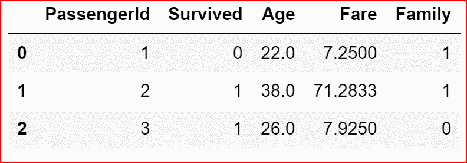

numeric_data for all numeric features

```
category_data=data_set.iloc[:,[2,3,4,8,10,11]]
```

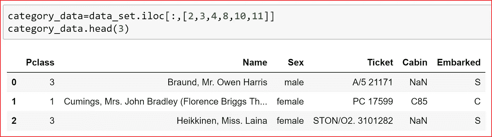

category_data for categorical data

我们从 **pairplot** 开始，它绘制了数据集中所有数值变量的成对关系

它有助于获得整个数据集的快速可视化，我们将任何分类变量设置为色调。因为我们想了解每个特征如何影响乘客的存活率，所以我们在数据集中设置色调为“存活”列

幸存列的不同值，即:幸存和未幸存的数据会以不同的颜色出现

```
sns.pairplot(numeric_data.dropna(), hue='Survived')
```

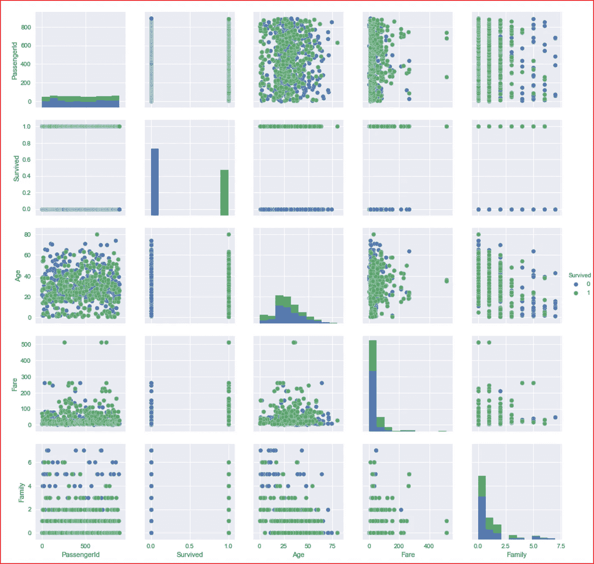

pairplot for all numeric variables with hue to indicate if a passenger survived or not

*现在让我们了解不同特征的数据分布，从数字特征开始*

我们将使用 **distplot()** 绘制年龄的数据分布。

对于年龄，我们有一些空值，所以我们在绘制数据之前删除它们

```
sns.distplot(numeric_data['Age'].dropna())
```

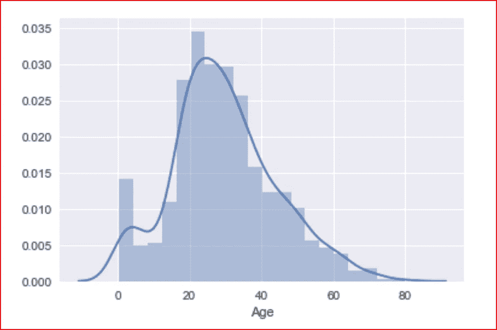

distplot for Age along with kde

这张图告诉我们，大多数乘客都很年轻，他们大多在 20-40 岁之间，船上还有一些非常年幼的孩子，还有一些乘客年龄在 70-80 岁之间。

distplot()用于绘制单变量或单变量。在这里，我们绘制费用，并分成 10 个不同的箱，我们不想要核密度估计图，所以我们设置 kde 为假，我们得到一个**直方图**

```
sns.distplot(numeric_data['Fare'], bins =6, kde= False)
```

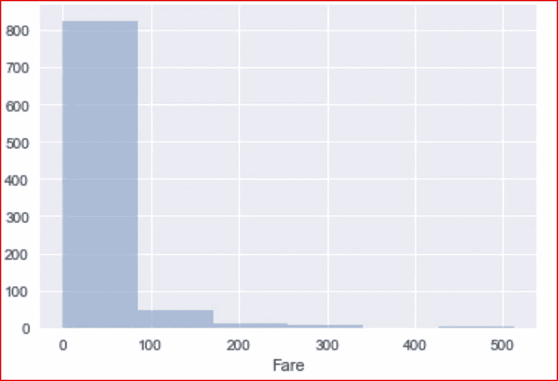

这里我们看到，尽管我们有 3 个舱位，但我们至少有 5 种不同的票价，大多数乘客支付的票价低于 100 美元，极少数人支付的票价超过 100 美元。最高票价范围为 500 美元

绘制家庭成员数量的分布图

```
sns.distplot(numeric_data['Family'], kde=False)
```

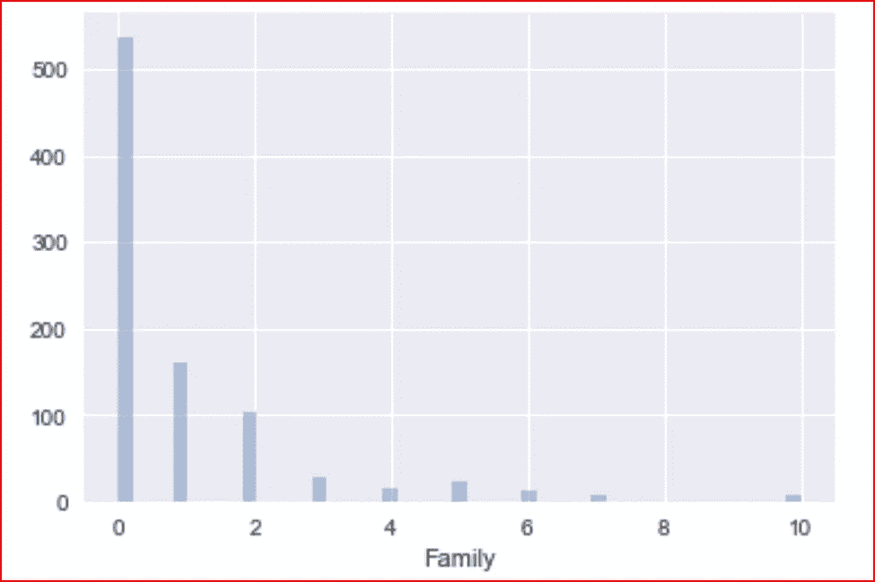

Distribution for number of family members

*我们现在已经涵盖了所有的数字变量，所以让我们深入分类变量*

当我们查看分类数据时，我们意识到姓名和机票号码对乘客的生存机会没有任何影响，所以我们删除了这些列

```
category_data = category_data.iloc[:,[0,2,4,5]]
category_data.head(3)
```

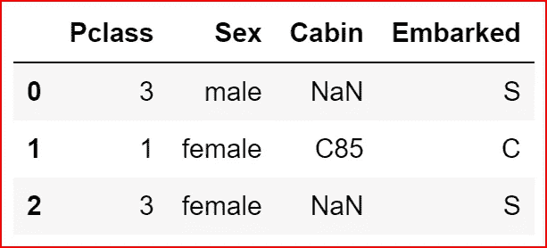

dropping columns that do not add value to predict target variable

我们现在试图了解性别数据的分布，我们在数据集中有多少雄性和多少雌性关于他们的生存

```
plt.figure(figsize=(5,5))
sns.countplot(data=data_set, x="Sex", hue='Survived')
```

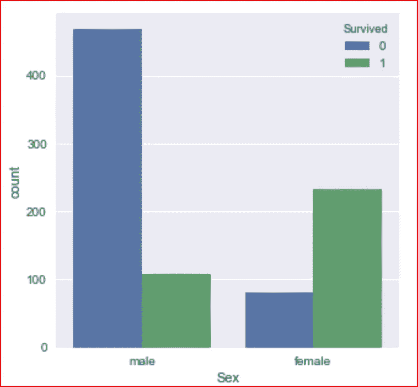

More females survived than males

检查 Pclass 是否对存活率有影响

```
sns.countplot(data=data_set, x="Pclass", hue='Survived')
```

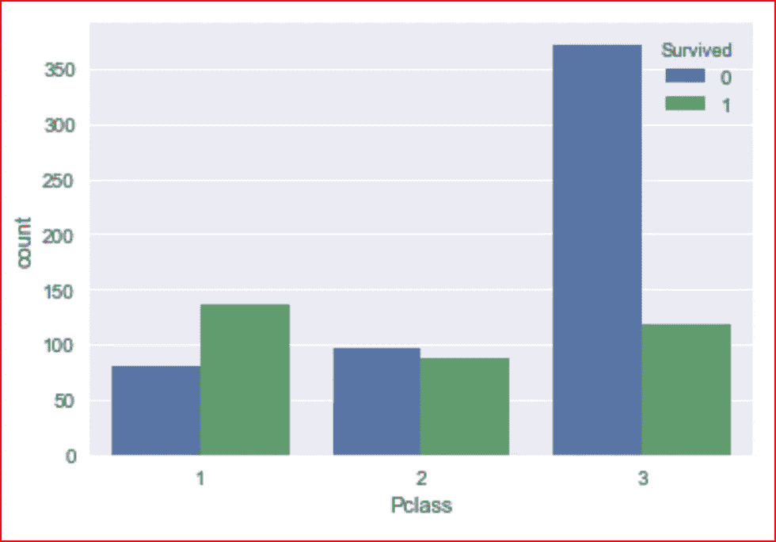

First class passengers survived more than second or third class passengers

头等舱的乘客比二等舱和三等舱的乘客存活得多

我们最后一个分类变量是装货港

```
sns.countplot(data=data_set, x="Embarked", hue='Survived')
```

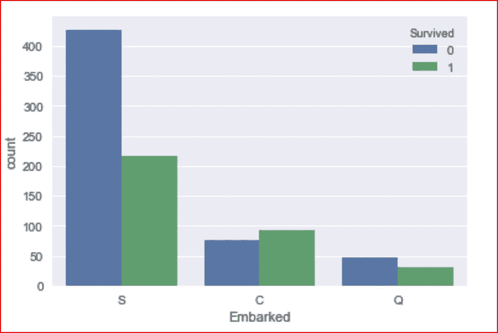

Passengers who embarked from Q = Queenstown survived less compared to S = Southampton

装船港与 Pclass 有什么关系吗？让我们通过可视化数据来找出答案

```
sns.countplot(data=data_set, x="Embarked", hue='Pclass')
```

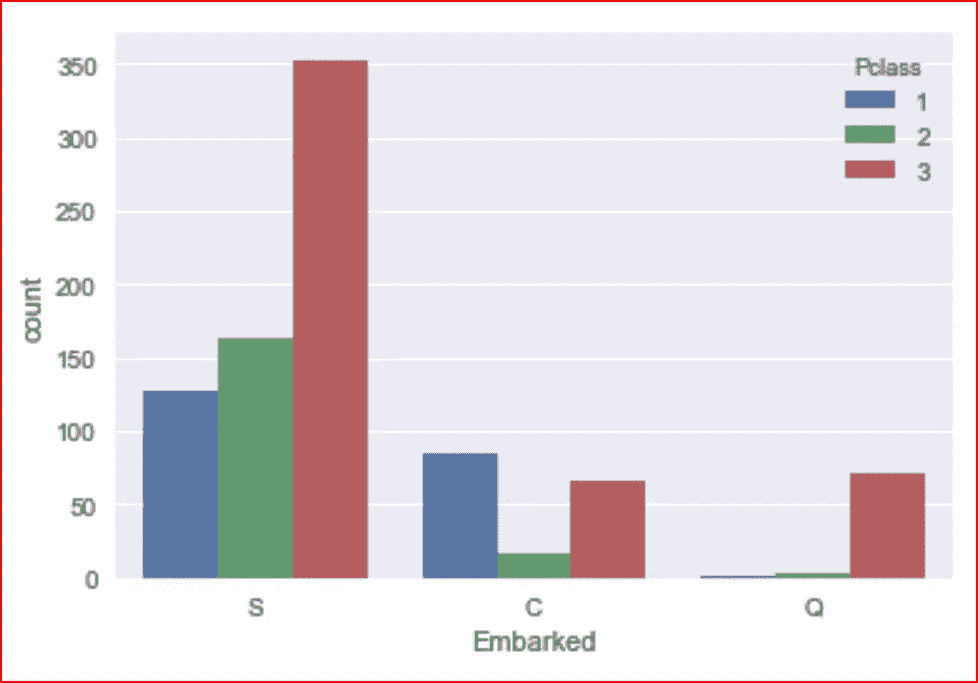

South Hampton had more passengers and also more first class passengers than Queenstown

让我们想象一下年龄和性别特征对乘客生存机会的影响

```
sns.boxplot(data=data_set, x=’Age’, y=’Sex’, hue =’Survived’)
```

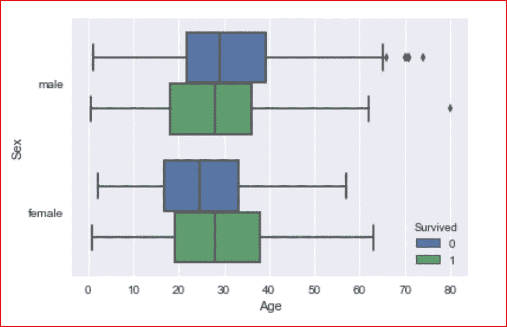

Boxplot for Age and Sex with respect to Survival

我们现在使用 jointplot，它允许我们组合两个变量的分布。

在 jointplot 中，我们将从 data 属性中指定的 dataset 中获取 x 和 y 中指定的数据变量的分布。默认情况下，中间显示的是散点图

```
sns.jointplot(x= 'Age',y='Fare', data= data_set)
```

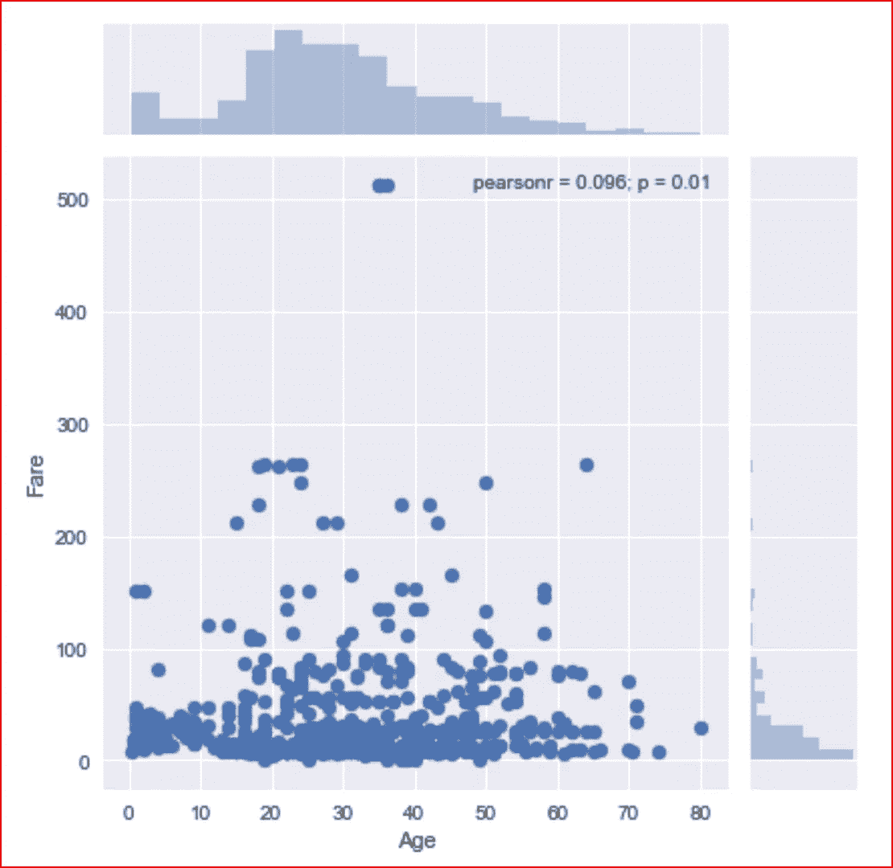

jointplot between Age and Fare

这个图告诉我们，大多数乘客的票价低于 100 美元。

最后，我们使用数据集的相关性绘制热图

```
sns.heatmap(data_set.corr(), annot=True)
```

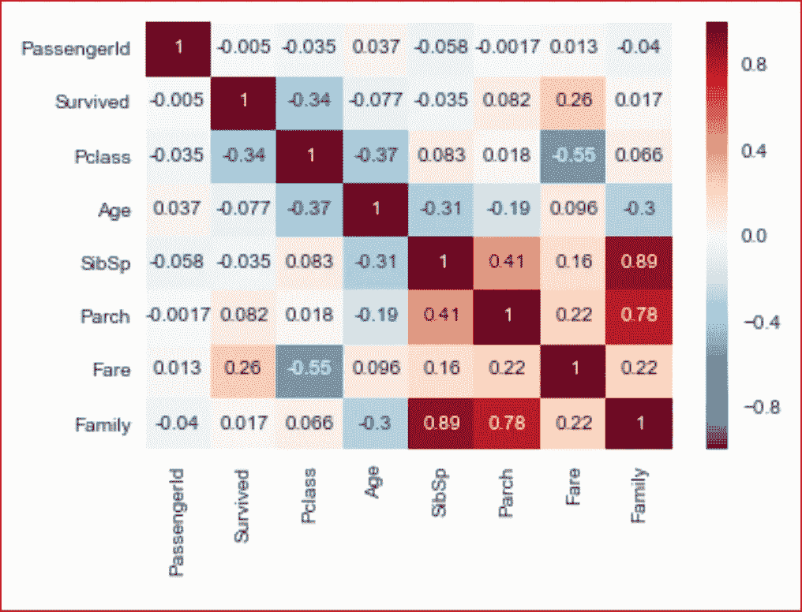

Heatmap for the data_set

现在，我们已经更好地了解了与乘客生存相关的特征，我们现在将清理数据，为下一步做准备