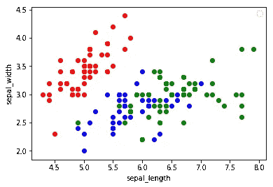
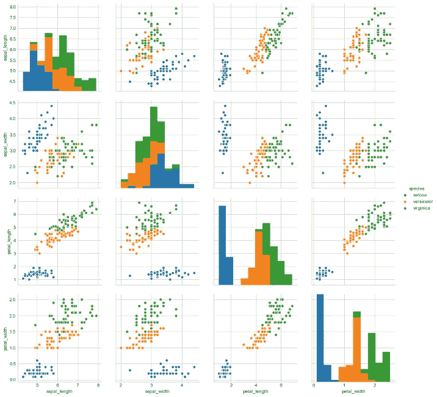
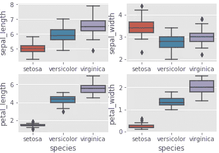
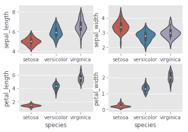
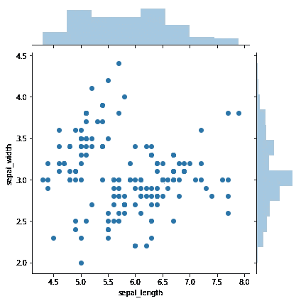
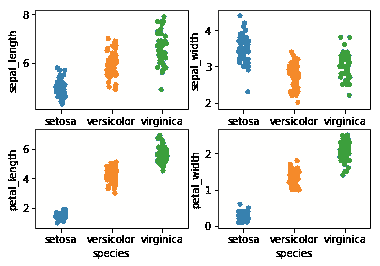

# 使用 matplotlib 和 seaborn 实现数据可视化

> 原文：<https://medium.datadriveninvestor.com/data-visualization-a6dccf643fbb?source=collection_archive---------3----------------------->

## 数据可视化简介

在这篇博客中，我们将尝试理解什么是数据可视化，以及如何使用 Python 中的 matplotlib 和 seaborn 来制作图表。我们还将讨论各种类型的分析以及数据可视化中最常见的绘图类型。

# **什么是数据可视化？**

数据可视化是视觉交流的一种**形式**。它包括创建和研究数据的**视觉表现**。

我们将在“iris”数据集上实现各种数据可视化技术。

# **不同类型的分析:**

1.  **单变量(U)** :在单变量分析中，我们使用单个特征来分析其属性。
2.  **双变量****【B】**:当我们比较恰好两个特征之间的数据时，这称为双变量分析。
3.  **多变量(M)** :比较 2 个以上的变量称为多变量分析。

# **数据可视化中最常见的绘图类型:**

1.  散点图(B)
2.  配对图(米)
3.  箱形图
4.  小提琴情节(美)
5.  分布图(U)
6.  联合地块(U)和(B)
7.  条形图(B)
8.  线形图(B)

让我们逐一看看数据可视化中使用的一些图:

**导入用于数据可视化的库**

首先，我们需要为数据可视化导入两个重要的库-

1.  matplotlib
2.  海生的

Matplotlib 是一个广泛用于数据可视化的 python 库。而 **Seaborn** 是基于 matplotlib 的 python 库**。Seaborn 提供了一个高级界面，用于绘制有吸引力和信息丰富的统计图形。**

```
import matplotlib.pyplot as plt
import seaborn as sns
```

**将文件加载到数据帧中**

```
iris = pd.read_csv("iris.csv")
```

# **1。散点图:**

这是简单数据可视化最常用的绘图之一。它为我们提供了整个数据集中每个点相对于任何 2 或 3 个特征(或列)的位置表示。它们在 2D 有 3D 版本。

```
# Here we are plotting sepal_length vs sepal_width 
# setosa - 'red'; versicolor - 'blue'; virginica - 'green'
for n in range(0,150):
    if iris['species'][n] == 'setosa':
        plt.scatter(iris['sepal_length'][n], iris['sepal_width'][n], color = 'red')
        plt.xlabel('sepal_length')
        plt.ylabel('sepal_width')
    elif iris['species'][n] == 'versicolor':
        plt.scatter(iris['sepal_length'][n], iris['sepal_width'][n], color = 'blue')
        plt.xlabel('sepal_length')
        plt.ylabel('sepal_width')
    elif iris['species'][n] == 'virginica':
        plt.scatter(iris['sepal_length'][n], iris['sepal_width'][n], color = 'green')
        plt.xlabel('sepal_length')
        plt.ylabel('sepal_width')
```



# **2。配对图**

假设我们在一个数据中有 n 个特征，配对图将帮助我们创建一个(n x n)图，其中**对角线图将是对应于该行的特征的直方图**，其余的图是 y 轴中每行的特征和 x 轴中每列的特征的组合。

Iris 数据集上实现的配对图的代码片段如下:

```
sns.set_style("whitegrid");
sns.pairplot(iris, hue="species", size=3);
plt.show()
```



# **3。箱线图**

箱线图(或盒须图)以某种方式显示定量数据的分布，使**便于变量之间或分类变量**水平之间的比较。该框显示数据集的四分位数，而触须延伸以显示分布的其余部分。

使用箱线图绘制要素的代码:

```
# Plotting the features using boxes
plt.style.use('ggplot')
plt.subplot(2,2,1)
sns.boxplot(x = 'species', y = 'sepal_length', data = iris)
plt.subplot(2,2,2)
sns.boxplot(x = 'species', y = 'sepal_width', data = iris)
plt.subplot(2,2,3)
sns.boxplot(x = 'species', y = 'petal_length', data = iris)
plt.subplot(2,2,4)
sns.boxplot(x = 'species', y = 'petal_width', data = iris)
```



# **4。小提琴剧情:**

violin 图可以推断为中间的**箱线图和数据**两侧的分布图(核密度估计)的组合。这可以给我们分布的细节，如分布是否是多模态的，偏斜度等。

小提琴剧情也是来自 seaborn 包。代码很简单，如下所示。

```
# Representing data using violin form
plt.style.use('ggplot')
plt.subplot(2,2,1)
sns.violinplot(x = 'species', y = 'sepal_length', data = iris)
plt.subplot(2,2,2)
sns.violinplot(x = 'species', y = 'sepal_width', data = iris)
plt.subplot(2,2,3)
sns.violinplot(x = 'species', y = 'petal_length', data = iris)
plt.subplot(2,2,4)
sns.violinplot(x = 'species', y = 'petal_width', data = iris)
```



# **5。联合地块**

连接图可以进行单变量和双变量分析。**主图**将为我们提供**双变量分析**，而在**顶部和右侧**我们将获得被认为是的两个变量的**单变量图。这使得我们的工作变得容易，因为我们可以在一个图中同时得到二元的散点图和一元的分布图。**

有多种选项可供选择，可以使用 seaborn 联合绘图功能中的**种类**参数进行调整。

```
# Joint plots shows bivariate scatterplots
# And univariate histograms
sns.jointplot(x = 'sepal_length', y = 'sepal_width', data = iris)
```



# 6。带状图

带状图可以单独绘制，但在您想要显示所有观察结果以及一些基本分布的情况下，它也是对盒状图或小提琴图的很好补充。

这是一种图形数据分析技术，用于总结单变量数据集。它通常用于**小型数据集**(直方图和密度图通常适用于大型数据集)。

```
# Plottign data in strip
plt.subplot(2,2,1)
sns.stripplot(x = 'species', y = 'sepal_length', data = iris, jitter = True)
plt.subplot(2,2,2)
sns.stripplot(x = 'species', y = 'sepal_width', data = iris, jitter = True)
plt.subplot(2,2,3)
sns.stripplot(x = 'species', y = 'petal_length', data = iris, jitter = True)
plt.subplot(2,2,4)
sns.stripplot(x = 'species', y = 'petal_width', data = iris, jitter = True)
```



# **seaborn 中的 lmplot()函数**

Seaborn 的 lmplot 是一个 **2D 散点图，带有可选的重叠回归线**。lmplot 还支持二元分类的逻辑回归。它旨在作为一个**方便的接口来拟合数据集条件子集的回归模型**。

该函数可以绘制两个变量`x`和`y`的散点图，然后拟合回归模型`y ~ x`，并绘制出该回归的 95%置信区间的回归线。

`[lmplot()](https://seaborn.pydata.org/generated/seaborn.lmplot.html#seaborn.lmplot)`将`data`作为必需参数，并且`x`和`y`变量必须指定为字符串。

```
# This graph is same as above but plotting the species separately
sns.lmplot(x = 'sepal_length', y = 'sepal_width', data = iris, hue = 'species', col = 'species')
```


# **结论:**

现在，您已经了解了使用 seaborn 和 matplotlib 库可以制作的不同类型的绘图。数据可视化不仅帮助你**更好地理解你的数据**，而且无论何时你发现任何见解，你都可以使用这些可视化技术**与其他人**分享你的发现。

现在，继续尝试在一些真实世界的数据集上创建如此惊人的图表。