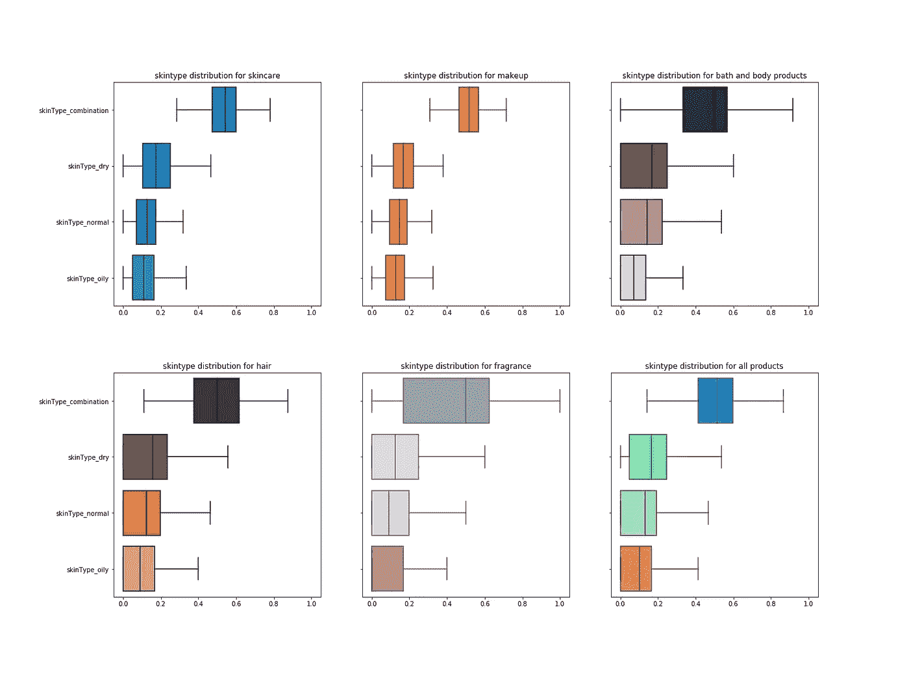
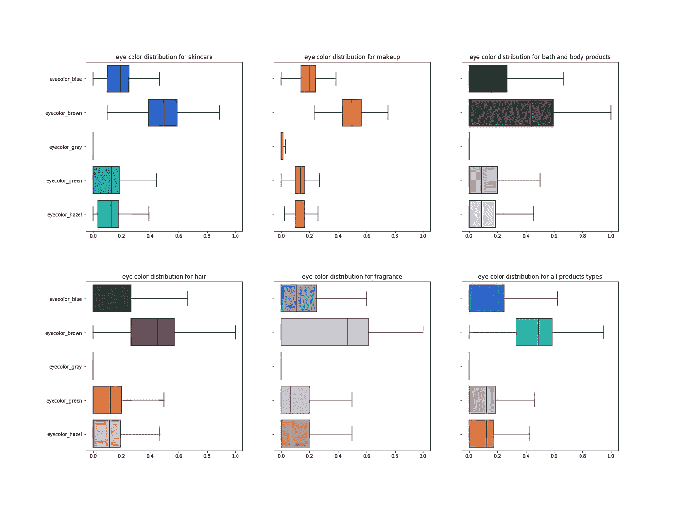
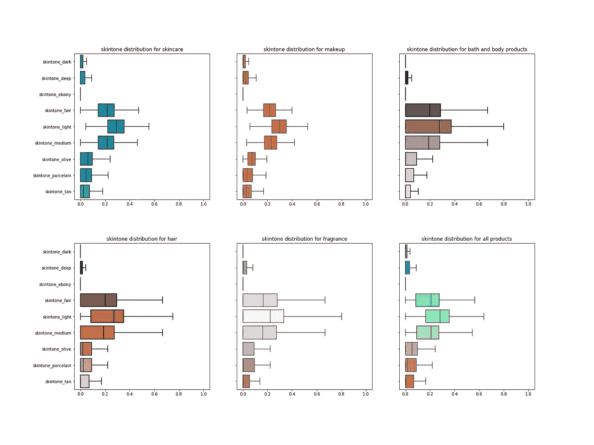
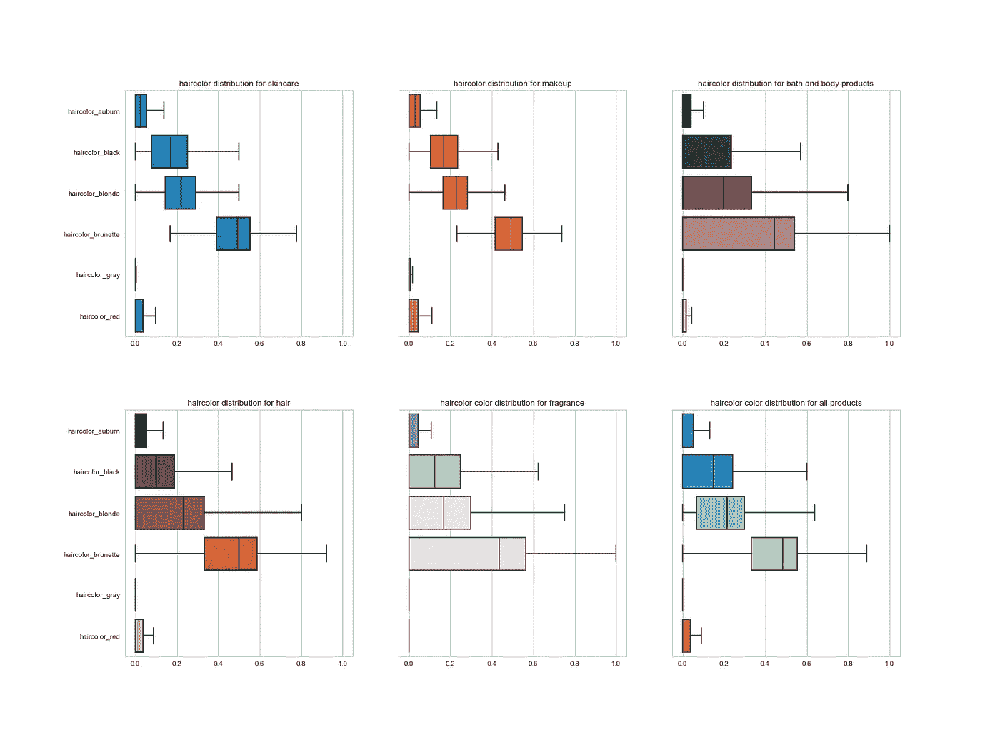
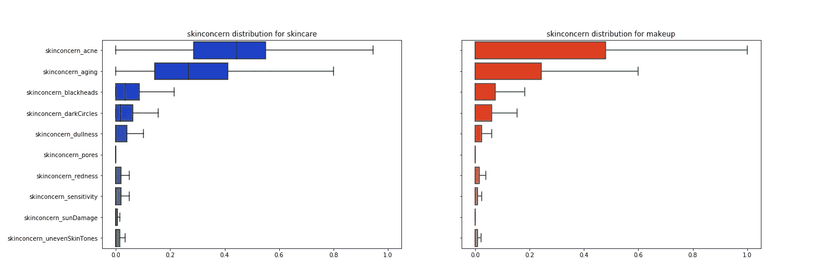
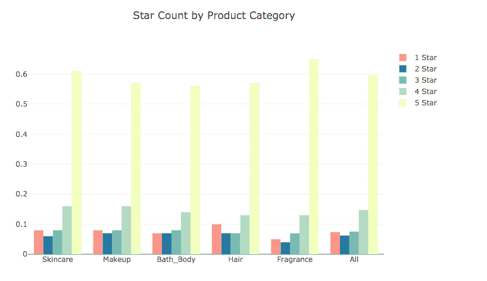
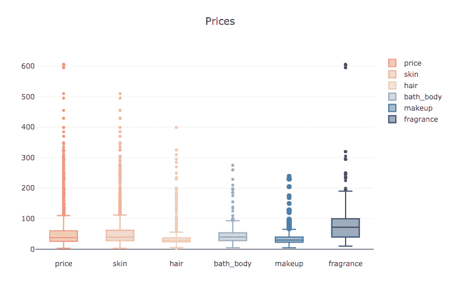
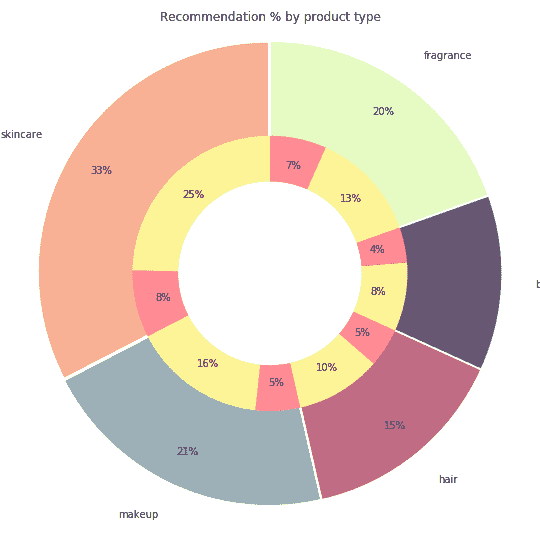

# 丝芙兰的数据可视化

> 原文：<https://medium.datadriveninvestor.com/data-visualization-of-sephora-b2cc91b19b35?source=collection_archive---------0----------------------->

对于我在熨斗学校的顶点项目，我决定将我对美丽世界的迷恋和数据的力量结合起来。我对该项目的总体目标是利用机器学习算法，根据产品的客户资料、产品描述和成分，对产品评级和推荐进行预测。Sephora.com 在网站上有一个内容丰富的评论和反馈部分，介绍它销售的每一种产品。我使用了关于产品的简介信息，包括成分和描述，并创建了一个模型，该模型能够预测客户是否会推荐该产品，或者该产品的平均评分是高于还是低于平均水平。有能力对产品性能做出预测(至少对产品的评级或推荐级别)。美容零售市场是一个 2500 亿美元的全球产业，美国约为 560 亿美元。然而，这个行业也是竞争激烈和快节奏的。因此，探索零售商或商店是否有办法预测他们想在商店里销售的产品的性能是很有趣的。

我的数据集是从 Sephora.com 废弃的，其中包括产品的名称、描述、品牌、成分(如果有的话)、类别、平均评分、推荐数量，以及所有评论者的个人资料(眼睛颜色、头发颜色、护肤问题、皮肤类型等)，以及评论信息的分类(推荐数量、星级)。这些是我可以用来帮助制作预测模型的可用特征。所有数据基于 Sephora.com 截至 2018 年 10 月 1 日发布的产品信息。

以下是客户概况的概述。丝芙兰的大多数顾客都有棕色的眼睛，棕色的头发，中等至浅肤色，混合型皮肤，他们主要关心的是痤疮或老化的皮肤。方框图显示了“最小值”、第一个四分位数(Q1)、中间值、第三个四分位数(Q3)和“最大值”，帮助我了解客户样本的情况，或者他们认为自己的皮肤问题是什么。

skintype boxplot

Eyecolor boxplot

Skintype box plot

Hair color box plot

分析每个产品类别的星级数显示，每个类别都有大量五星级产品。因此，任何没有获得 4 星或以上平均评价(Sephora.com 上所有产品的平均评价为 3.99 星)的产品将被标记为表现低于平均水平，而任何获得 4 星或以上平均评价的产品将被标记为表现高于平均水平。

图表显示，Sephora.com 上的大多数产品标价在 30 美元到 50 美元之间，然而，产品的平均价格在 38 美元左右。如果你好奇的话，最贵的产品是 605 美元的汤姆·福德香水。

Product price box plots by category

最后，我想看看丝芙兰所有产品的推荐明细。正如大多数人会证明的那样，我们买东西是因为我们的朋友喜欢它，并向我们承诺无论什么神奇的药水都会改变生活。有一个产品推荐是一个强大的促销工具。从逻辑上可以得出结论，丝芙兰没有理由销售用户不推荐的产品，没有足够推荐的产品很可能无法在市场上生存，因此，每个类别中的大多数产品都是由评论家推荐的。黄色内圈代表推荐产品，红色内圈代表不推荐产品。

这些可视化是一种有趣的方式，可以看到 Sephora.com 上的产品概况，以及谁是在网站上购物和留下评论的客户。我期待着继续探索我的项目的机器学习部分，以便根据我从网站上收集的信息制作预测模型。如果你有兴趣阅读这些图表背后的代码，请随意查看我的 [Github](https://github.com/catherhuang/Sephora_rating_review_analysis/blob/master/Presentation_analysis.ipynb) 。