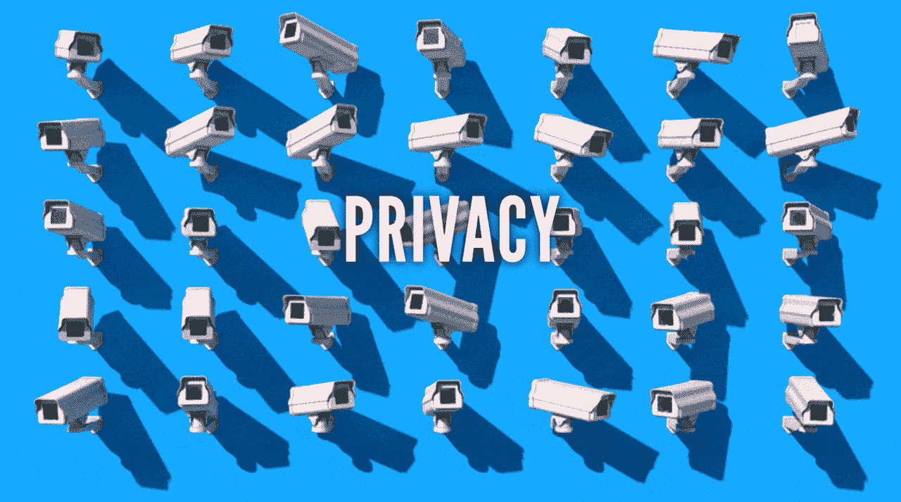
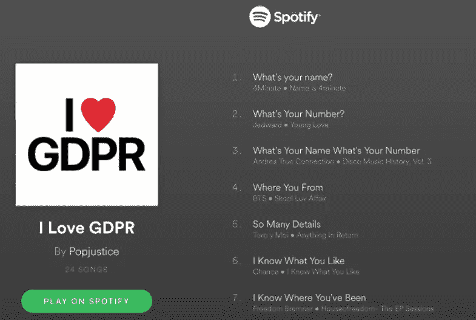
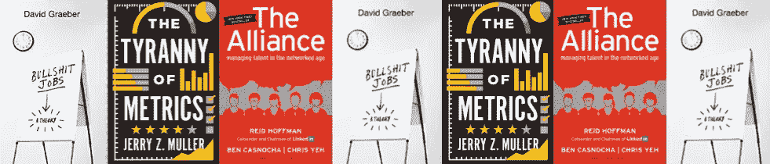
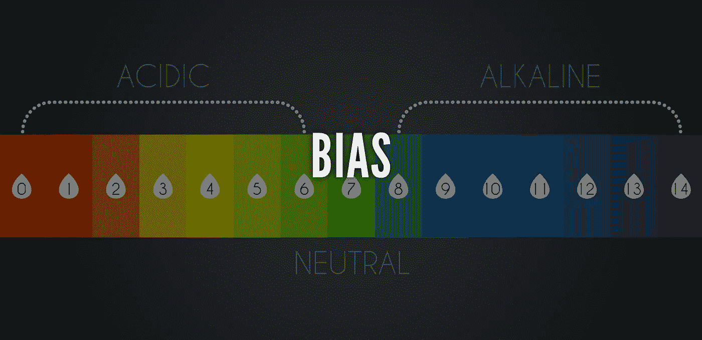
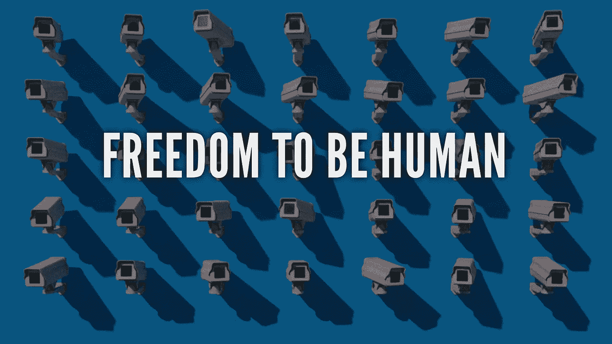

# 数据与隐私——如何找到平衡点？

> 原文：<https://medium.datadriveninvestor.com/data-vs-privacy-how-can-you-find-the-balance-bc7163b0b30a?source=collection_archive---------9----------------------->

任何了解我的人都知道我是一个技术怀疑论者。当我在活动中做演讲时，我会利用这个机会去看看软件本身以外的东西，以及它如何影响我们这些真实的人。数据与人类。

如果你希望这篇文章是关于 GDPR 的，恐怕不是…虽然这是一个真正的 Spotify 播放列表…

取而代之的是，我将从我最近读的三本书中取材…

那么，谁在乎人呢？我希望你们大多数人，因为我们在谈论工作的人性。

我将探讨为什么我们试图将我们对数据中心的了解应用到那些拥有某种中世纪技术的人身上，而这种技术还不够聪明，不足以应对这种情况，我们基本上是在将自己变成机器人，就像 20 世纪 70 年代在自动化生产线上所做的那样。我们需要创造力，但没有发挥的空间。所以实际上，我们要么被机器人统治者接管，要么成为那些机器人统治者。在我们所做的大部分工作中，没有任何关于我们人类的东西。所以，如果我们想让你变得伟大，那么我们自己也需要照照镜子。如果我们对人感到困扰，并且我们对技术有一点了解，那么我们就有一点要做。

无论你是否精通技术，我认为关键的事情是这东西并不简单，我们经常在它简单的前提下被销售。它不是。我们的所作所为存在偏见，需要加以解决。

当我们谈论数据和隐私时，我们倾向于跳过数据位，专注于隐私，但实际上今天我将做相反的事情，谈论数据和我们为什么这样做的指标，它的意义是什么，它的陷阱是什么。我将特别关注性能指标，因此这是数据和人性发生冲突的地方。

分析对我们来说很重要。我们知道人们对数据位感兴趣，但是我们知道我们要用它做什么吗？在我们得到数据之前，我们有问题吗？不。通常我们购买了大量的分析，尽我们所能挖掘它，但实际上，我们没有提出我们需要的问题。

因此，分析，它可以追溯到泰勒的家伙进入工厂，使他们更有效率，我们说，任何可以衡量的，可以改善。是的，这是真的，但它会得到改善吗？—可能是更大的问题。这是一种非常老式的思考工作的方式。自上而下，“我们将调查你做的每一件事，以便改进它。”这是数字对判断。我们只是回到了“一切都是关于数字”的状态，在没有判断的情况下证明一些事情。

这与我们在新兴联盟中所说的相反，在新兴联盟中，我们说雇员和雇主是平等的联盟，这是一个成年人的谈话，你必须说‘我会在这里待一段时间，这是我必须带的东西’，以及‘这是你必须带的东西’。这更多的是一起工作，而不是父母和孩子的关系，在这种关系中，你会说，“在我解雇你之前，你基本上是我们的奴隶。”

**信任**

我要讲的很多例子都与信任有关。为什么我们仍然有这种自上而下的态度和调查我们的组织？因为他们不信任我们。我们仍然在用一种非常老式的方式来做这件事，但是有各种各样的原因来解释为什么这种信任不存在，并且总是有怀疑。

这些不好的[插入职业]，我们将根除它们，我们将通过数字来做这件事……而不是用一种更复杂的方式来做。

总之，这总是和信任有关。

如果我们能确保我们有一个有效的系统，信任就是责任，我们一起工作，那么我们就不需要这种老式的，自上而下的衡量方式。

**医院**

再说医学吧…

在英国国民医疗服务体系中，我们知道他们所谓的“治愈测试”。如果你为某件事设立了衡量标准，那么它们就会被博弈。但是有些数据是好的，不要以为我在说所有的数据都是垃圾。

举个例子，在美国，大约是 30 天的再入院。因此，如果一个病人离开医院，但在 30 天内又回来了，那么这就是一个问题，因为最初的护理不够好。医院得到奖励或惩罚，并根据他们是否达到这些数字获得或多或少的钱。你猜怎么着？他们只是玩玩而已。他们会在急诊室治疗这些病人，或者他们会一直治疗到第 31 天，直到他们再次把他们带回来。

同样在美国，他们会根据自己的能力给医生打分，我不知道他们是否也开始这样做了，但是他们会给医生一种成绩单。同样的问题是，如果我想保持我的分数，并在这个分数的基础上获得报酬，我只会接那些不会出错的案子。我为什么要做不同的事情？

一旦你让它变得透明，一旦你把它与惩罚或奖励联系起来，它就变得有点困难了。

**教学**

所以，教学是另一个一旦你把它和其他事情联系起来的例子……如果你有像我一样的中学生，你会意识到，在学校里，他们专注于“为考试而教”，其他一切都被抛到了九霄云外。我希望我能在这一点上不那么非黑即白，但是有很多关于考试的课程，没有真正的内容，只是考试。

成绩没有错，只是有些东西不太好衡量。你如何衡量批判性思维？事实上，当其他一切都自动化时，你如何衡量这些人将来需要的所有东西？因为简单，老板们能理解，他们认为这就足够了——因为问题越复杂，解决问题的方法就越简单。

**军方**

军方开始有所改善，在这里我将讨论人员指标和结果。

人员(输入)度量是基于我们自己努力程度的*指标，与我们努力的效果截然不同。例如，输入指标包括:杀死的敌人数量、训练的友军数量、建造的学校或诊所数量、完成的道路里程数等等…………*

*“这些指标告诉我们正在做什么，但不是我们正在产生的效果。为了理解这种影响，我们需要看看产出指标:有多少友军在训练 3 个月后仍在服役，有多少学校或诊所在一年后仍在使用。”*

因此，我们正在做的事情和它是否真的有所作为是有区别的，这些结果衡量标准很难做到，它们是我们需要关注的一点。

现在，想出有用的度量标准通常需要沉浸在当地条件中，所以有一个判断/经验位。

以外来蔬菜的市场价格为例，很少有外人把它视为一个有用的指标，来衡量人们对和平和幸福的感受

有一篇题为《衡量阿富汗的进步》的文章讨论了反叛乱问题…

*“阿富汗是一个农业经济体，全国各地的作物多样性差异显著。鉴于阿富汗农业生产的自由市场经济，风险和成本因素——种植一份拷贝的机会、在不安全的道路上运输它的风险、在市场上出售它和将钱运回家的风险——往往会自动计入水果和蔬菜的成本。因此，总体市场价格的波动可能是普遍信心和安全感的替代指标。特别是，外来蔬菜——那些生长在特定地区之外的蔬菜，为了在该地区销售，必须冒着更大的风险运输到更远的地方——可以是一个有用的线索标记。”*

如果它们更便宜，这意味着每个人都更有安全感。但是，如果被问到“我们如何衡量阿富汗”，谁会想到呢？这是做这件事的方法。实际上，这就是我们将要做的。

作者用艺术和科学这样的标准来描述反叛乱——但主要是艺术。这与当地的经验有关:

这种趋势是把必然存在的东西视为纯粹的、可测量的科学，而这在很大程度上是一种艺术，需要基于经验的判断

**公制固定**

我们中有多少人做了大量的管理工作？问题在于，你关注的是你被衡量的方面，而不是其他品质，比如你的指导有多好，或者你是否是那些将团队凝聚在一起的社会人之一。它们很难衡量。因此，取而代之的是，我们通过发送多少封电子邮件来衡量我们的沟通能力。专注于几个容易衡量的方面而牺牲其他方面只是一个衡量标准固定的问题。其他一些概述如下:

*   **宣扬短期主义；**每 3 个月我们都要满足预算，所以我们必须有一些短期的东西。当我们让数据符合指标时，我们不会考虑长期计划，我们无法真正解决任何大问题。
*   **员工时间成本；**支持每个人都要求的这些指标需要多少成本？
*   **效用递减；这些指标的有用性降低了。**
*   **打击创新；**你没有改变想法或跳出框框，你只是在想我至少能做些什么。
*   **劝阻合作；没有动力一起工作。**
*   **让工作变得沉闷，少了人情味；我们所做的大部分事情只是推数据，而不是人为的。**
*   **生产率成本**

**隐私**

当我们谈论隐私的时候，很多人会想，‘我没有做任何违法的事情’，所以我没什么好担心的。但隐私更像是不完美的自由或者做人的自由。

当我们从就业角度考虑时，我们希望增长，我们谈论让人们变得伟大，与此同时，我们将会失败。让我们以简历为例。总的来说，简历没什么用，因为我们几乎可以编造简历。假设我们可以在简历后做些别的事情，我们可以核实数据，这是基于你在工作中的实际表现。但问题是，我可能在工作中做了一些非常垃圾的事情。我要不要捕捉这些信息，并把它放进类似简历的东西里，这样它就会得到验证，永远留在那里？我可能在成长过程中犯了一个错误，但最终在某个时候，你会做一些让你后悔的事情。但是隐私问题出现了，它问我该如何继续下去，继续下去是对的吗？这应该是正确的，你不能忽视别人的所作所为并使其无效，但是你也要小心。数据放在哪里？好吧，数据在“拥有者”那里，你的“拥有者”。但是很明显，数据应该和人坐在一起；我。任何与我的表现有关的东西都应该是我的数据，应该由我来保管。雇主不应该几乎什么都不需要。那么，我们如何在这两件事之间找到平衡呢？

这是一个新兴事物，我不知道它在哪里，但深入研究这一点是我们必须要做的。

> *我们必须参与这些对话。我们可能不精通技术，但我们需要参与其中。因为数据是重要的，但判断、经验、创造力以及大量的人类事物和人类事物也是我们所需要的。*

当我们展望未来时，这有点像汽车。20 世纪 70 年代的汽车；有些有效，有些无效。但是现在所有的汽车都可以工作，所以现在制造一辆好车与创新有关，而与它能不能工作无关。我们将进入相同的阶段，效率将是一个组织的底线，然后创造力和创新将带我们走，让我们更有利可图。

> *因此，技术、数据和指标正在让我们变得迟钝的技能，正是我们未来需要的技能。*

我们需要进去。有一个喜剧演员谈到一个恶霸的父母，他说‘你在抚养希特勒，进去！’我们需要进入那里，因为留给技术官僚的情况意味着人们将不再是人，我们的整个工作生活将在整体上变得“扯淡”。

我们能做些什么呢？

当我们进行测量时，我们需要查看数据与人性清单:

1.用共享的、深思熟虑的结果指标来衡量

2.保持敏捷，像项目一样运行它

3.定期重新评估有用性和成本

4.对透明度、奖励和惩罚要非常小心

5.在可能的情况下，将内部数据委托给所有者

6.增强当地的判断和经验

有兴趣知道你对隐私、数据、人性的想法，以及我们如何在未来的工作中找到平衡。

*原载于 2018 年 6 月 25 日*[*【https://www.linkedin.com】*](https://www.linkedin.com/pulse/data-vs-privacy-how-can-you-find-balance-mark-williams/)*。*