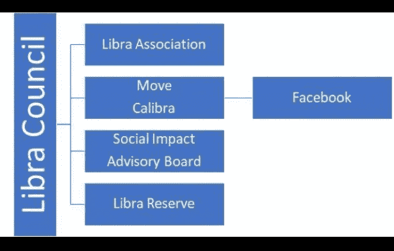

# 数据网格区块链 vs. Libra

> 原文：<https://medium.datadriveninvestor.com/datagrid-blockchain-vs-libra-329708d40273?source=collection_archive---------0----------------------->

**脸书 Libra 与 Prasaga DataGrid 区块链的高级概念对比**

作者:首席技术官大卫·贝伯曼

**天秤座**

脸书刚刚宣布了 Libra，并发布了关于它的技术和商业信息。技术面似乎是由一个基于领导者的、非分片的、BFT 共识式的、有限的分布式分类账组成的；再加上新的语言和带有新的内置数据类型的 VM，以及“模块”概念。该分类帐最初被许可，声称它将变得没有许可，而添加新代码的能力极其有限，同样声称它将在未来开放。

 [## 十大区块链课程-数据驱动的投资者

### 渴望在区块链发展吗？你想知道区块链是如何工作的，但不知道在哪里？或者就是太多了…

www.datadriveninvestor.com](https://www.datadriveninvestor.com/2019/03/08/top-10-blockchain-courses/) 

在商业方面，有一个由大公司组成的财团，支付 1000 万美元的象征性费用，成为运行 Libra 分布式账本的节点。所有 Libra 币都由某种其他货币篮子支持，为了获得 Libra 币，用户需要向其中一家公司存入一些其他货币(即购买它们)。操作分布式分类帐的节点不铸造新硬币(即，没有激励奖励)。硬币在存款时被创造出来，在兑换其他货币时被销毁，大概是法定货币(如美元、欧元等)。).这就是所谓的货币储备概念。这些储备以存款的形式持有，并可能被存款人用于投资，以获取自己的财务收益。

Libra 委员会(即财团)的结构如下所示:

**对比 Prasaga 数据网格区块链**

Prasaga 基金会的结构有点类似于 Libra Council，因为它是一个非营利信托机构。它下面有一个“研究所”，旨在为区块链的应用和使用孵化创新。它还相当于一个社会影响委员会，旨在充当一个慈善投资机构。由于数据网格区块链是无权限和开放的，因此没有节点操作者协会的角色。

Prasaga 基金会不包括储备金。这是因为数据网格令牌(“DGT”)不是一种储备货币，而是将使用一种货币政策方法，根据区块链账户的经济指标来管理硬币供应。竞争性市场力量将推动 DGT 和其他加密货币以及法定货币之间的汇率。DGB 使用 DGT 分散铸造的激励模式，用于管理硬币供应，并帮助确保 DGT 的分配。

尽管 DGB 概念要求理解货币供应、通货膨胀和实际经济增长以及反馈控制系统，但它导致了由区块链本身支持的独立货币。

DGB 技术包括一种新的虚拟机代码执行模型，该模型明确面向对象，显著增加了代码重用量，并支持多语言。DGB 帐户的架构支持帐户级别的分片，而不是智能合约级别，这大大增加了并行执行的机会和吞吐量。

此外，区块链账户架构为创建分散的多租户多边市场提供了机会，作为一个支持平台，并为投资者提供了隐含遵守 KYC 等法规的手段，同时为应用开发者提供了一个开放、灵活的编程环境。

简而言之，我们相信 DGB 提供了开放的、无许可的区块链技术，加上可伸缩性、托管独立货币、高级面向对象语言支持、实现平台等等。

**意见**

在我看来，到目前为止我看到的所有储备方法基本上都是让脸书这样的公司拿走你的法定货币，给你一个代币，然后用你的钱做他们想做的任何事情。没有联邦存款保险公司的保险。没有保护。对他们银行的挤兑将会把这一切搞砸，给代币持有者留下无法兑现的代币。尽管我确信加密货币的目的是防止这种情况的发生，但我认为加密货币的目的就是避免这种类型的系统。

我还可以补充一点，他们控制着支持其货币的货币篮子的汇率。他们可以将其贬值，这意味着你的代币会因他们的一时兴起而贬值。再说一遍，我确信对于标有 to 的购物篮是有规定的，但它仍然处于集中控制之下。

DGB 的货币政策不会受到中央集权的控制。相反，它将由分散节点激励的算法控制，具有可以修改算法参数的超站点功能。oversite 将由利益相关方投票提供，因此是一个分散的开放系统。经济活动越多使用 DGB，DGT 就变得越稳定。

由于 DGB 账户架构直接支持分片，账户数量越多，并行操作的机会就越多，DGB 的吞吐能力就越大。换句话说，DGB 可以随着使用量的增加而不断扩展，而不是固定的每秒事务数(TPS)。Libra 协议似乎是一种复制的数据库风格，带有分布式日志。尽管这具有较高的 TPS，但它是一个固定的容量，与账户或交易的数量无关。因此，我预计它会有峰值饱和问题，并随着时间的推移变得不可靠。

最后，Libra 正在使用一种拜占庭容错(“BFT”)版本，它有一个选举产生的领导者，包括节点的签名，可以被认为是一种利害关系证明风格的协议。尽管有大量证据表明，依赖于使用私钥/公钥对的签名的 PoS 共识模型在每次交易的基础上表现得更好，但是对私钥安全性的依赖仍然是一个永久的问题。此外，在没有工作证明的计算强度的情况下，如果对手在历史中的某个时间点获得了足够的密钥来克服 BFT，则有可能创建虚假链并以比“真实”链更快的速度生成虚假交易。

我不相信一个区块链可以声称长期安全，如果没有一些方面的工作证明，包括消除对节点私钥的唯一依赖。因此，DataGrid 区块链被设计为既使用一种形式的利益证明，又使用我们的工作证明形式。我们相信，这将为我们的区块链提供与比特币或以太坊同等的长期安全性，同时提供可扩展性，以支持当前和未来分散式应用的交易吞吐量。

数据网格区块链、DGB、数据网格令牌、DGT、可扩展区块链对象模型、XBOM、可扩展智能对象资产、XSOA、智能对象、可扩展签名对象、XSIG 是 Prasaga，LLC 的商标。保留所有权利。【www.prasaga.com】info@prasaga.com