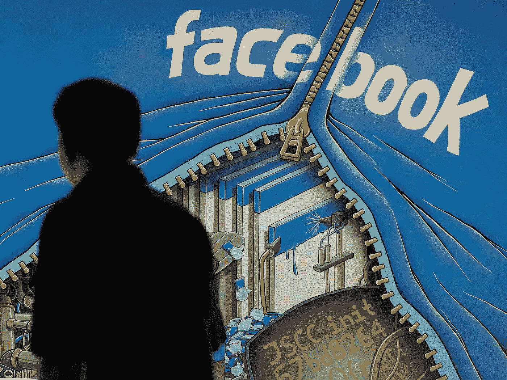

# 数据的道德困境:如何赚钱，代价是什么？

> 原文：<https://medium.datadriveninvestor.com/datas-moral-dilemma-how-to-monetize-and-at-what-cost-c713f8681a5d?source=collection_archive---------0----------------------->

20 年前，如果你想买一条面包，收银员询问你的年龄、性别、婚姻状况和收入以完成交易，你会扬起眉毛，大步走出商店。你甚至可以打电话给当地的国会议员或更好的商业机构投诉。2018 年，你故意放弃大量个人数据，不仅是为了购物，也是为了访问网站或发送电子邮件。

有没有比现代数字数据更无形的力量？大多数人无法理解他们的在线活动如何转化为数据，以及这些数据对企业的价值有多大。

随着消费者意识和政府审查的普及，希望利用用户数据赚钱的公司需要做出决定:与可能以不道德或非法的方式收集数据的数据经纪人合作，或将数据视为神圣的个人隐私的延伸。

## 数据经纪人

数据代理是一个价值 2000 亿美元的行业。数字世界与我们的现代生活交织在一起。这让位于经纪人包装我们的数据，然后卖给零售商、服务提供商和广告商。这些数据可能包含用户的性别、年龄、婚姻状况、收入、购买历史、宗教、兴趣或爱好。

数据经纪人从数据源提取数据，并建立数字档案。购买这些档案的目的是将它们与广告配对或产生销售线索。有了正确的数据，没有一种服务或产品不会卖得更快更好。

公司卖什么不重要。知道他们的客户想要什么或在哪里找到新客户已经让位于一大群寻求从用户信息中获利的数据经纪人。

## 脸书表明了立场

今年 3 月，脸书宣布将终止与几家大型数据经纪公司的合作关系，这些公司帮助广告商在社交网络上锁定目标人群，此前脸书出现了处理个人信息的丑闻。全球最大的社交媒体公司在披露约 5000 万脸书用户的信息错误地落入政治咨询公司剑桥分析公司(Cambridge Analytica)手中后，一直面临改善数据处理的压力。

以前，数据经纪人能够锁定特定的脸书用户群，让他们将更广泛的广告定位指标带到脸书。现在，他们要么不得不使用脸书自己的目标工具，要么使用一种更为具体的目标形式，即所谓的“定制受众”，这通常要求公司事先与他们的目标用户建立关系。

脸书还宣布，他们将关闭相反方向的数据流，防止相同的数据经纪人收到关于他们的广告活动如何被接收的匿名信息。

## 数据货币化

任何数据都可以货币化。市场是无限的，如果搭配正确的策略，它会推动销售和知名度。数据通过识别效率低下、创造更好的客户体验、显示收入损失和洞察客户获取来解决业务问题。

组织已经习惯于雇用不同的供应商或采用各种系统来防止流失或管理销售或降低客户获取成本。数据提供了这些服务的更好版本。是的，购买、分类、分析数据并将其转化为策略是一项巨大的投资，但它更高效、更可靠。

数据有其丑陋的一面，以负面方式使用它的诱惑永远存在。组织必须了解数据代理或拥有这种访问权限的危险。他们需要划清界限，尊重用户，并且能够坦然地说不。

道德数据使用的第一步是诚实地获取数据。