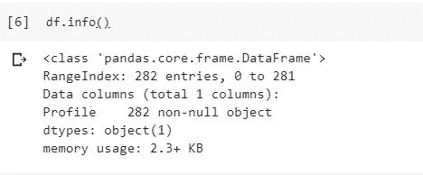
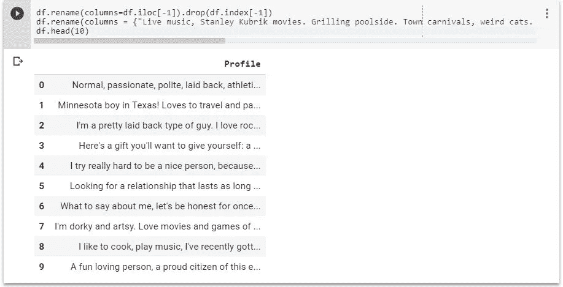
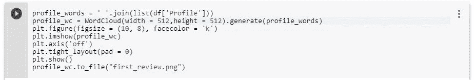
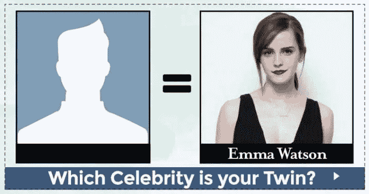
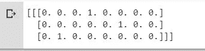
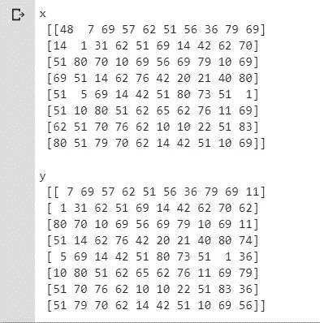

# 大数据和人工智能时代的约会

> 原文：<https://medium.datadriveninvestor.com/dating-in-the-big-data-and-ai-era-410d1011aec5?source=collection_archive---------2----------------------->

[](http://www.track.datadriveninvestor.com/1B9E)

网上约会已经成为结识新朋友并可能找到真爱的流行场所。在我以前的一篇帖子中，我谈到了*黑镜集《牵手 DJ》*，这是关于现代世界中的网恋。但是这个未来世界离我们的现实有一百万年的距离吗？我不这么认为。大数据和人工智能算法是让我们进入现实的关键。

想象一下这些约会应用和网站从不同的人那里收集的数据，这些人注册寻找重要的人。数据是所有企业的黄金。你有没有想过这些约会应用是如何决定潜在情侣配对的？机器学习算法和人工智能正被用于实现精确匹配。数据越多，匹配越好，就这么简单。

那么，他们如何收集大量的数据来开始做出好的预测呢？

在得到用户许可的情况下，许多约会应用和网站从其他网站获取有见地的数据(你可能做过在线测试！)，社交媒体平台和购物网站。这种数据非常重要，因为它可以揭示一个人的许多情况。约会应用程序收集这些信息来改善他们的匹配。

约会应用程序也使用协同过滤，如网飞和亚马逊，这样，他们可以根据他们最受欢迎的节目和他们购买的产品种类等因素获得更好的匹配。从数据中得出的结论比问卷数据更可信。人们在写个人资料时往往会隐瞒自己的弱点。

Bumble 和其他约会应用程序可以选择将你的社交媒体链接到你的约会应用程序档案。你可能会错过的是，通过这种方式，你向他们提供了关于你的个性和兴趣的详细信息。

在为来自脸书的 *PyTorch 奖学金挑战*的**“项目展示倡议”**比赛做兼职项目时，受到上周末我读到的一篇帖子的启发:

[](https://www.getcenturylink.com/blog/bot-read-tinder-bios-came-up-with-own/) [## 我们有一个机器人读取了 500 个 Tinder 的 Bios，它想出了自己的 GetCenturyLink

### 这些天，有一个适合每个人的约会应用程序。从马术爱好者到培根爱好者，再到无麸浪漫主义者。但是没有…

www.getcenturylink.com](https://www.getcenturylink.com/blog/bot-read-tinder-bios-came-up-with-own/) 

我将与一个团队合作，创建一个由 AI 提供一些功能的**约会应用程序。**

首先，让我们考虑一下数据。我们需要收集真实的数据，所以我的家庭作业是从互联网上的 200 个约会资料中收集数据。不得不从真正的约会应用程序中获取。虽然数据集仍然很小，但我计划将它变大以获得更好的结果。

让我们来看看:


200 Profiles!

我们来分析一下数据:



Info about our dataset



Our dataframe



Generating a wordcloud

**单词云**是我最喜欢的可视化数据的工具之一，这是一种流行的数据可视化技术，用于表示文本数据，其中每个**单词**的大小表示其频率或重要性。让我们来看看我从这些简介中生成的 wordcloud:


Most common words


Fifteen most common words

我们可以在**单词云**中看到，最常用的单词是(选择能给我们提供更多关于这个人的详细信息的单词):

**爱情:**这有两种可能:他们在描述他们喜欢做的事情，或者……他们在寻找爱情。

**寻找:**他们让我们知道他们在寻找什么:可能是一段认真的感情，也可能只是约会。

好:他们可能在描述他们喜欢做或喜欢的事情。

**享受:**另一个形容自己喜欢做的事情的词。

**时间:**时间似乎是这些人的一个重要因素。他们可能有时间，也可能没有时间去参加一场可能的比赛。

**狗:**这些数据是从奥斯汀个人资料中收集的，奥斯汀看起来是一个对狗友好的城市，所以，这似乎是这些人的一个重要因素。他们可能喜欢或拥有一只狗。

**电影:**所有这些简介里的流行和共同爱好。

他们似乎都喜欢户外活动。

旅行:看来他们可能的另一半喜欢旅行是必须的！

朋友:在他们的简介中，最重要的一点是他们会提到朋友，所以他们可能会欣赏他们的朋友或与他们可能的伴侣的良好友谊。

您可以清理数据以获得更多见解，例如去掉少于 4 个字母的小单词。这取决于你。

现在我分析了一点数据，让我们动手做吧！

# 创建新的 Bumble 档案，从 200 个 Bumble 档案中学习。让乐趣开始吧！

如果我们使用深度学习来生成约会应用程序的个人资料提案会怎么样。有时候，我们没有灵感写下一个。但是嘿，这也很搞笑！所以，这个项目的第一个目的就是找点乐子！


我想到的另一件事是……我们为什么不利用人脸识别的优势，加入一项服务，在你上传图片(名人图片)时为你提供匹配？)去找一个和你分享的图片里的人身体相似的匹配？



It’s a WIN-WIN option!

你可以训练一个模特给你推荐一个搭配，同时用名人图片喂它！

因此，让我们从概要文件生成器的概念开始。我将使用来自 **Udacity** 的深度学习课程中提供的材料来完成这第一步:

# PyTorch 中的角色级 LSTM

我将使用 PyTorch 创建一个角色级别的 LSTM。该网络将在我之前使用的 280 个 Bumble 配置文件上逐个字符地训练，然后逐个字符地生成新的配置文件。这个模型将能够基于这些配置文件生成新的 Bumble 配置文件！

这个网络是基于 Andrej Karpathy 关于 RNN 的文章和 Torch 的实现。下面是 RNN 的总体架构。


首先，让我们加载数据加载和模型创建所需的资源:

```
import numpy as np
import torch
from torch import nn
import torch.nn.functional as F
```

**载入数据**

然后，我们将加载 200 个 Bumble profiles 文本文件，并将其转换成整数供我们的网络使用。

```
# open text file and read in data as `text`
with open('dating_profiles_200.txt', 'r') as f:
    text = f.read()
```

让我们检查前 800 个字符，确保一切正常:

```
text[:800]
```

\ ufeffLive 音乐，Stanley Kubrik 电影。泳池边烧烤。小镇嘉年华，怪猫。吉他，寿司，80 年代的恐怖。摩托车。古董店。黑胶唱片。天文学

**标记化**

在下面的单元格中，我创建了两个字典来将字符和整数相互转换。将字符编码为整数使得在网络中作为输入更容易。

```
# Encode the text and map each character to an integer and vice versa# we create two dictionaries:
# 1\. int2char, which maps integers to characters
# 2\. char2int, which maps characters to unique integers
chars = tuple(set(text))
int2char = dict(enumerate(chars))
char2int = {ch: ii for ii, ch in int2char.items()}# Encode the text
encoded = np.array([char2int[ch] for ch in text])
```

我们可以从上面看到同样的字符，编码成整数:

```
encoded[:800]
```

数组([24，7，8，25，60，71，66，10，77，8，51，15，71，9，55，83，19，64，60，72，71，74，10，53，54，8，40，71，66，32，25，8，60，77，44，71，35，54，8，64，64，8，19，69 44, 71, 35, 10, 8, 55, 83, 54, 77, 15, 71, 9, 10, 77, 33, 8, 15, 71, 78, 73, 67, 77, 71, 33, 32, 54, 54, 32, 54, 44, 71, 84, 32, 55, 32, 54, 51, 72, 51, 64, 60, 77, 44, 71, 56, 8, 19, 55, 83, 69, 60, 71, 77, 33, 32, 18, 77, 44, 71, 56, 8, 19, 72, 64, 71, 54, 60, 51, 32, 54, 37, 77, 44, 71, 47, 77, 55, 54, 32, 19, 32, 66, 72, 71, 79, 21, 83, 8, 64, 71, 9, 83, 69, 83, 19, 68, 38, 44, 71, 7, 60, 55, 67, 77, 71, 60, 16, 18, 64, 32, 54, 60, 71, 83, 19, 71, 83, 53, 83, 19, 37, 32, 19, 60, 37, 71, 53, 10, 8, 64, 37, 8, 19, 69, 71, 55, 32, 69, 60, 55, 33, 60, 54, 44, 48, 36, 32, 54, 66, 83, 64, 15, 71, 18, 83, 77, 77, 8, 32, 19, 83, 55, 60, 15, 71, 18, 32, 64, 8, 55, 60, 15, 71, 64, 83, 8, 37, 71, 53, 83, 51, 40, 15, 71, 83, 55, 33, 64, 60, 55, 8, 51, 15, 71, 83, 37, 25, 60, 19, 55, 10, 54, 32, 10, 77, 71, 66, 83, 19, 71, 77, 60, 60, 40, 77, 71, 22, 32, 66])

**数据预处理**

正如您在上面的 char-RNN 图像中看到的，我们的 LSTM 期望输入是一个热编码，这意味着每个字符都被转换为一个整数(通过我们创建的字典)，然后转换为一个列向量，其中只有它对应的整数索引的值为 1，向量的其余部分将被填充为 0。因为我们是一个热编码数据，所以让我们创建一个函数来完成此操作！

```
def one_hot_encode(arr, n_labels):

    # Initialize the the encoded array
    one_hot = np.zeros((np.multiply(*arr.shape), n_labels), dtype=np.float32)

    # Fill the appropriate elements with ones
    one_hot[np.arange(one_hot.shape[0]), arr.flatten()] = 1.

    # Finally reshape it to get back to the original array
    one_hot = one_hot.reshape((*arr.shape, n_labels))

    return one_hot
    # check that the function works as expected
    test_seq = np.array([[3, 5, 1]])
    one_hot = one_hot_encode(test_seq, 8) print(one_hot)
```



**制作训练小批量**

为了根据这些数据进行训练，我们还想创建小批量来进行训练。请记住，我们希望我们的批处理是一些期望数量的序列步骤的多个序列。

我们将获取编码的字符(作为 arr 参数传入)并将它们分成多个序列，由 batch_size 给出。我们的每个序列的长度都是 seq_length。

**创建批次**

1.  我们需要做的第一件事是丢弃一些文本，这样我们只有完全完整的小批量。

每个批次包含 **N×M** 个字符，其中 N 是批次大小(批次中序列的数量)，而 **M** 是序列的 seq_length 或时间步数。然后，为了得到我们可以从数组 arr 中得到的批次总数， **K** ，你用 arr 的长度除以每批的字符数。一旦知道了批次数，就可以从 arr，**N∫M∫k .**中得到要保留的字符总数

2.之后，我们需要将 arr 分成 **N** 批。

您可以使用 arr . shape(size)来实现这一点，其中 size 是一个包含整形后数组的维度大小的元组。我们知道我们想要一批中的 **N** 个序列，所以让我们把它定为第一维的大小。对于第二维，您可以使用-1 作为大小的占位符，它会用合适的数据填充数组。在这之后，你应该有一个数组是**n×(M∫K)**。

3.现在我们有了这个数组，我们可以遍历它来获得我们的小批量。

想法是每一批都是在**n×(M∫K)**阵列上的一个 **N×M** 窗口。对于每个后续批次，窗口移动 seq_length。我们还想创建输入和目标数组。记住，目标只是移动了一个字符的输入。我做这个窗口的方式是使用 range 从 0 到 arr.shape[1]的 n_steps 大小的步长，即每个序列中标记的总数。这样，从 range 得到的整数总是指向一个批处理的开始，并且每个窗口的宽度都是 seq_length。

我们将在下面的函数中编写创建批处理的代码:

```
def get_batches(arr, batch_size, seq_length):
    '''Create a generator that returns batches of size
       batch_size x seq_length from arr.

       Arguments
       ---------
       arr: Array you want to make batches from
       batch_size: Batch size, the number of sequences per batch
       seq_length: Number of encoded chars in a sequence
    '''

    batch_size_total = batch_size * seq_length
    # total number of batches we can make
    n_batches = len(arr)//batch_size_total

    # Keep only enough characters to make full batches
    arr = arr[:n_batches * batch_size_total]
    # Reshape into batch_size rows
    arr = arr.reshape((batch_size, -1))

    # iterate through the array, one sequence at a time
    for n in range(0, arr.shape[1], seq_length):
        # The features
        x = arr[:, n:n+seq_length]
        # The targets, shifted by one
        y = np.zeros_like(x)
        try:
            y[:, :-1], y[:, -1] = x[:, 1:], arr[:, n+seq_length]
        except IndexError:
            y[:, :-1], y[:, -1] = x[:, 1:], arr[:, 0]
        yield x, y
```

**测试您的实现**

现在，我将制作一些数据集，我们可以在批量处理数据时查看发生了什么。我将使用 8 和 50 个序列步骤的批量大小。

```
batches = get_batches(encoded, 8, 50)
x, y = next(batches)# printing out the first 10 items in a sequence
print('x\n', x[:10, :10])
print('\ny\n', y[:10, :10])
```



尽管确切的数字可能不同。检查以确保 y 的数据移动了一步。

**用 PyTorch 定义网络**

下面是您定义网络的地方。

我将使用 PyTorch 来定义网络的架构，首先定义我们需要的层和操作。然后，定义向前传递的方法。你还被赋予了一种预测字符的方法。模型结构

在 **init** 中，建议的结构如下:

```
Create and store the necessary dictionaries (this has been done for you)
Define an LSTM layer that takes as params: an input size (the number of characters), a hidden layer size n_hidden, a number of layers n_layers, a dropout probability drop_prob, and a batch_first boolean (True, since we are batching)
Define a dropout layer with dropout_prob
Define a fully-connected layer with params: input size n_hidden and output size (the number of characters)
Finally, initialize the weights (again, this has been given)
```

注意，有些参数已经在 **init** 函数中命名和给出，我们通过类似 self.drop_prob = drop_prob 这样的操作来使用和存储它们。

**你可以创建一个基本的 LSTM 图层，如下所示**

self.lstm = nn。LSTM(输入大小，n 个隐藏层，n 个层，dropout=drop_prob，batch_first=True)

其中，input_size 是该单元格期望看到的顺序输入的字符数，n_hidden 是该单元格中隐藏层的单元数。并且我们可以通过添加一个具有指定概率的脱落参数来添加脱落；这将自动增加输入或输出的下降。最后，在 forward 函数中，我们可以使用. view 将 LSTM 单元格堆叠成层。这样，您传入一个单元格列表，它会将一个单元格的输出发送到下一个单元格。

我们还需要创建一个全零的初始隐藏状态。这是这样做的

self.init_hidden()

```
# check if GPU is available
train_on_gpu = torch.cuda.is_available()
if(train_on_gpu):
    print('Training on GPU!')
else: 
    print('No GPU available, training on CPU; consider making n_epochs very small.')
```

关于 GPU 的训练！

```
class CharRNN(nn.Module):

    def __init__(self, tokens, n_hidden=512, n_layers=3,
                               drop_prob=1, lr=0.0001):
        super().__init__()
        self.drop_prob = drop_prob
        self.n_layers = n_layers
        self.n_hidden = n_hidden
        self.lr = lr

        # creating character dictionaries
        self.chars = tokens
        self.int2char = dict(enumerate(self.chars))
        self.char2int = {ch: ii for ii, ch in self.int2char.items()}

        ## Define the LSTM
        self.lstm = nn.LSTM(len(self.chars), n_hidden, n_layers, 
                            dropout=drop_prob, batch_first=True)

        ## Define a dropout layer
        self.dropout = nn.Dropout(drop_prob)

        ## Define the final, fully-connected output layer
        self.fc = nn.Linear(n_hidden, len(self.chars))

    def forward(self, x, hidden):
        ''' Forward pass through the network. 
            These inputs are x, and the hidden/cell state `hidden`. '''

        ## Get the outputs and the new hidden state from the lstm
        r_output, hidden = self.lstm(x, hidden)

        ## Pass through a dropout layer
        out = self.dropout(r_output)

        # Stack up LSTM outputs using view
        # you may need to use contiguous to reshape the output
        out = out.contiguous().view(-1, self.n_hidden)

        ## Put x through the fully-connected layer
        out = self.fc(out)

        # return the final output and the hidden state
        return out, hidden

    def init_hidden(self, batch_size):
        ''' Initializes hidden state '''
        # Create two new tensors with sizes n_layers x batch_size x n_hidden,
        # initialized to zero, for hidden state and cell state of LSTM
        weight = next(self.parameters()).data

        if (train_on_gpu):
            hidden = (weight.new(self.n_layers, batch_size, self.n_hidden).zero_().cuda(),
                  weight.new(self.n_layers, batch_size, self.n_hidden).zero_().cuda())
        else:
            hidden = (weight.new(self.n_layers, batch_size, self.n_hidden).zero_(),
                      weight.new(self.n_layers, batch_size, self.n_hidden).zero_())

        return hidden
```

训练时间到了！

训练功能使我们能够设置时期数、学习率和其他参数。

下面我们使用 Adam 优化器和交叉熵损失，因为我们把字符类分数作为输出。像往常一样，我们计算损失并执行反向传播！

关于培训的几个细节:

```
Within the batch loop, we detach the hidden state from its history; this time setting it equal to a new tuple variable because an LSTM has a hidden state that is a tuple of the hidden and cell states.
    We use clip_grad_norm_ to help prevent exploding gradients.
```

训练网络的功能:

```
def train(net, data, epochs=20, batch_size=10, seq_length=50, lr=0.0001, clip=5, val_frac=0.1, print_every=10):
    ''' Training a network 

        Arguments
        ---------

        net: CharRNN network
        data: text data to train the network
        epochs: Number of epochs to train
        batch_size: Number of mini-sequences per mini-batch, aka batch size
        seq_length: Number of character steps per mini-batch
        lr: learning rate
        clip: gradient clipping
        val_frac: Fraction of data to hold out for validation
        print_every: Number of steps for printing training and validation loss

    '''
    net.train()

    opt = torch.optim.Adam(net.parameters(), lr=lr)
    criterion = nn.CrossEntropyLoss()

    # create training and validation data
    val_idx = int(len(data)*(1-val_frac))
    data, val_data = data[:val_idx], data[val_idx:]

    if(train_on_gpu):
        net.cuda()

    counter = 0
    n_chars = len(net.chars)
    for e in range(epochs):
        # initialize hidden state
        h = net.init_hidden(batch_size)

        for x, y in get_batches(data, batch_size, seq_length):
            counter += 1

            # One-hot encode our data and make them Torch tensors
            x = one_hot_encode(x, n_chars)
            inputs, targets = torch.from_numpy(x), torch.from_numpy(y)

            if(train_on_gpu):
                inputs, targets = inputs.cuda(), targets.cuda()# Creating new variables for the hidden state, otherwise
            # we'd backprop through the entire training history
            h = tuple([each.data for each in h])# zero accumulated gradients
            net.zero_grad()

            # get the output from the model
            output, h = net(inputs, h)

            # calculate the loss and perform backprop
            loss = criterion(output, targets.view(batch_size*seq_length))
            loss.backward()
            # `clip_grad_norm` helps prevent the exploding gradient problem in RNNs / LSTMs.
            nn.utils.clip_grad_norm_(net.parameters(), clip)
            opt.step()

            # loss stats
            if counter % print_every == 0:
                # Get validation loss
                val_h = net.init_hidden(batch_size)
                val_losses = []
                net.eval()
                for x, y in get_batches(val_data, batch_size, seq_length):
                    # One-hot encode our data and make them Torch tensors
                    x = one_hot_encode(x, n_chars)
                    x, y = torch.from_numpy(x), torch.from_numpy(y)

                    # Creating new variables for the hidden state, otherwise
                    # we'd backprop through the entire training history
                    val_h = tuple([each.data for each in val_h])

                    inputs, targets = x, y
                    if(train_on_gpu):
                        inputs, targets = inputs.cuda(), targets.cuda()output, val_h = net(inputs, val_h)
                    val_loss = criterion(output, targets.view(batch_size*seq_length))

                    val_losses.append(val_loss.item())

                net.train() # reset to train mode after iterationg through validation data

                print("Epoch: {}/{}...".format(e+1, epochs),
                      "Step: {}...".format(counter),
                      "Loss: {:.4f}...".format(loss.item()),
                      "Val Loss: {:.4f}".format(np.mean(val_losses)))
```

**实例化模型**

现在我们可以训练网络了。首先，我们将用一些给定的超参数创建网络本身。然后，定义小批量的大小，并开始训练！

```
# define and print the net
n_hidden=512
n_layers=20net = CharRNN(chars, n_hidden, n_layers)
print(net)
```

CharRNN( (lstm): LSTM(85，512，num_layers=20，batch_first=True，Dropout = 1)(Dropout):Dropout(p = 1)(fc):Linear(in _ features = 512，out_features=85，bias=True))

```
batch_size = 32
seq_length = 100
n_epochs =1000 # start smaller if you are just testing initial behavior# train the model
train(net, encoded, epochs=n_epochs, batch_size=batch_size, seq_length=seq_length, lr=0.0001, print_every=10)
```

**获得最佳模特**

要设置超参数以获得最佳性能，您需要观察训练和验证损失。如果你的训练损失比确认损失低很多，你就过度适应了。增加正规化(更多辍学)或使用较小的网络。如果训练和验证的损失很接近，那么你的装备不足，所以你可以增加网络的规模。

**超参数**

这是网络的超参数。

在定义模型时:

```
n_hidden - The number of units in the hidden layers.
n_layers - Number of hidden LSTM layers to use.
```

在本例中，我们假设辍学概率和学习率将保持默认值。

在培训中:

```
batch_size - Number of sequences running through the network in one pass.
seq_length - Number of characters in the sequence the network is trained on. Larger is better typically, the network will learn more long range dependencies. But it takes longer to train. 100 is typically a good number here.
lr - Learning rate for training
```

这里有一些安德烈·卡帕西关于训练网络的好建议。为了您的利益，我将把它复制到这里，同时也链接到它最初的来源。[https://github.com/karpathy/char-rnn#tips-and-tricks](https://github.com/karpathy/char-rnn#tips-and-tricks)

# 提示和技巧

**监控验证损失与培训损失**

```
If you're somewhat new to Machine Learning or Neural Networks it can take a bit of expertise to get good models. The most important quantity to keep track of is the difference between your training loss (printed during training) and the validation loss (printed once in a while when the RNN is run on the validation data (by default every 1000 iterations)). In particular: If your training loss is much lower than validation loss then this means the network might be overfitting. Solutions to this are to decrease your network size, or to increase dropout. For example you could try dropout of 0.5 and so on.
    If your training/validation loss are about equal then your model is underfitting. Increase the size of your model (either number of layers or the raw number of neurons per layer)
```

**参数的大概数量**

```
The two most important parameters that control the model are n_hidden and n_layers. I would advise that you always use n_layers of either 2/3\. The n_hidden can be adjusted based on how much data you have. The two important quantities to keep track of here are: The number of parameters in your model. This is printed when you start training.
    The size of your dataset. 1MB file is approximately 1 million characters.These two should be about the same order of magnitude. It's a little tricky to tell. Here are some examples: I have a 100MB dataset and I'm using the default parameter settings (which currently print 150K parameters). My data size is significantly larger (100 mil >> 0.15 mil), so I expect to heavily underfit. I am thinking I can comfortably afford to make n_hidden larger.
    I have a 10MB dataset and running a 10 million parameter model. I'm slightly nervous and I'm carefully monitoring my validation loss. If it's larger than my training loss then I may want to try to increase dropout a bit and see if that helps the validation loss.
```

**最佳车型策略**

```
The winning strategy to obtaining very good models (if you have the compute time) is to always err on making the network larger (as large as you're willing to wait for it to compute) and then try different dropout values (between 0,1). Whatever model has the best validation performance (the loss, written in the checkpoint filename, low is good) is the one you should use in the end.It is very common in deep learning to run many different models with many different hyperparameter settings, and in the end take whatever checkpoint gave the best validation performance.By the way, the size of your training and validation splits are also parameters. Make sure you have a decent amount of data in your validation set or otherwise the validation performance will be noisy and not very informative.
```

**检查点**

训练结束后，我们将保存模型，以便以后需要时可以再次加载它。这里我保存了创建相同架构所需的参数，隐藏层超参数和文本字符。

```
# change the name, for saving multiple files
model_name = 'rnn_100_epoch.net'checkpoint = {'n_hidden': net.n_hidden,
              'n_layers': net.n_layers,
              'state_dict': net.state_dict(),
              'tokens': net.chars}with open(model_name, 'wb') as f:
    torch.save(checkpoint, f)
```

# 做预测

既然模型已经训练好了，我们就要从中取样并预测下一个角色！为了采样，我们传入一个字符，让网络预测下一个字符。然后我们把那个字符传回来，得到另一个预测的字符。只要继续这样做，你就会生成一堆文本！关于预测函数的一点注记

我们的 RNN 的输出来自全连接层，它输出下一个字符分数的分布。

```
To actually get the next character, we apply a softmax function, which gives us a probability distribution that we can then sample to predict the next character.Top K samplingOur predictions come from a categorical probability distribution over all the possible characters. We can make the sample text and make it more reasonable to handle (with less variables) by only considering some K most probable characters. This will prevent the network from giving us completely absurd characters while allowing it to introduce some noise and randomness into the sampled text. Read more about topk, here. [https://pytorch.org/docs/stable/torch.html#torch.topk](https://pytorch.org/docs/stable/torch.html#torch.topk)
```

预测功能:

```
def predict(net, char, h=None, top_k=None):
        ''' Given a character, predict the next character.
            Returns the predicted character and the hidden state.
        '''

        # tensor inputs
        x = np.array([[net.char2int[char]]])
        x = one_hot_encode(x, len(net.chars))
        inputs = torch.from_numpy(x)

        if(train_on_gpu):
            inputs = inputs.cuda()

        # detach hidden state from history
        h = tuple([each.data for each in h])
        # get the output of the model
        out, h = net(inputs, h)# get the character probabilities
        p = F.softmax(out, dim=1).data
        if(train_on_gpu):
            p = p.cpu() # move to cpu

        # get top characters
        if top_k is None:
            top_ch = np.arange(len(net.chars))
        else:
            p, top_ch = p.topk(top_k)
            top_ch = top_ch.numpy().squeeze()

        # select the likely next character with some element of randomness
        p = p.numpy().squeeze()
        char = np.random.choice(top_ch, p=p/p.sum())

        # return the encoded value of the predicted char and the hidden state
        return net.int2char[char], h
```

**启动和生成文本**

通常情况下，您会希望启动网络，以便建立隐藏状态。否则，网络将开始随机生成字符。一般来说，第一串字符会有点粗糙，因为它还没有建立一个很长的字符历史来预测。

```
def sample(net, size, prime="I'm looking for", top_k=None):

    if(train_on_gpu):
        net.cuda()
    else:
        net.cpu()

    net.eval() # eval mode

    # First off, run through the prime characters
    chars = [ch for ch in prime]
    h = net.init_hidden(1)
    for ch in prime:
        char, h = predict(net, ch, h, top_k=top_k)chars.append(char)

    # Now pass in the previous character and get a new one
    for ii in range(size):
        char, h = predict(net, chars[-1], h, top_k=top_k)
        chars.append(char)return ''.join(chars)
```

打印一些样品:

```
print(sample(net, 2000, prime="I'm looking for", top_k=5))
```

# 加载检查点

```
# Here we have loaded in a model that trained over 20 epochs `rnn_20_epoch.net`
with open('rnn_20_epoch.net', 'rb') as f:
    checkpoint = torch.load(f)

loaded = CharRNN(checkpoint['tokens'], n_hidden=checkpoint['n_hidden'], n_layers=checkpoint['n_layers'])
loaded.load_state_dict(checkpoint['state_dict'])
```

使用加载模型的示例:

```
# Sample using a loaded model
print(sample(loaded, 300, top_k=5, prime="I'm looking for")) 
```

我没有显示结果，因为我正在研究一个更好的模型和更大的数据集，以获得更好的预测！那也是你的作业！

下一部分，我将展示结果，并继续第二部分:为我们的约会应用程序实现“面部相似性”！


Black Mirror, “Hand the DJ”