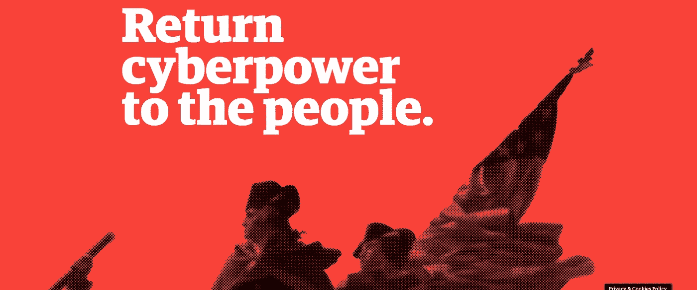

# 大卫·杰伦特想要杀死脸书；“去殖民化”互联网

> 原文：<https://medium.datadriveninvestor.com/david-gelernter-wants-to-kill-facebook-decolonize-the-internet-e2c259a71123?source=collection_archive---------6----------------------->

我们需要一个建立在区块链基础上的公共数据库和社交市场吗？

你可能听说过大卫·格勒恩特。他是耶鲁大学的计算机科学教授，是“自由派”学术界和政治正确性的激烈批评者，是气候变化怀疑论者，也是——不幸的是——尤那邦摩恐怖分子泰德·卡钦斯基的受害者，后者在 1993 年寄给他一个邮件炸弹，差点要了他的命。炸弹爆炸时，格勒恩特失去了右手，右眼也永久受损

几天前，Gelernter 在媒体上推出了一个名为 [Revolution Populi](https://revolutionpopuli.com/) 的新想法，呼吁针对脸书的民粹主义革命，并倡导建立一个基于区块链的大规模公共数据库和一个社交密码市场作为替代。

 [## 幸福的算法？数据驱动的投资者

### 从一开始，我们就认为技术正在使我们的生活变得更好、更快、更容易和更实用。社交媒体…

www.datadriveninvestor.com](https://www.datadriveninvestor.com/2019/03/08/an-algorithm-for-happiness/) 

他的[宣言](https://medium.com/@david.gelernter/manifesto-6b94d4b34210)一针见血:

*脸书是鸦片窟，更新。它是一台八卦机器:它偷走你的生活，潜移默化地毒害社会——但却提供无尽的娱乐。脸书上的朋友可以浏览彼此的生活，并对自己的生活深深着迷——脸书的老板们记下每个用户的行为细节，出售这些笔记，并向每个用户推销源源不断的广告，旨在建立在他的特殊兴趣和弱点上。*

他接着列举了三项不满，并要求予以纠正。

1.  脸书已经剥夺了我们自然的数字产权。
2.  脸书破坏了自由、公共互联网的理念。
3.  *脸书破坏了言论自由，这是人权法案的基本保障。*

# 他写道:“如果我们不尽快行动，我们将把我们天然的数字产权拱手让给脸书和其他殖民互联网的公司描述你的数据是你的生活̶它属于你，不属于 Facebook，也不属于这些公司。”

你可以自己阅读他的断言背后的推理。他们提出了许多问题——例如，数字产权的“自然”是什么,“免费”互联网是上帝赋予的权利吗——但让我们规定它们有一定的“真实性”。

一份新闻稿声称 Gelernter 发明了世界上第一个社交网络和云(这是一件事还是两件事？)比较有问题。我会选择斯图尔特·布兰德和拉里·布里安特在 1985 年创立的电子邮件社区。云的部分可能是真的。20 世纪 80 年代，他帮助创建了一个[并行计算](https://en.wikipedia.org/wiki/Parallel_computation)模型，由[琳达](https://en.wikipedia.org/wiki/Linda_(coordination_language))编程系统使用(他以[琳达·拉芙蕾丝](https://en.wikipedia.org/wiki/Linda_Lovelace)命名，据说是为了贬低[阿达](https://en.wikipedia.org/wiki/Ada_(programming_language))向[阿达·洛芙莱斯](https://en.wikipedia.org/wiki/Ada_Lovelace)致敬的方式)。

Gelernter 和他的同事们提议用一个建立在区块链上的大规模公共数据库和一个社交密码市场来代替脸书。在这个生态系统中，广告商直接用加密货币支付给用户，然后用户将这笔钱用于音乐流媒体等数字服务，或者作为直接收入。该公司本身期望通过加密货币交易所赚钱，并打算通过象征性销售来资助这些努力，讨厌的细节即将公布。

“解决方案非常简单，”Revolution Populi 的首席执行官 Rob Rosenthal 说。*“这是一个公共的区块链数据库，上面有很多应用程序。就是这样。如果你看看大卫的职业生涯，你会发现他有设计未来的独特能力。他今天与我们团队提出的解决方案最终将成为未来的公共数据库，是非凡创新、公平和无限可能性的引擎。”*

[Revolution Populi](https://revolutionpopuli.com/) 公布了其网站和白皮书[呼吁创建一个分散的、公共管理的区块链数据库，任何公司或组织都可以访问该数据库，该公司的愿景是推出一个新的社交应用程序，开始向数据库提供数据。](https://revolutionpopuli.com/wp-content/uploads/2019/07/Revolution-Populi-1.pdf)

人民革命是由四位背景不同的领导人建立的:格勒恩特；罗布·罗森塔尔(Rob Rosenthal)，高盛(Goldman Sachs 年的资深员工，前纽约朋克摇滚艺术家，曾以 300 美元竞选美国国会议员，保罗·科波拉(Paolo Coppola)博士，工程师、企业家、医生和奥斯卡获奖电影制片人；以及技术公关专业人士托德·艾德洛特(Todd Aydelotte)。

不知何故，我并不像应该的那样感到放心。