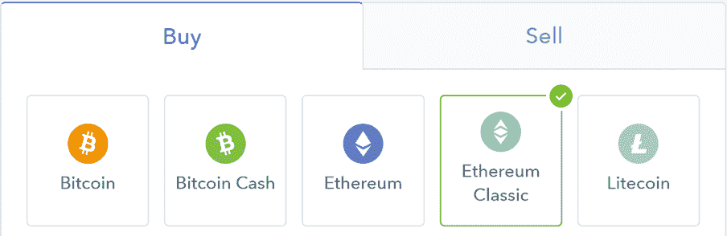

# DDI 区块链周刊(8 月 13 日-19 日)

> 原文：<https://medium.datadriveninvestor.com/ddi-blockchain-weekly-august-13th-19th-980ec13ae455?source=collection_archive---------4----------------------->

加密市场短暂跌至 2 亿美元以下，达到 2017 年 11 月以来的最低总市值，然后反弹至本周结束时几乎没有变化。虽然比特币也遵循了类似的趋势，但比特币的主导地位在周二达到了 54.4%，这是自去年 12 月以来的最高水平，周日回落至 52%。

对比特币基地来说，这是忙碌的一周……

继[在 7 月份首次宣布](https://blog.coinbase.com/adding-ethereum-classic-support-to-coinbase-becb9a337e9c)将以太坊经典(ETC)加入其受支持的加密货币名单后，比特币基地[终于在周三](https://twitter.com/coinbase/status/1029874618033614848)公布了其最新成员，并于第二天开始交易。在接下来的 24 小时内，ETC 上涨了 15%，达到 14.91 美元的峰值，然后在本周结束前回落。

ETC 的加入使比特币基地的代币可用性达到 5 种，比特币、以太坊、莱特币和比特币现金是另外 4 种。此外，在不久的将来可能会添加更多的密码，比特币基地最近透露，它正在“探索”另外五个令牌——Cardano、基本注意力令牌、Stellar Lumens、Zcash 和 0x。

比特币基地[周二还公布了一份专利申请](http://patft.uspto.gov/netacgi/nph-Parser?Sect1=PTO2&Sect2=HITOFF&u=%2Fnetahtml%2FPTO%2Fsearch-adv.htm&r=1&p=1&f=G&l=50&d=PTXT&S1=10,050,779.PN.&OS=pn/10,050,779&RS=PN/10,050,779)，提出了一种新的机制来进一步确保比特币支付的安全。该专利解释说，现有的基础设施没有“提供一种解决方案来维护私钥的安全性，同时仍然允许用户在商家页面上结账并使用他们的钱包进行支付。”

因此，新提案旨在创建一个“密钥仪式”，将私人用户密码加密为“万能密钥份额”。然后，这些份额被组合成一个“操作主密钥”，用于结账时的私钥加密，以及支付时的交易签名。专利中还包括一个 API 密钥，因此其他网站可以推出自己的门户版本。

**Vitalik Buterin 讨论了关于 Casper 的最新消息**

在一篇包含约 75 条推文的[帖子中，Vitalik Buterin 周三详细介绍了以太坊提议的股权证明项目。这些推文提供了许多关于 Casper 发展和当前状态的信息，详细描述了可追溯到 2014 年 1 月的历史，并讨论了 Casper 的发展“作为任何 PoW 或 PoS 或其他区块链之上的覆盖层，以增加终结性保证”](https://twitter.com/VitalikButerin/status/1029900695925706753)

布特林通过讨论[他对莱斯利·兰波特的 99%拜占庭容错算法](https://vitalik.ca/general/2018/08/07/99_fault_tolerant.html)的版本来结束这场推特风暴，他在本月早些时候提交了该算法。总之，这些信息为以太坊最令人期待的升级之一提供了引人入胜的见解，无疑值得一读。

**Petro 成为官方记账单位**

周二，委内瑞拉总统宣布，其国家加密货币将在法律上被视为这个陷入困境的国家的记账单位。Petro，以及即将发行的新法定货币，都将从今天(8 月 20 日，星期一)开始其官方会计单位的地位。据西班牙报纸 ABC 报道，Petro“将成为共和国的第二个会计单位，并将作为 PDVSA 国有石油工业的法定会计单位开始运作”

这个石油丰富但现金匮乏的拉美国家遭受了灾难性的经济管理不善和恶性通货膨胀，马杜罗试图通过引入新的主权玻利瓦尔(将现有货币有效贬值 10 万倍)来解决这一问题。随着石油也成为官方记账单位，据报道，工资和价格将与石油支持的国家加密货币挂钩。

**AT & T 起诉加密货币投资者**索赔 2.24 亿美元

周三，一家美国加密投资者对电信公司美国电话电报公司提起了 2.24 亿美元的诉讼。在投资者迈克尔·特平(Michael Terpin)涉嫌因“美国电话电报公司愿意与黑客合作、严重疏忽、违反法定职责以及未能遵守其隐私政策中的承诺”而损失 2400 万美元加密货币后，诉状指控该公司玩忽职守

Terpin 是七个月内两次独立黑客攻击的受害者，其中一个冒名顶替者从“与黑客合作的内部人员”那里获得了他的电话号码，而美国电话电报公司商店的员工没有要求他出示有效身份证明或提供所需的密码。根据诉状，该电话号码随后被用来访问 Terpin 的加密货币账户，“美国电话电报公司的所作所为就像一家酒店给了一个持假身份证的小偷一把房间钥匙和一把房间保险箱的钥匙，让他从合法主人那里偷走保险箱里的珠宝，”诉状称。美国电话电报公司否认这些指控。

**德勤发布 2018 年全球区块链调查**

领先的咨询公司德勤[对来自加拿大、中国、法国、德国、墨西哥、美国和英国的 1053 名“了解区块链的高管”进行了调查，最近公布了其调查结果](https://www2.deloitte.com/content/dam/Deloitte/global/Documents/Energy-and-Resources/gx-us-fsi-2018-global-blockchain-survey-report.pdf)，作为其努力的一部分，以发现更多关于区块链采用状况和对该技术的态度。其主要结论包括，39%的受访者认为区块链“被夸大了”，这一数字在美国受访者中上升到 44%，高于 2016 年的 34%。

“区块链疲劳”正在那些感觉“其潜力被过度传播，而其现实世界的好处仍然难以捉摸”的人中间出现。遗留问题和“不确定”的投资回报也是企业在试图将区块链整合到现有商业模式中时面临的挑战。也就是说，德勤自己认为，“区块链在美国的采用程度远比德勤全球调查显示的要高。”

*原载于 2018 年 8 月 20 日*[*www.datadriveninvestor.com*](http://www.datadriveninvestor.com/2018/08/20/ddi-blockchain-weekly-august-13th-19th/)*。*