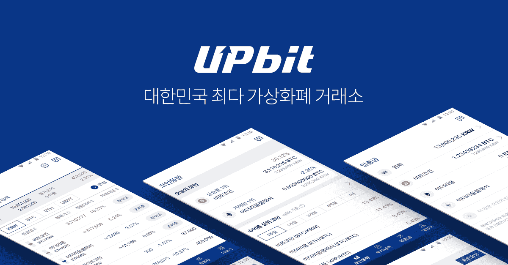
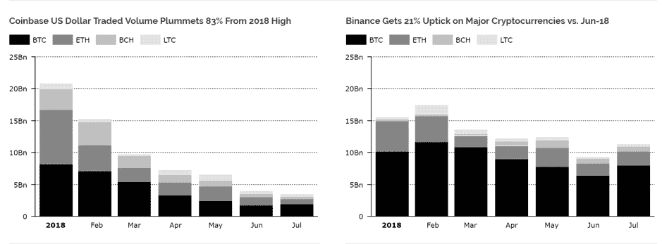

# DDI 区块链周刊(8 月 20 日-26 日)

> 原文：<https://medium.datadriveninvestor.com/ddi-blockchain-weekly-august-20th-26th-b734f6953ff3?source=collection_archive---------15----------------------->

总体而言，对于密码市场来说，这是相当平静的一周。尽管在 SEC 拒绝新的 ETF 后，市场周三有下跌的危险，但很快出现了温和的复苏，使总市值在一周内基本保持不变。这可能表明，市场已经完全消化了任何与 ETF 相关的利空消息。

# **SEC 否决 9 个比特币 ETF 提案**

美国证券交易委员会(SEC)已经拒绝了来自 [ProShares](https://www.sec.gov/rules/sro/nysearca/2018/34-83904.pdf) 、 [Direxion](https://www.sec.gov/rules/sro/nysearca/2018/34-83912.pdf) 和 [GraniteShares](https://www.sec.gov/rules/sro/cboebzx/2018/34-83913.pdf) 的比特币 ETF 提案。在所有这三个案例中，监管机构都使用了相同的拒绝理由，即他们未能证明他们的提议“符合国家证券交易所的规则旨在防止欺诈和操纵行为和做法的要求。”美国证券交易委员会还强调，拒绝是基于“比特币，或者更一般的区块链技术，作为创新或投资是否具有效用或价值”的任何评估。

尽管这三项提议与比特币期货市场有关，而不是直接持有比特币的基金，但美国证交会引用了当前期货市场之一 CBOE 的一封信，信中称，“CBOE 期货交易所和芝加哥商业交易所目前的比特币期货交易量可能不足以支持寻求 100%长期或短期投资比特币的 etp。”也就是说，被拒绝的提案的一线希望是，美国证券交易委员会也表示，他们将在晚些时候接受审查。

# **中国打击加密货币……再次**

周四,[南华早报](https://www.scmp.com/tech/enterprises/article/2161014/china-block-more-120-offshore-cryptocurrency-exchanges-crackdown)报道称，超过 120 家离岸加密货币交易所被中国当局封锁。据称，政府还加强了对新加密新闻网站和 ico 公告的监控，这两个网站都将面临关闭和用户 IP 地址封锁。

此前有消息称，北京禁止酒店、商场和办公室等场所推广或举办支持加密货币的活动。一项针对八家加密媒体的单独禁令也已生效，许多人认为，最近的这些举措是为了遏制日益增加的金融风险和不稳定性。

# **韩国最大的交易所盈利 1 亿美元**

尽管熊市持续，但韩国最大的加密交易所 Upbit 公布了 2018 年第三季度 1 亿美元的利润。[联合通讯社](http://www.yonhapnews.co.kr/bulletin/2018/08/22/0200000000AKR20180822160100002.HTML)报道称，韩国科技巨头 Kakao 的子公司 Upbit 利润可观。Kakao 及其子公司估计在各自的金融科技、打车服务、消息和社交媒体市场中拥有超过 90%的市场渗透率，并在 3 月份透露将为其 12，000 家商户和超过 1 亿用户集成加密货币。

Upbit 的利润也轻松超过了韩国第二大交易所 Bithumb 公布的 3500 万美元的利润。据报道，预计 Bithumb 去年的净利润不到 20%，去年的净利润接近 4 亿美元。该交易所在 6 月份遭遇了一次安全漏洞，价值 1700 万美元的密码被盗，尽管它承诺向盗窃受害者提供补偿。

# **比特币基地交易量暴跌**

加密资产研究公司 Diar 援引 CoinApi 的数据报告称，以美元计价的加密货币交易在 2018 年大幅下降。尽管币安等其他加密货币交易所的交易量稳定或上升，但比特币基地的交易量却大幅下降，从 1 月份的 210 亿美元降至 7 月份的 39 亿美元。

[*来源*](https://diar.co/volume-2-issue-33-34/#4)

提供美元交易对的 Bitstamp 和北海巨妖的交易量也大幅下降。与此同时，全球最大的交易所之一 OKEx 的交易量创下新高，从 6 月份的 28 亿美元增至 7 月份的 29 亿美元。

# **沃兹尼亚克透露参与了一家加密初创公司**

在接受 NullTV 采访时，苹果联合创始人史蒂夫·沃兹尼亚克透露，他将很快与加密初创公司 Equi Capital 一起进入区块链领域。“很快，我就要第一次参与区块链公司的工作了……我们的方法不像一种新的货币，也不像一个事件会让它升值的假币。它是一家公司的股票。这家公司正在接受投资者的投资，这些投资者在迪拜的公寓楼等方面有着良好的投资记录。”

沃兹尼亚克还保留了对以太坊的赞扬，他形容以太坊与苹果类似，数千家公司在该平台上开发自己的应用程序。“以太坊为你自己的区块链应用提供了工具……我看到更多的人以这种方式使用以太坊，但比特币仍然是数字黄金。”

# **伊朗的国家加密货币准备好了吗？**

据当地新闻媒体[金融论坛报](https://financialtribune.com/articles/economy-business-and-markets/92356/iran-cryptocurrency-document-drafted)报道，伊朗国家网络空间中心表示，国家支持的加密货币草案的文件草案现已准备就绪。根据哈桑·鲁哈尼总统的命令，该项目似乎已经完成了最后的开发阶段，负责为伊朗最高网络空间委员会起草法规的副主任赛义德·马赫迪尤恩透露，伊朗网络空间管理局正在积极寻求一种国家加密货币。

国家发行的令牌似乎正在加速，以避免美国不久将再次对伊朗实施制裁，并方便世界任何地方的资金转移。据报道，伊朗当局也在考虑利用区块链来规避特定的挑战，例如 8 月初颁布的全面禁止购买美元的禁令。

*原载于 2018 年 8 月 27 日*[*www.datadriveninvestor.com*](http://www.datadriveninvestor.com/2018/08/27/ddi-blockchain-weekly-august-20th-26th/)*。*