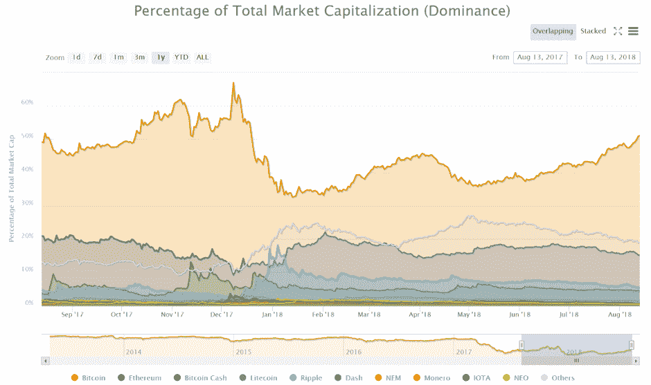
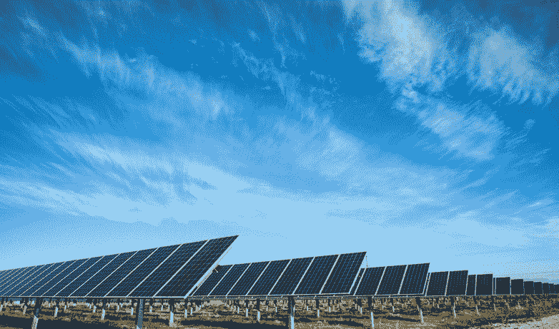

# DDI 区块链周刊(8 月 6 日—12 日)

> 原文：<https://medium.datadriveninvestor.com/ddi-blockchain-weekly-august-6th-12th-8443f5260e7d?source=collection_archive---------6----------------------->

这是有高潮也有低谷的一周。周六，加密市场整体跌至 2018 年的新低，周六总市值跌至不到 2120 亿美元，这是 2017 年 11 月以来的水平。几乎与此同时，比特币的主导地位自去年 12 月以来首次超过 50%。

[*来源*](https://coinmarketcap.com/charts/#dominance-percentage)

**SEC 推迟比特币 ETF 决定**

九月三十日。这是美国证券交易委员会决定推动其最终决定批准比特币交易所交易基金拟议规则变化的日期。美国金融监管机构周二透露，将会给自己更多时间来考虑是否批准允许 CBOE BZX 交易所上市比特币交易所交易基金的规则变化。如果是这样，这将标志着比特币交易所交易基金首次在美国上市，该基金将由投资公司 VanEck 和区块链初创企业 SolidX 合作创建。

**全球首只区块链债券**

世界银行已选择澳洲联邦银行(CBA)授权发行全球首只区块链债券。根据他们的[联合新闻稿](http://www.worldbank.org/en/news/press-release/2018/08/09/world-bank-mandates-commonwealth-bank-of-australia-for-worlds-first-blockchain-bond),‘bond-I’(区块链运营的新债务工具)是第一个完全由区块链技术管理的同类产品，此类债券通过 DLT 创建、分配和转让，以确保每笔交易的安全。

世界银行和 CBA 已经建立了一个基于以太坊的私人区块链平台，i-bond 将在该平台上发行和分销。世界银行将在 DC 为该债券运作，并表示投资者的兴趣已经很大。CBA 区块链创新实验室的负责人 Sophie Gilder 预计，bond-i 将在释放区块链对金融市场的革命性潜力方面发挥重要作用。

**大卫·马库斯离开比特币基地董事会**

脸书区块链分部的负责人决定辞去他在比特币基地董事会的职务。据报道，在 2014 年加入脸书担任现任职务之前，PayPal 总裁大卫·马库斯(David Marcus)将离开比特币基地董事会，以避免出现利益冲突。此举引发了许多猜测，认为脸书可能会进一步进军加密领域，有传言称它将建立自己的加密支付网络。一些人还提出，它可能会创建一个交易所，一个身份管理平台，甚至是自己的硬币。

然而，*似乎不真实的是，脸书正在与 Stellar 联手。社交媒体巨头上周否认正在与加密货币公司进行讨论，此前有报道称，他们正在联合开发脸书在区块链的业务。一位脸书的发言人说“我们没有与 Stellar 进行任何讨论，我们也不考虑基于他们的技术，”以回应 [Business Insider 报道](https://www.businessinsider.de/facebook-is-talking-to-cryptocurrency-stellar-about-making-a-big-move-into-crypto-2018-7?r=US&IR=T)称他们已经讨论了从 Stellar 主网络分支的可能性。*

**加密欺诈报告仍在继续，但情绪正在改变**

[据其主管 Kenneth Blanco](https://www.fincen.gov/news/speeches/prepared-remarks-fincen-director-kenneth-blanco-delivered-2018-chicago-kent-block) 称，金融犯罪执法网络(FinCEN)每月从金融机构和交易所收到超过 1500 份关于加密货币的可疑活动报告(SAR)文件。可疑交易报告是由金融机构在涉嫌洗钱或欺诈事件后提交的，因此每月 1，500 份涉及加密交易的此类报告显然是一个主要问题。

布兰科承认，尽管密码有许多积极的应用，但它们也为金融罪犯、恐怖分子和流氓国家等坏人创造了机会。他还澄清说，搜索和救援信息包括“受益所有权信息、我们之前不知道的交易所的其他活动、管辖区信息，以及我们可以联系的其他金融机构以获得新线索”。

**比特大陆上市**

看起来比特大陆要上市了。据报道，占主导地位的加密货币矿业公司将在 9 月份申请 IPO，价值可能高达 180 亿美元，总市值为 400 亿至 500 亿美元。如果属实，这将是有史以来最大的 IPO 之一。比特大陆已经在 7 月 23 日完成了一轮 10 亿美元的融资，估值为 150 亿美元。但 180 亿美元的上市规模甚至会超过脸书的 IPO。

**太阳能地下开采**

对于澳大利亚的地下采矿来说，一个更加环保的解决方案即将出现。众所周知，这是一个电力密集型过程，对比特币等密码的工作证明挖掘因需要大量电力来验证区块而受到了很多批评。但现在，澳大利亚太阳能供应商 Hadouken Pty 已经同意为可能成为“澳大利亚第一个电网背后”的太阳能数据和加密采矿中心提供电力。该公司的目标是在澳大利亚西南部建造一个 20 兆瓦的太阳能发电场，以支持比特币的开采业务，并将由位于珀斯的 DC Two 和 Two Coin 数据中心和加密开采合作伙伴运营。

# 评论

评论

*原载于 2018 年 8 月 13 日*[*【www.datadriveninvestor.com】*](http://www.datadriveninvestor.com/2018/08/13/ddi-blockchain-weekly-august-6th-12th/)*。*