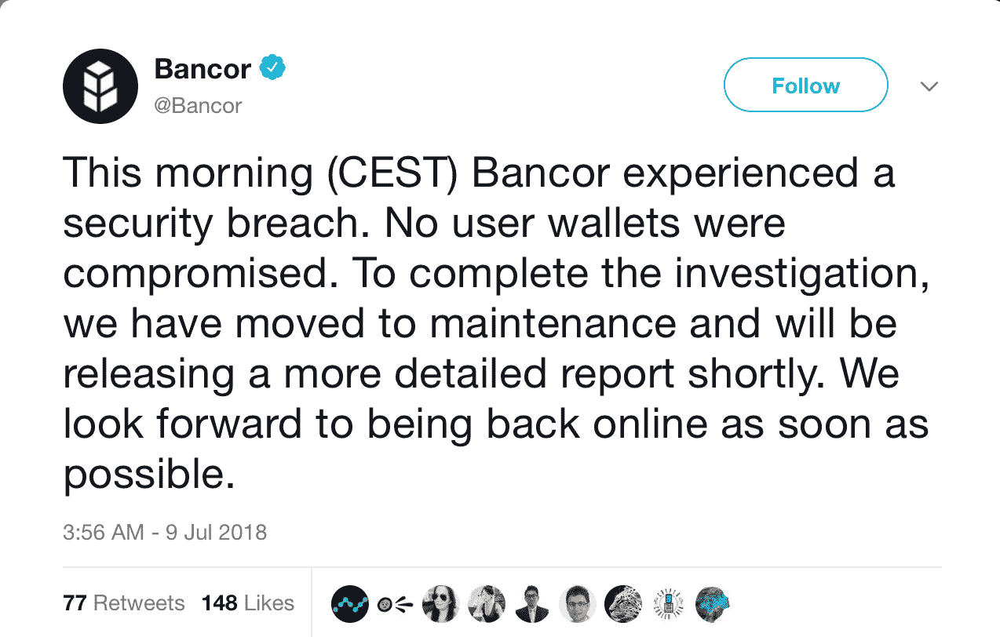

# DDI 区块链周刊(7 月 9 日-15 日)

> 原文：<https://medium.datadriveninvestor.com/ddi-blockchain-weekly-july-9th-15th-2683e77c77da?source=collection_archive---------6----------------------->

就在 7 月的第一周，加密市场迎来了 300 亿美元的增长，第二周，这些收益被完全抹去，因为亏损导致总市值回落至 2500 亿美元大关。就在本周早些时候，当比特币似乎可能最终突破 7000 美元关口时，它逆转了方向，到周五大幅跌至 6200 美元以下，然后在周末出现小幅反弹。

**比特币基地推出五种新的加密货币**

然而，一些市场受到比特币基地正在考虑增加五种新加密货币的消息的提振。在其周五在[发表的博客文章](https://blog.coinbase.com/coinbase-is-exploring-cardano-basic-attention-token-stellar-zcash-and-0x-9e44f0eb823f)中，这家受欢迎的加密货币经纪商确认了这五项资产为 Cardano (ADA)、Basic Attention Token (BAT)、Stellar Lumens (XLM)、Zcash (ZEC)和 0x (ZRX)。虽然有可能获得新的加密货币的机会应该是受欢迎的，但迄今为止还没有官方确认任何新增内容。事实上，比特币基地已经非常清楚，事情目前只是“探索性的”。

此外，与网站上现有的硬币相比，它们可能只能提供有限的功能。比特币基地表示，用户可能只能购买和出售一些新资产，而不能发送和接收它们，“我们也可能只允许通过我们的网站以某些方式与这些资产进行交互，例如只支持从透明的 Zcash 地址进行存款和取款。最后，这些资产中的一部分可能会在美国上市之前在其他司法管辖区发行。”

**Bancor Exchange 被盗 1350 万美元**

又是一周，又是一次密码交换攻击。这一次轮到 Bancor 经历安全漏洞，导致价值 1350 万美元的密码被盗:

根据 Bancor 的说法，一个用于升级智能合约的钱包被攻破，并被用于窃取 Bancor 自己的 320 万个 BNT 令牌，以及 2.5 万个 ETH 和 2.3 亿个 Pundi X (NPXS)令牌。或许最引人注目的是，Bancor 说它已经冻结了 BNT 代币以防止丢失。

令人欣慰的是，Bancor 通过有效地按下故障保险按钮冻结了网络，防止了进一步的损失，但现在人们开始担心，一家声称提供分散服务的公司通过实施明显的集中解决方案解决了问题(我们最近已经深入讨论了这个问题)。

**以太坊提升可扩展性**

以太坊的好消息是——可扩展性问题很可能在年底前得到解决。这是该项目的联合创始人和区块链项目的创始人乔·卢宾(Joe Lubin)在周三表示，以太坊现在正进入开发的“第二阶段”。根据 Lubin 的说法，“我们正在进入一个以太坊可以作为第一层信任系统的空间，在以太坊中，我们将在第二层系统中进行成千上万的交易，我们将在今年看到这一点。”

**俄罗斯利用比特币洗钱**

Crypto 还在本周最大的全球新闻事件中发挥了重要作用——美国司法部起诉 12 名俄罗斯情报人员，指控他们干预该国 2016 年总统选举。根据美国司法部副部长罗德·罗森斯坦(Rod Rosenstein)周五宣布的起诉书，情报人员侵入了美国民主党使用的计算机网络和电子邮件账户，其中包括总统候选人希拉里·克林顿(Hillary Clinton)。

在共谋洗钱的指控下，12 名 [GRU](https://en.wikipedia.org/wiki/Main_Intelligence_Directorate) 官员“通过一个交易网络，利用比特币等加密货币的匿名性，共谋洗钱相当于 9.5 万美元。”起诉书继续声称:“除了挖掘比特币，阴谋者还通过各种旨在掩盖资金来源的手段获取比特币。这包括通过交易所购买比特币，通过其他数字货币转移资金，以及使用预付卡。他们还获得了一家或多家第三方交易所的帮助，这些交易所通过提供更高匿名性的数字货币交易平台来促进分层交易。”

**数字货币:货币的未来**

事实上，最近美国出现了一系列与密码相关的新闻。在本周举行的听证会之前，众议院周六将数字货币称为“货币的未来”。听证会“将审查美国政府在多大程度上应将加密货币视为货币，以及加密货币在国内和全球的潜在用途。该小组委员会将评估央行使用加密货币的好处，并讨论加密货币和实物现金的未来。”

**中国踩下 ICOs**

自去年 9 月禁止这种新的融资方式以来，中国一直对 ico 保持着明显严格的立场。上周一，中国人民银行(PBoC)副行长潘功胜宣布，“任何未经现有法律框架授权的新金融产品或现象，只要它们敢于浮出水面，我们就将予以粉碎。”潘特别提到了那些已经走出中国，但继续向国内投资者推销的国际投资公司。

**80%的 ico 宣称骗局**

也许中国有理由采取如此严厉的措施，尤其是在上周另一份报告显示 ICO 领域欺诈盛行之后。这次的研究来自 ICO 咨询公司 Statis Group，[认定 2017 年 80%的 ICO 是骗局。3%的 ICO 总量在年底被宣布“死亡”，这意味着这些项目在不到一年的时间里从开始 ICO 活动到从交易所退市。尽管如此，该报告还指出，ico 的大部分货币价值被分配给了分析认为“质量更高”的项目。](https://research.bloomberg.com/pub/res/d28giW28tf6G7T_Wr77aU0gDgFQ)

*原载于 2018 年 7 月 16 日*[*www.datadriveninvestor.com*](http://www.datadriveninvestor.com/2018/07/16/ddi-blockchain-weekly-july-9th-15th/)*。*