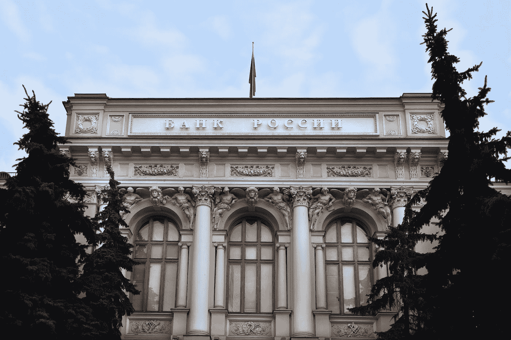

# DDI 区块链周刊(6 月 11 日-17 日)

> 原文：<https://medium.datadriveninvestor.com/ddi-blockchain-weekly-june-11th-17th-41bd1869f821?source=collection_archive---------8----------------------->

对于加密货币复合体来说，这是又一个低迷的一周，继 6 月 10 日韩国交易所 Coinrail 遭受 4000 万美元的黑客攻击后，市场在本周早些时候继续下行。截至周四，总市值达到 2.67 亿美元，为两个月来的最低点，随后在周末略有回升。

对于 EOS 来说，这是特别重要的一周，它见证了其 Mainnet 的上线——但据该平台 21 家顶级区块生产商的[帖子](https://steemit.com/eos/@eosargentina/eos-mainnet-status-update)称，它在上线后不到 48 小时就“冻结”了。暂停持续了 5 个小时，在此期间，区块链完全停止运行。一个 EOS [电报频道](https://t.me/eosmainnet/4)报道说，在“暂停”之后，块生产者和备用节点讨论并修复了这个问题，有报道称 Mainnet 在大约五个小时后再次上线。

虽然这个问题似乎已经解决，但它在 EOS 和更广泛的加密货币社区中引发了很多争论。很明显，在发布后 5 个小时的停机时间是不理想的，尤其是可能有成千上万的事务不得不被延迟。更不用说在发布前 2 周的延迟，这引发了对团队是否做了足够的工作来确保 Mainnet 没有错误的猜测。尽管如此，现在还为时尚早，如果这个团队现在已经解决了这些问题，那么以太坊平台的一个有力竞争者已经开始运作了。

在监管方面，本周最大的新闻来自美国证券交易委员会(SEC)，其公司金融部门主任威廉·辛曼(William Hinman)宣布，比特币和以太都不能被归类为“证券”。因此，它们不会受到美国证券法的监管。根据 Hinman 自己的说法，“根据我对以太网、以太坊网络及其分散结构的现状的理解，我们认为当前的要约和 ETH 的销售不是证券交易。”然而，他没有断言任何其他加密货币。

这个问题已经激烈辩论了一段时间，特别是自去年 DAO 被黑后，SEC 开始更深入地调查 ICO 监管。DAO 的代币销售是在以太坊平台上进行的。但似乎监管机构将把这两种主要加密货币更像黄金和石油等大宗商品一样对待。与此同时，Hinman 建议，对某样东西是否是一种证券的分析“不是静态的，也不是该工具所固有的。”他还明确表示，即使代币被归入“公用事业”类别，仅作为分散网络中的一种交易手段，它仍然可以“作为一种投资策略打包出售，可以成为一种证券。”这表明，在令牌的整个存在过程中，令牌分类将一直是一个动态过程。

作为其通过全球超过 15 所大学投资区块链研究的 5000 万美元承诺的一部分，Ripple 上周承诺向奥斯汀的德克萨斯大学提供 200 万美元的资金，将在未来五年内支付。这笔资金将主要用于该大学的麦库姆斯商学院，以支持其区块链研究计划，尽管资金将如何具体分配仍有待确定。

负责区块链项目的金融学副教授塞萨尔·弗拉卡西(Cesare Fracassi)表示，“不仅商学院，其他分支机构也将能够参与进来。例如，医学院表示对区块链的研究感兴趣。”与此同时，该倡议的网站表示，其目的是支持教师和研究生对区块链的研究，“并”向学生传授与区块链、加密货币和数字支付相关的主要概念。“该倡议还打算促进与工业和媒体组织的关系。

俄罗斯央行与俄罗斯企业财务官协会(RACT)联手，开始测试一个政府资助的区块链项目。据其白皮书称，该项目名为 Masterchain，将加强与俄罗斯银行系统的沟通。它还可能最终取代该国目前使用的 SWIFT 支付系统，自 2014 年美国和欧盟对俄罗斯实施制裁以来，俄罗斯政府一直在寻求这样做。

此前，央行第一副行长 Olga Skorobogatova 宣布，该行正在讨论创建新技术，“用于在作为超国家基础设施的欧亚经济联盟(EAEU)之间传输信息和支付”，新系统将使该行能够“在 EAEU 的空间内使用分布式总账技术，结算支付和传输金融信息，绕过当前的支付系统。”据称，新系统还将包括市场监管机构，并使银行能够在不违反银行保密法的情况下共享消费者信用记录和潜在的欺诈信息。

*原载于 2018 年 6 月 19 日*[*【www.datadriveninvestor.com】*](http://www.datadriveninvestor.com/2018/06/19/ddi-blockchain-weekly-june-11th-17th/)*。*

