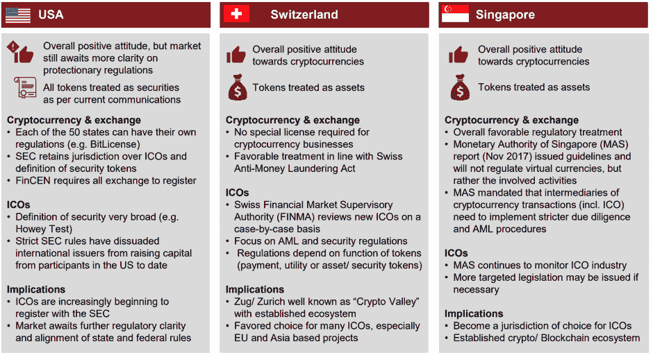

# DDI 区块链周刊(6 月 25 日—7 月 1 日)

> 原文：<https://medium.datadriveninvestor.com/ddi-blockchain-weekly-june-25th-july-1st-d17d0ae32b62?source=collection_archive---------10----------------------->

就在 crypto 看起来似乎又要遭受一周的痛苦损失时，市场在周六强劲反弹，以市值计算，本周整体小幅上涨。在恢复之前，周五比特币跌破 6000 美元，恰逢芝加哥商业交易所集团期货合约的最后一天，因此随着期货到期日的临近，抛售趋势仍在继续。

## 脸书撤销加密货币广告禁令

脸书决定部分撤销禁止在其网站上发布加密货币广告的决定。早在 1 月份，脸书决定停止“经常与误导或欺骗性促销行为相关的金融产品和服务，如二元期权、首次发行硬币或加密货币。”但上周，它宣布将允许预先批准的加密公司在网站上做广告，尽管似乎禁令仍然适用于 ICOs。

尽管如此，这个消息应该对加密市场非常有利，因为今年面临着包括谷歌和 Twitter 在内的几家科技巨头的大量禁令。这也引发了人们的猜测，脸书自己可能也在为进军太空做准备。五月，it [宣布](https://www.facebook.com/davidm/posts/10160585531500195)将领导一个试探性的区块链团队，该团队将直接向公司首席技术官迈克·斯科洛普夫汇报。[据经济学家](https://www.economist.com/business/2018/06/02/american-tech-giants-are-making-life-tough-for-startups)报道，有传言称脸书将收购比特币基地。

## ICOs 要破产了？

最近 Techcrunch [的一份报告](https://techcrunch.com/2018/06/29/thousands-of-cryptocurrency-projects-are-already-dead/)显示，在今年上半年，超过 1000 个加密项目被归类为“已经死亡”。使用来自 [Coinopsy](https://www.coinopsy.com/dead-coins/) 和 [DeadCoins](https://deadcoins.com/) 的数据，该报告对那些被认为“被放弃、被欺骗、网站死亡、没有节点、钱包问题、没有社交更新、低量或开发者已经离开项目”的项目进行了分类遭受这种命运的一些更知名的项目包括 Bitconnect，它于 1 月份关闭，被 Coinopsy 描述为“迄今为止加密领域最成功的庞氏骗局”，以及最近被 SEC 关闭的 Titanium ICO。

## ICO 吊杆

然而，尽管有大量死亡项目，ico 在 2018 年继续创造纪录。领先的咨询公司普华永道(PwC)和瑞士加密谷协会(Swiss Crypto Valley Association)的联合报告显示，仅在 2018 年 1 月至 5 月期间，ICO 数量就已经是去年全年的两倍。据普华永道瑞士称，“自今年年初以来，总共有 537 个 ico 注册，总价值超过 137 亿美元。相比之下，2017 年共有 552 个 ico，交易额略高于 70 亿美元。此外，自去年以来，ICO 的平均规模几乎翻了一番，从 1280 万美元增加到 2550 万美元以上。”报告特别提到 Telegram 和 EOS，认为它们开创了“ICO 独角兽”时代，分别融资 17 亿美元和 41 亿美元。

该报告还提到美国、瑞士和新加坡是主要的全球 ICO 中心，英国和香港在最近几个月取得了显著进展。

[*来源*](https://cryptovalley.swiss/wp-content/uploads/20180628_PwC-S-CVA-ICO-Report_EN.pdf)

有趣的是，该领域也出现了三种监管模式:美国(证券驱动)、欧洲(平衡)和亚洲(二元)。在与传统风险投资基金竞争方面，报告看好 ICO，尤其是在科技和区块链相关的初创企业，而混合模式(结合传统风险投资/私募股权基金和 ICO)“正日益成为有效的融资选择”

## 欧洲虚拟货币监管

本周末，欧洲议会还发布了对“虚拟货币和央行货币政策:未来的挑战”的深入研究在其研究结果中，该研究得出结论认为，尽管加密货币技术进步，覆盖全球，但它们远不能挑战主权货币的主导地位和中央银行的货币政策，特别是在主要货币区。尽管在一些极端情况下，如“在恶性通货膨胀、金融危机、政治动荡或战争期间”，数字货币在个别经济体中作为货币替代手段可能是有用的。

该报告强调的另一个挑战是数字货币向用户提供的匿名性。这仍然是金融机构尚未适应这一领域的一个关键原因，因为这使得洗钱等金融犯罪更容易实施。也就是说，各国开始采取更严格的了解你的客户(KYC)政策，以打击此类活动。

## 中本聪崛起

最后，上周出现了一些有趣的猜测，令人难以捉摸的比特币创造者中本聪可能还活着，而且很好，他正计划出版一本讲述比特币起源的书，并回答一些关于加密货币的常见问题。一篇[帖子](http://nakamotofamilyfoundation.org/duality.pdf)周五出现在一个名为 Nakamoto Family Foundation 的网站上——这个域名是上周用亚马逊的域名注册商匿名购买的——它讨论了这本书的摘录，这本书有望成为“一个短篇故事，如果你愿意的话，还有一些最常见的问题和答案。我想让人们知道真相。”

帖子的真实性仍未得到证实。许多人试图挖掘中本聪化名的真实身份，但都失败了，还有几个人站出来声称自己是中本聪。关于神秘的比特币创始人的身份，阴谋论仍然层出不穷。有趣的是，这个新帖子暗示了中本聪实际上是一群人的可能性，“我要说的是，考虑一下区别；至于我在创作中是否得到了帮助，或者是帮助的一部分，然后把这一点与跟随的人分开，这在很大程度上是非常一致的。”但是考虑到帖子的未经证实的性质和它的许多古怪的说法，几乎没有迹象表明最近围绕中本聪的传言是真实的。

*原载于 2018 年 7 月 2 日*[*【www.datadriveninvestor.com*](http://www.datadriveninvestor.com/2018/07/02/ddi-blockchain-weekly-june-25th-july-1st/)*。*