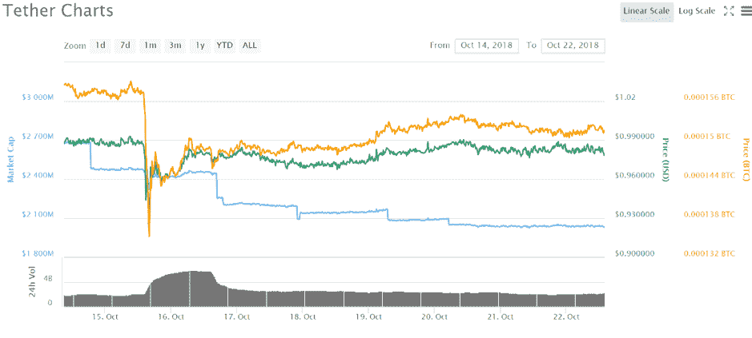
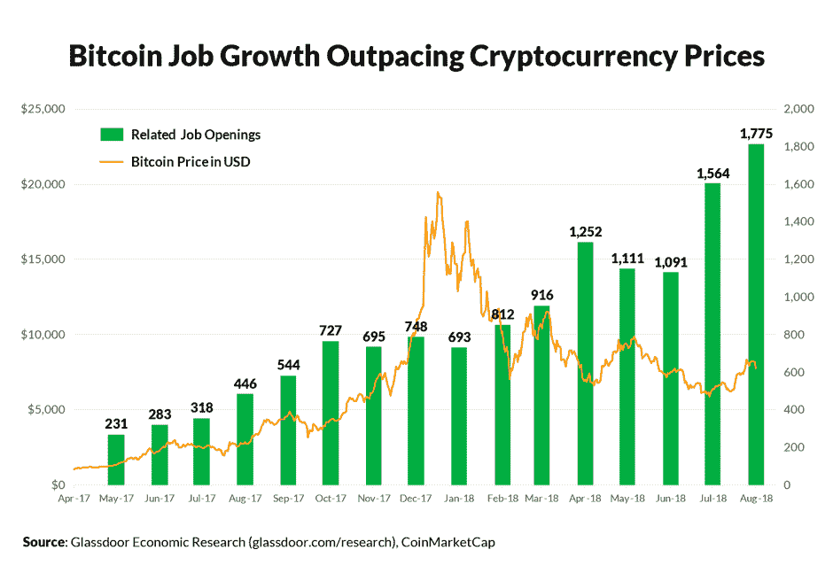

# DDI block chain Weekly(10 月 15-21 日)

> 原文：<https://medium.datadriveninvestor.com/ddi-blockchain-weekly-october-15th-21st-9e2eb22bcf43?source=collection_archive---------39----------------------->

上周，加密业务的增长出现了可喜的回归，市场在七天内增加了约 100 亿美元，截至本周末为 2110 亿美元。最明显的变化发生在周一，在全球最大的资产管理公司之一发布强烈看涨的消息后，市场在几个小时内上涨了近 200 亿美元

# 忠诚跃入密码

资产管理重量级公司富达投资(Fidelity Investments)在宣布推出一家独立公司富达数字资产服务(Fidelity Digital Asset Services)时，对密码货币进行了决定性的尝试，该公司将为机构投资者处理密码货币托管和交易执行事务。该公司已经管理着超过 70 亿美元的资产，是全球五大金融服务提供商之一。

据报道，该公司在 2017 年年中首次决定进入密码空间。现在新公司已经成立，董事长兼首席执行官阿比盖尔·约翰逊宣布富达的目标是“让投资者更容易获得比特币等数字本地资产。”约翰逊还预计“长期而言，将继续投资和试验，寻找让我们的客户更容易理解和使用这一新兴资产类别的方法。”与此同时，领导新部门的汤姆·杰瑟普(Tom Jessup)认为，富达数字资产的创建“是为数字资产创建一个全面服务的企业级平台的长期愿景的第一步”。

# 系绳失去了固定

领先的稳定货币——USDT——在周一失去与美元的 1:1 联系后，上周面临尖锐的批评。价值下降发生在 tiert 的合作伙伴交易所 BitFinex 破产的消息公开后不久，尽管这些报道后来被驳斥。但是大量的猜测认为 Tether 没有足够的法定货币来支持其 USDT 代币的供应。在某些机制下，系绳的价格跌至 0.85 美元，尽管此后再次反弹至 1.00 美元。

一些人认为，价格下跌是系绳最终可能内爆的信号，因为投资者对系绳维持与美元平价能力的信心越来越受到质疑。例如，著名的密码投资者迈克·诺沃格拉茨将这一下降归因于系绳缺乏透明度，尽管他后来表示，他认为 USDT 将完全由实物美元支持。

# 比特币基地增加了 0x

周三，比特币基地在其 Medium 账户上正式宣布，在其可用密码货币列表中增加了 0x (ZRX)。“从今天开始，比特币基地支持 Coinbase.com 的 ZRX，以及比特币基地的 Android 和 iOS 应用。根据该公告，比特币基地客户现在可以购买、销售、发送、接收或存储 ZRX，以及比特币、比特币现金、以太网、以太网经典和 Litecoin。

0x 本身是一个协议，它支持以太坊上 ERC-20 令牌的分散式对等交换。在比特币基地上市后，ZRX token 的股价在上市后几分钟内上涨了 30%，直到周末才开始下跌。因此，在本周结束时，仅比上市前略有上涨，新上市的 0x 似乎没有像之前比特币基地增加的比特币现金和以太坊那样产生相同的价格推动效应。

# 以太坊将君士坦丁堡硬叉推迟到新年

开发者周五证实，以太坊计划推出的名为“君士坦丁堡”的硬叉子原定于 11 月，将推迟到 2019 年初。在代码中发现几个错误后，开发人员决定推迟是最合适的选择，现在预计在 1 月底或 2 月。根据以太坊开发者 Afri Schoeden 的说法，“我一直有一种感觉，我们正试图仓促行事，我赞同我们应该喘口气，看看会发生什么。”

hard fork 本身包含五个向后不兼容的网络更改，从较小的代码优化到更有影响的更改，例如减少为每个新事务块创建的 ETH 数量的更改。它于 10 月 13 日在以太坊公共测试网 Ropsten 上首次测试，但很快就遇到了问题，在激活前的两个小时里，fork 在一个块上停滞不前，testnet miners 无法激活转换。

# 美国区块链相关职位空缺激增 300%

根据求职网站 Glassdoor 的一份[报告，美国区块链和密码行业的职位空缺数量今年大幅增长。报告发现，尽管今年市场低迷，但该领域的报价是 2017 年的四倍。截至 2018 年 8 月，发布了 1775 个空缺职位，而 Glassdoor 在 2017 年仅发布了 446 个此类职位——相当于增长了 300%。](https://www.glassdoor.com/research/rise-in-bitcoin-jobs/)

不出所料，科技城市纽约和旧金山在区块链相关职位中占据主导地位，分别占总职位空缺的 24%和 21%。然后是圣何塞(6%)、芝加哥(4%)和西雅图(4%)。

与此同时，从雇主的角度来看，最受欢迎的区块链职位主要是技术和工程职位。软件工程师占总职位列表的 19%，其次是前端工程师和技术架构师。事实上，工程、技术和科学职位占所有职位空缺的 55%,这表明需要技术熟练的人员继续推动技术进步。

*原载于 2018 年 10 月 22 日*[*【www.datadriveninvestor.com*](http://www.datadriveninvestor.com/2018/10/22/ddi-blockchain-weekly-october-15th-21st/)*。*