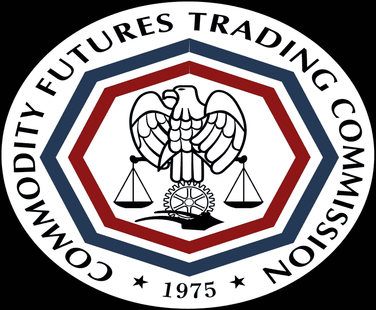

# DDI 区块链周刊(10 月 1 日—7 日)

> 原文：<https://medium.datadriveninvestor.com/ddi-blockchain-weekly-october-1st-7th-fbb107ee9bb?source=collection_archive---------20----------------------->

适度的抛售为密码市场平淡无奇的一周画上了句号。在此期间的大部分时间里，市值徘徊在 2200 亿美元左右，而比特币继续在 6500 美元左右波动，最终在周末损失了约 1%。随着其他加密货币跌幅略大，比特币的主导地位攀升至 52%以上。

# 比特币即将开始托管 ico？

上周有消息透露，加密融资领域可能会在今年年底前发生巨大变化，据报道，最初的硬币发行将转向比特币。由 [RSK](http://www.rsk.co/) 开发的新侧链将使比特币区块链能够托管 ico——这是只有以太坊和少数其他平台才有能力做的事情。事实上，自 2016 年初以来，RSK 一直在致力于这一倡议，智能合约使用 Solidity 进行编码，这与以太坊使用的语言相同。一种名为“智能比特币”的与 BTC 挂钩的加密货币也将用于推动网络发展。

据报道，11 月下旬，韩国区块链初创企业 Temco 将“利用这一开创性的想法和 RSK 的技术，发起公开发售代币，目标是筹集 1900 万美元。”Temco 首席执行官 Scott Yoon 认为，比特币最终将拥有与以太坊相同的功能，并承认“RSK……将主导(智能合约)生态系统，比特币将开启另一个比特币时代，就像以太坊一样。”

# CFTC 董事长:Crypto“将继续存在”

[周二](https://www.cnbc.com/video/2018/10/01/cftc-chair-chris-giancarlo-on-the-future-of-crypto.html)，商品期货交易委员会(CFTC)主席克里斯蒂安·吉安卡洛对美国消费者新闻与商业频道说，他个人认为“加密货币将继续存在”。吉安卡洛补充道，“我认为他们有未来。我不确定它们是否会成为美元或其他硬通货的竞争对手，但世界上有一整块地区确实渴望功能性货币，而它们在本国货币中却找不到。”

由于世界上许多货币“不值聚合物或书写它们的纸张，而世界上这些地区依赖硬通货”，吉安卡洛认为比特币或其他加密货币“可能会解决一些问题。”与此同时，他保证 CFTC 仍然专注于“加密货币市场的欺诈和操纵方面”，并引用了监管机构最近的法庭胜利，允许其在加密领域起诉此类案件。

# SEC 设定 ETF 截止日期

美国证券交易委员会(SEC)已将 10 月 26 日定为“任何一方或其他人”提交支持或反对 9 只加密货币交易所交易基金(ETF)的声明的最后期限，该基金于 8 月 22 日被拒绝。这些交易所交易基金是由 Proshares、Graniteshares 和 Direxion 提出的，但都被 SEC 拒绝，理由是它们不符合《交易法》防止欺诈和操纵行为的要求。

监管机构的[命令安排提交审查声明](https://www.sec.gov/rules/sro/cboebzx/2018/34-84368.pdf)指出，不批准 ETF 的命令“在委员会审查之前仍然有效。”但 SEC 是否会改变最初的决定仍有待观察。

# 韩国推动解除 ICO 禁令

韩国立法者正在推动法案，以解除政府之前对 ico 的禁令。韩国商业的一份[报告称，执政的民主党议员闵炳斗和卢武铉正在努力说服政府撤销 2017 年 9 月的 ICO 禁令，并采取更加积极、对加密友好的法规。](http://www.businesskorea.co.kr/news/articleView.html?idxno=25416)

闵希望恢复韩国在 ICO 领域与新加坡和瑞士等国的地位，“由于区块链和加密货币各有利弊，只有自信的政府才能妥善处理它们。一个恰当的例子是新加坡、瑞士和法国。这些国家为公司开辟了 ICOs 之路。”他还对政府未能解除禁令表示遗憾，“这是一个非常令人担忧的情况。最近的一份报告显示，韩国的区块链技术已经下降到美国的 75%

# 耶鲁投资 4 亿美元加密货币基金

周五的[彭博报道](https://www.bloomberg.com/news/articles/2018-10-05/yale-is-said-to-invest-in-crypto-fund-that-raised-400-million)称，美国常青藤联盟大学耶鲁大学支持以加密货币为重点的“范式”基金，该基金有望筹集 4 亿美元。该报告观察到围绕该基金的高度保密，知情人士要求保持匿名，耶鲁大学的投资细节在现阶段仍未披露。

该基金由比特币基地联合创始人弗雷德·厄尔萨姆(Fred Ehrsam)、红杉资本(Sequoia Capital)前合伙人马特·黄(Matt Huang)和潘迪拉资本的查尔斯·诺伊斯(Charles Noyes)创建。据报道，黄今年早些时候离开红杉，与 Ehrsam 一起创立了这只基金。

*原载于 2018 年 10 月 8 日*[*【www.datadriveninvestor.com】*](http://www.datadriveninvestor.com/2018/10/08/ddi-blockchain-weekly-october-1st-7th/)*。*