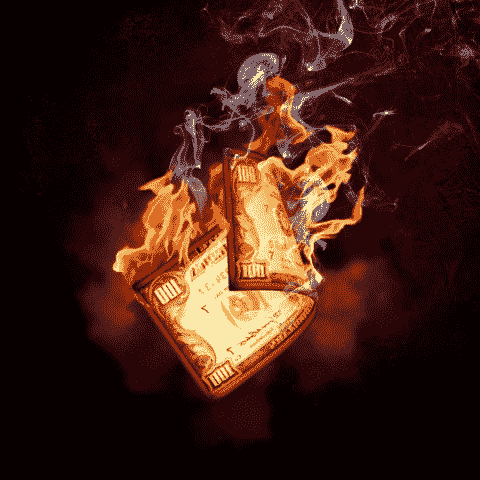
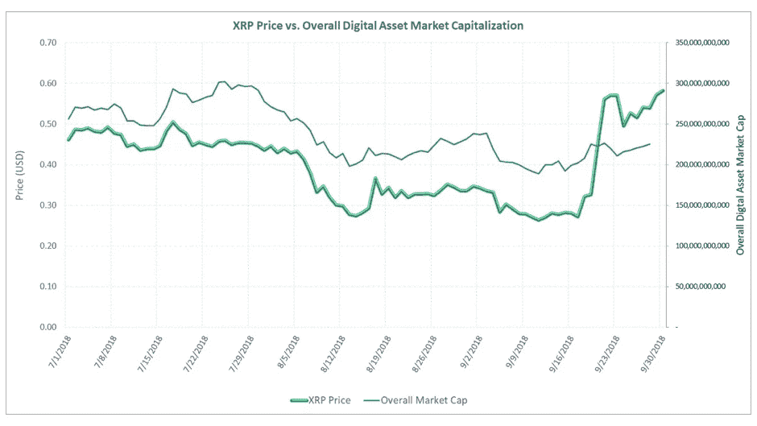

# DDI 区块链周刊(10 月 22 日-28 日)

> 原文：<https://medium.datadriveninvestor.com/ddi-blockchain-weekly-october-22nd-28th-5ea5b9a0c1e9?source=collection_archive---------31----------------------->

在七天紧张、窄幅波动的交易中，加密市场在一周内几乎保持不变。市场资本总额几乎一直保持在 2100 亿美元左右。比特币也保持相当稳定，过去 10 天的交易价格在 6500 美元左右，从而延续了自 8 月份以来几乎一直徘徊在 6000 美元左右的趋势。

# **比特币基地推出稳定币**

在[周三发表的一篇博文](https://blog.coinbase.com/coinbase-and-circle-announce-the-launch-of-usdc-a-digital-dollar-2cd6548d237)中，流行的比特币基地加密交易所宣布推出 USDC 稳定币，这种币将完全由美元支持。这是该平台上第一款稳定币。比特币基地表示，其受支持司法管辖区的客户“可以在 Coinbase.com 以及比特币基地的 iOS 和 Android 应用程序中购买、出售、发送和接收美元硬币 stablecoin (USDC)。”纽约州以外的美国客户可以“购买和销售”，而世界各地的客户可以“发送和接收”。未来还将宣布更多的地区。

稳定币是比特币基地和 Circle 合作的结果，据报道，每种代币 100%由账户中持有的相应美元担保，并定期公开报告储备情况。根据这篇博客文章，“与传统的基于银行账户的美元相比，像 USDC 这样的区块链数字美元的优势在于更容易编程，更容易发送，更容易在 dApps 中使用，更容易在本地存储。这就是为什么我们认为这是迈向更加开放的金融体系的重要一步。”

但并非所有稳定的新闻都带来了如此积极的消息…

# **泰瑟烧掉了 5 亿 USDT 硬币**

周三的一份官方声明证实，领先的 stablecoin Tether 已经销毁了其国库钱包中的 5 亿枚 USDT 代币:“Tether 已经从流通的代币供应中赎回了大量的 USDT。与此一致，Tether 将从其国库钱包中销毁 5 亿 USDT，并将剩余的 USDT(约 4.66 亿英镑)留在钱包中，作为未来 USDT 发行的准备措施。”

> *Tether 刚刚销毁了来自 Tether 国库钱包的 5 亿美元，交易如下:*[*https://t.co/HTG52LaRVh*](https://t.co/HTG52LaRVh) *有关更多信息，请参见此处的公告:*[*https://t.co/McLTCGzmJi*](https://t.co/McLTCGzmJi)
> 
> *—系绳(@ Tether _ to)*[*2018 年 10 月 24 日*](https://twitter.com/Tether_to/status/1055139613000507392?ref_src=twsrc%5Etfw)

但似乎没有任何官方理由为这一激烈的行动提供。最近对泰瑟来说是一段艰难的时期。随着诺贝尔银行(Nobel Bank)首先宣布 Tether 和 Bitfinex 都不再是其客户，随后越来越多的人猜测 Tether 的代币是否有足够的美元支持，从而导致其失去与美元的联系，最近的代币焚烧几乎没有消除围绕该项目的争议和缺乏透明度。

# 一个新的加密令牌即将来到以太坊

分散交易所 Kyber Network 和 Republic Protocol 背后的公司以及加密货币托管公司 BitGo 的联合项目正在以太坊上推出比特币支持的 ERC20 令牌。BitGo 首席技术官本尼迪克特·陈(Benedict Chan)表示，这种被称为包装比特币(WBTC)的令牌将于 2019 年 1 月推出，旨在融合“两个世界的最佳之处”，他形容 WBTC 拥有“比特币的稳定性和以太坊的灵活性”

BitGo 的官方博客公告称，WBTC 将为用户提供“各种各样的新的去中心化用例，包括去中心化交易所(dex)，作为以太坊生态系统内的稳定信贷或借贷、支付和灵活智能合约的抵押品。”与此同时，Chan 也注意到新的代币“在某些方面非常类似于人们创造代表一磅黄金的纸币。一磅黄金更重，交易时间也更长。你可以用一张代表一磅黄金的钞票，这种做法很受欢迎。”

# **第三季度对 Ripple 令牌的需求翻倍**

根据 Ripple 的[2018 年第三季度 XRP 市场报告](https://ripple.com/insights/q3-2018-xrp-markets-report/)，第三大高价值加密货币项目的本地令牌(XRP)在今年第三季度的需求是 Q2 的两倍。第三季度，XRP 的销售额达到 1.6333 亿美元，而 Q2 为 7553 万美元，其中大部分增长归功于机构直销——9806 万美元，而 Q2 为 1687 万美元。程序化销售额也略有增长，从 5，666 万美元增至 6，527 万美元。

该报告承认，尽管 crypto 的总市值在本季度有所下降，但 Ripple 受益于上个月的独立价格上涨。

该报告还谈到了马耳他对交易量的具体贡献，指出“在本季度超过三分之二的时间里，全球数字资产交易是由马耳他的交易所主导的”，马耳他总理约瑟夫·马斯喀特博士(Dr. Joseph Muscat)称加密货币是“货币的必然未来”。

# **日本授予加密货币行业自律地位**

日本虚拟货币交易所协会(JVCEA)代表了日本最重要的加密货币平台的集合，现已获得法律许可来监管行业参与者。据[路透社](https://www.reuters.com/article/us-japan-cryptocurrency/japan-grants-cryptocurrency-industry-self-regulatory-status-idUSKCN1MY10W)报道，日本金融服务厅(FSA)将允许该集团对违反 FSA 规定的当地交易所进行监控和处罚。他们还将负责保护客户资产、防止洗钱、提供运营指导以及监管合规性。

据一名 FSA 官员称，“这是一个发展非常迅速的行业。专家及时制定规则总比官僚好。”与此同时，在 FSA 宣布后，该集体声明将“进一步努力建立一个受客户信任的行业”。

*原载于 2018 年 10 月 29 日*[*www.datadriveninvestor.com*](https://www.datadriveninvestor.com/2018/10/29/ddi-blockchain-weekly-october-22nd-28th/)*。*