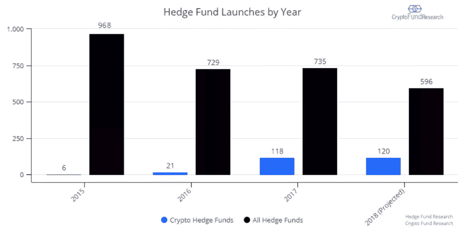
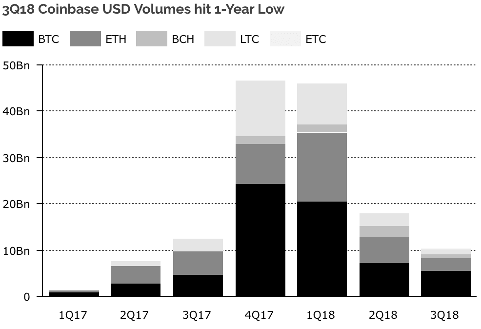

# DDI 区块链周刊(10 月 8 日—14 日)

> 原文：<https://medium.datadriveninvestor.com/ddi-blockchain-weekly-october-8th-14th-f8f0c074d025?source=collection_archive---------20----------------------->

大多数项目在上周都出现了亏损，因为加密市场下跌了约 2000 万美元，总市值回到了 2 亿美元。周四跌幅尤其明显，当时 60 亿美元化为乌有，领跌的是 Ripple 和以太坊。虽然似乎没有一个单一的问题引发了下跌，但市场不太可能受到 Nouriel“末日博士”Roubini [在参议院发言](https://www.youtube.com/watch?v=p-03UVopTFI)谴责 crypto 是“所有骗局和泡沫的母亲或父亲”的鼓舞尽管如此，市场在本周结束前保持坚挺。

**Blockstream 的比特币支付流动网络上线**

根据[周三](https://blockstream.com/2018/10/10/liquid-launch.html)发布的公告，Blockstream 的 [Liquid](https://blockstream.com/liquid/) 缩放解决方案现已推出，于 9 月 27 日在合作伙伴中上线。比特币的“侧链”(sidechain)，即一种允许来自一个区块链的数字资产在另一个区块链安全使用的机制，Liquid 被其创造者描述为“一个交易所间的结算网络”，并将促进“企业和个人之间更快的比特币交易，同时实现扩展的功能。”

液体被视为[闪电网络](https://lightning.network/)的补充扩展解决方案。但是，Blockstream CSO Samson Mow 表示，虽然 Lightning 专注于小额支付，但“Liquid 旨在促进快速可靠的大额转账”。“流动资金允许各方将资金汇往任何目的地，无需提前建立渠道。Lightning 中的资金是“热的”(私钥是在线的)，而你可以在热钱包或冷钱包中存储液态比特币。Liquid 还能够添加闪电作为第二层，因此我们认为这两种技术是互补的，对生态系统都很重要。”

**2018 年推出的对冲基金中有 20%是加密基金**

根据 [Crypto Fund Research](https://cryptofundresearch.com/release-20-percent-new-hedge-funds-crypto-funds/) 汇编的数据，专注于加密货币的基金占 2018 年对冲基金发行总额的 20%。尽管今年熊市持续，但似乎并没有阻止新的加密基金进入这个领域。截至今年第三季度末，该行业已有 90 只加密货币基金发行，到第四季度末，这一数字可能高达 120 只。这比 2017 年增加了 1.69%，比 2016 年增加了 471%。

尽管这些数字对 crypto 来说无疑是令人鼓舞的，但运营中的加密基金总数为 303 只，仅占全球 9，000 多只对冲基金的 3%。此外，加密对冲基金管理的资产不到 40 亿美元，在对冲基金领域也只占一小部分。

**比特币开发商称 EOS 是骗局**

周五，在 T2 接受 Crypto Insider 采访时，著名比特币开发者和区块链教育家 Jimmy Song 坦率地谈到了几个加密项目和问题。他最著名的断言之一是区块链平台 EOS 是一个“骗局”，它“将在未来五年内死于可怕的垃圾箱大火”虽然他没有提供持有这一观点的理由，但他也对比特币现金和以太坊都保留了批评。

对于前者:“BCH 没有存在的理由，我写了一篇名为“[比特币现金是法定货币](https://medium.com/@jimmysong/bitcoin-cash-is-a-fiat-money-39626c002f77)”的文章，“如果你想看我关于为什么我认为比特币现金一文不值或者它对任何人都没有任何价值的论点，请去阅读。”而对于后者:“”以太坊，我认为是这些骗局的一个平台，这或多或少是他们的杀手锏。我不认为这在技术上很有趣，他们所做的大多数功能都是以非常业余的方式完成的。就像添加图灵完备性……没有人使用它；太蠢了。"

据世界银行行长称，分布式账本技术具有“巨大的潜力”

世界银行行长金永吉认为，区块链技术具有改造银行系统的“巨大潜力”。在周四举行的国际货币基金组织和世界银行年会上，金墉谈到了技术进步可以帮助传统金融“跨越几代人的不良做法，这几代人在减少腐败方面将永远无法实现。”他还强调了将区块链作为战胜贫困和促进繁荣的工具。

“……我们认为分布式账本有巨大的潜力，我们在 8 月份发行了第一只区块链债券，我们通过区块链技术创建、分配、转移和管理了整个债券。”今年早些时候，世界银行和澳大利亚联邦银行联合创建了一个基于以太坊的澳元区块链债券。Kim 还指出，世界银行到 2020 年普及金融服务的目标几乎肯定需要该银行采用区块链和人工智能等新技术。

**比特币基地活跃客户下降 80%**

根据专注于金融科技的风险公司 Tribe Capital 的数据，从 2017 年 12 月到 2018 年 9 月，9 月份在比特币基地平台上买卖加密的美国客户数量下降了约 80%。这些数字也支持了研究公司 Diar 的调查结果，该公司最近证实，从 2017 年第四季度到 2018 年第三季度，比特币基地的美元交易量下降了 80%。

Tribe 通过分析这一时期的信用卡和银行转账活动汇编了这些数据。尽管这些数字只涵盖了美国的交易，但 Tribe 表示，它们仍然捕捉到了整体趋势。预计其它以零售为主的交易所也将经历类似的下跌。

*原载于 2018 年 10 月 15 日*[*【www.datadriveninvestor.com*](http://www.datadriveninvestor.com/2018/10/15/ddi-blockchain-weekly-october-8th-14th/)*。*