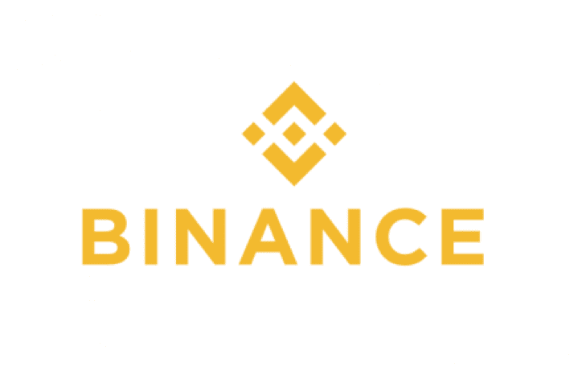

# DDI 区块链周刊(9 月 10 日—16 日)

> 原文：<https://medium.datadriveninvestor.com/ddi-blockchain-weekly-september-10th-16th-31d902cbc6b3?source=collection_archive---------45----------------------->

在九月炎热的第一个整周之后，加密市场在过去的七天里成功阻止了任何进一步的下滑。然而，到本周末，总市值仅勉强回到 2 亿美元以上，市场仍处于不稳定状态。十大密码引领 crypto 温和上涨，而比特币在 1900 多种交易密码中的主导地位仍然保持在令人印象深刻的 55%。

**文克莱沃斯兄弟宣布双子座美元稳定币**

本周以[周一卡梅隆·文克莱沃斯的宣布](https://medium.com/gemini/gemini-launches-the-gemini-dollar-62787f963fb4)开始，他和他的兄弟泰勒，双子交易所的联合创始人，创造了双子美元，他们认为这是“世界上第一个受监管的稳定硬币”由于与美元挂钩，双子座美元应该能够让人们在以太坊网络上收发美元。稳定币已经得到了纽约金融服务部门的批准，旨在保持与美元 1:1 的价值。

根据[白皮书](https://gemini.com/wp-content/themes/gemini/assets/img/dollar/gemini-dollar-whitepaper.pdf)，新硬币是一种符合 ERC20 的令牌，意味着“它可以在以太坊网络上转移，并存储在任何以太坊地址。”

**摩根士丹利将提供比特币掉期交易**

据周四透露，华尔街最大的一家公司已经准备好了开始提供比特币掉期的所有基础设施。[彭博报道](https://www.bloomberg.com/news/articles/2018-09-13/morgan-stanley-said-to-prepare-bitcoin-swap-trading-for-clients)一位未透露姓名的消息人士透露，摩根士丹利将提供合约交易，“为投资者提供比特币表现的综合敞口”据消息人士称，投资者将能够“利用所谓的价格回报掉期做多或做空，摩根士丹利将对每笔交易收取差价”。

目前，该行正在进行内部审批，预计交易平台将在此基础上上线。这位未透露姓名的消息人士还提到，摩根士丹利没有交易实物比特币的计划；相反，掉期与比特币期货合约挂钩。这符合首席执行官詹姆斯·戈尔曼今年早些时候的声明，即该银行不会允许直接买卖加密货币，而是开发与数字资产相关的衍生品交易功能。

**币安准备在新加坡菲亚特交易所推出现场货币交易测试版**

世界上最大的加密交易所币安公司计划从明天开始为其即将推出的新加坡法定到加密交易所开通现场货币交易。[据 CEO 赵长鹏](https://twitter.com/cz_binance/status/1040918291202506752?ref_src=twsrc%5Etfw%7Ctwcamp%5Etweetembed%7Ctwterm%5E1040918291202506752&ref_url=https%3A%2F%2Fsludgefeed.com%2Fbinance-to-start-live-money-trading-on-singapore-fiat-exchange%2F)透露，这一消息最早是在上周透露的。在这个阶段，新的设施被认为是只有在邀请的基础上才可用。到目前为止，也没有迹象表明推出后哪些加密货币将可用于交易。

此前，币安和列支敦士登加密资产交易所(LCX)的合资企业币安 LCX 上月宣布，将创建并推出一个加密货币交易平台，允许用户直接交易欧元等法定货币。

**Tezos 在 mainnet 发布前享受收益**

今天对 Tezos 来说是个大日子，预计它的 mainnet 将如期推出。在过去的一周里，这个一度声称主办历史上最大的 ICO(现在在排行榜上排名第八)的项目，在对这一重大事件的预期中获得了巨大的收益。从 9 月 9 日到 16 日，特佐斯的本土货币 XTZ 的价格从 1.15 美元上涨到 1.75 美元，涨幅高达 52%。

Tezos 早在 2017 年 7 月就完成了耗资 2.32 亿美元的庞大 ICO，但该项目的创始成员之间的法律纠纷减缓了它的发展。这场战斗现在似乎已经结束，随着 Tezos 推出其第一个 mainnet，事情现在看起来更加光明。

**区块链有助于缩小 1.5 万亿美元的贸易缺口？**

贝恩公司和世界经济论坛周四发布的白皮书表明，区块链是少数有潜力填补全球贸易融资中 1.5 万亿美元供需缺口的新技术之一。根据亚洲开发银行的计算，这一失衡占全球商品贸易量的 10%左右，预计到 2025 年将扩大到 2.4 万亿美元，这主要是因为寻求扩张业务的中小企业(SME)无法获得足够的信贷。

根据这项研究，“随着物联网(IoT)、区块链和人工智能等技术的兴起，促进国际贸易的手段正在增长……数字化和先进技术有可能大大减少处理时间和商品跨境流动的成本。”该研究还指出，通过采用区块链等技术，单个企业和政府“正开始将其贸易和供应链流程数字化和自动化”。

**近三分之二的大公司希望部署区块链**

著名数字市场研究专家 Juniper Research 进行的一项调查显示，超过 65%的受访大型企业正在考虑或已经开始在其工作流程中部署区块链技术。T2 的调查显示，人们对区块链的兴趣也增加了，去年只有 54%的人有记录。它还显示，在那些考虑区块链的公司中，超过 30%的公司要么处于“试验”阶段，要么即将推出这项服务。

所有在区块链投资超过 10 万美元的受访公司都表示，在未来 12 个月内，他们将再次在技术上投资至少 10 万美元。

*原载于 2018 年 9 月 17 日*[*www.datadriveninvestor.com*](http://www.datadriveninvestor.com/2018/09/17/ddi-blockchain-weekly-september-10th-16th/)*。*