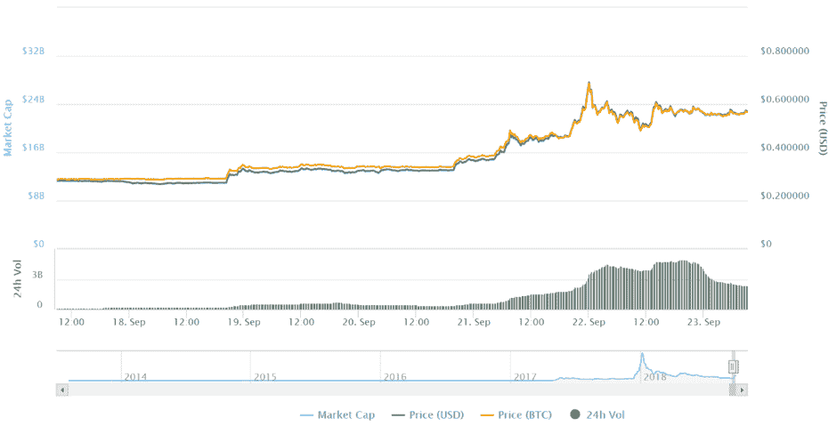
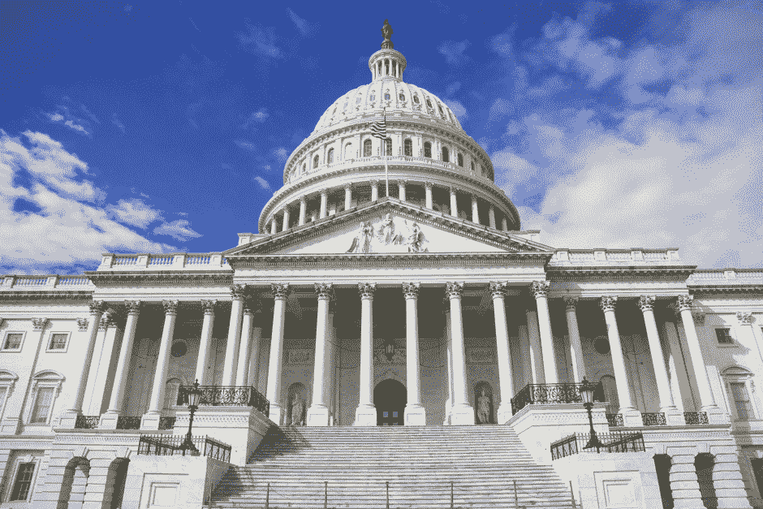

# DDI 区块链周刊(9 月 17 日—23 日)

> 原文：<https://medium.datadriveninvestor.com/ddi-blockchain-weekly-september-17th-23rd-4e65d6eaf78a?source=collection_archive---------59----------------------->

在经历了相当容易被人遗忘的前半个月之后，加密市场上周强劲反弹。总市值收盘时超过 2250 亿美元，周一开始时略高于 2000 亿美元。以太坊、Stellar、EOS 和最著名的 Ripple 领涨，后者本周涨幅超过 100%。相比之下，比特币仅略有上涨，从 6500 美元左右涨到 6700 美元，比特币的主导地位同时从 55%下降到略高于 51%。

# 涟漪反弹超过 100%

对于第三大加密货币来说，这是不平凡的一周，甚至看到它威胁到以太坊的第二名——它甚至在周五短暂地占据了令人垂涎的位置，当天它上涨了约 66%，然后在周末回落到第三名。

[*来源*](https://coinmarketcap.com/currencies/ripple/#charts)

这场反弹似乎是由几个因素引发的，其中最明显的是 Ripple 前首席技术官斯蒂芬·托马斯(Stefan Thomas)周四宣布，YouTube 和 Twitch 的内容创作者可以通过托马斯的新项目 Coil 在 XRP 获得资金，从而将他们的内容货币化。

周一，有消息称，Ripple Labs 期待已久的加密货币服务 xRapid 将很快推出，甚至可能最早在 10 月份推出。xRapid 是一项商业支付服务，允许金融机构使用 XRP 进行跨境交易。

# 另一个密码交易所被黑了

日本加密货币交易所 Zaif 是 9 月 14 日一次重大黑客攻击的受害者，在调查一些服务器问题后于上周一被发现。据交易所背后的公司 Tech Bureau Corp 称，6000 万美元的数字货币被盗，其中近 2000 万美元属于公司本身，其余属于交易所的客户。各种数量的比特币、比特币现金和 Monacoin 从交易所的热门钱包中被盗。

虽然不是最大的交易所之一，但这次黑客攻击促使日本主要监管机构金融服务厅(FSA)展开全面调查，以确定 Tech Bureau 是否能够弥补 Zaif 的客户损失。考虑到日本交易所在 apst 遭受的高调盗窃，包括 Mt. Gox 和最近的 5 . 3 亿美元硬币盗窃，这并不奇怪，因为这导致许多人认为 FSA 对这种活动的防范措施不够充分。

# 潜在灾难性的比特币漏洞细节曝光

据报道，比特币代码中的一个重大缺陷存在了一年多，可能被用来关闭网络的一个主要部分。周二，比特币核心团队发布了[进一步的披露](https://bitcoincore.org/en/2018/09/20/notice/)，披露该漏洞比之前想象的更严重，尽管上周发布的软件补丁似乎已经修复了该问题。该错误于 2017 年 3 月出现，是块中继相关性能改进的一部分，可能会诱导节点防止拒绝包含多次花费相同硬币的交易的块。这将导致一种双重消费的出现——这是比特币旨在防止的。

比特币开发者最初试图淡化该漏洞的潜在影响，而是选择将其描述为“不太严重的拒绝服务漏洞”，以便给矿工和其他受影响的系统时间将他们的软件升级到补丁版本。还值得注意的是，该漏洞从未被利用，这可能是因为矿工必须故意攻击系统，但这样做将不得不放弃大约 80，000 美元的奖金。

# 3 项区块链法案提交美国国会

上周五，美国国会议员汤姆·艾默(Tom Emmer)提出了三项法案草案，显示出对加密货币的大力支持。根据艾默的说法，“立法者应该拥抱新兴技术，并提供一个清晰的监管体系，让它们在美国蓬勃发展。”

[法案](https://emmer.house.gov/media-center/press-releases/emmer-spearheads-groundbreaking-legislation-support-blockchain)专注于支持区块链技术的发展和加密货币在美国的使用；

*   [1 号法案](https://emmer.house.gov/sites/emmer.house.gov/files/EMMER_055_xml.pdf)是一项众议院决议，支持“简单的法律环境”和鼓励区块链技术和数字货币发展的“轻度接触”。该法案将此与允许互联网蓬勃发展的情况相提并论。
*   [法案#2](https://emmer.house.gov/sites/emmer.house.gov/files/Blockchain_01_xml.pdf) 是“区块链监管确定性法案”，该法案支持允许矿工、钱包和其他服务运营，而不必遵守适用于其他金融服务的某些许可规则，例如注册为汇款人。这将适用于不控制用户资金的加密服务。
*   [法案#3](https://emmer.house.gov/sites/emmer.house.gov/files/EMMER_056_xml.pdf) 是“2018 年分叉资产纳税人安全港法案”，支持为硬分叉期间继承加密货币的纳税人提供“安全港”。该法案限制对试图报告这些资产的个人的罚款，直到国税局就报告这些资产的适当方式提供任何类型的指导。

# 比特币挖矿巨头推出新一代 ASIC 硬件

周三，BitFury Group [宣布](https://medium.com/meetbitfury/bitfury-launches-new-suite-of-bitcoin-mining-hardware-cba838cd660f)已经开发出一种新的、更高效的比特币挖矿芯片。Bitfury Clarke 专用集成电路(ASIC)芯片是为 SHA256 算法定制的，该算法被比特币和许多其他加密货币所使用，并且“在比特币挖矿芯片中提供了最强的性能，在效率上无与伦比。”

而就在两天后，首席执行官吴宣布了自己的新的 ASIC 挖掘芯片的 SHA256 算法。BM1391 芯片出现在传闻中的比特大陆首次公开募股(IPO)之前，据报道，IPO 将很快进行。

# 巴西最大的经纪公司推出加密交易所

巴西最大的独立经纪公司将在未来几个月推出比特币和以太坊交易所。XP Investimentos SA 的所有者 Grupo XP 正在进入这一领域，原因是人们的需求——据首席执行官古伊列梅·本奇莫尔称，约有 300 万巴西人接触比特币，而投资股票的人只有约 60 万。

该交易所将被命名为 XDEX，并与 XP 的其它经纪业务分开。此前，巴西监管机构发布了一系列规定，涉及如何允许资金投资于海外加密资产，但有一些限制。

*原载于 2018 年 9 月 24 日*[*www.datadriveninvestor.com*](http://www.datadriveninvestor.com/2018/09/24/ddi-blockchain-weekly-september-17th-23rd/)*。*