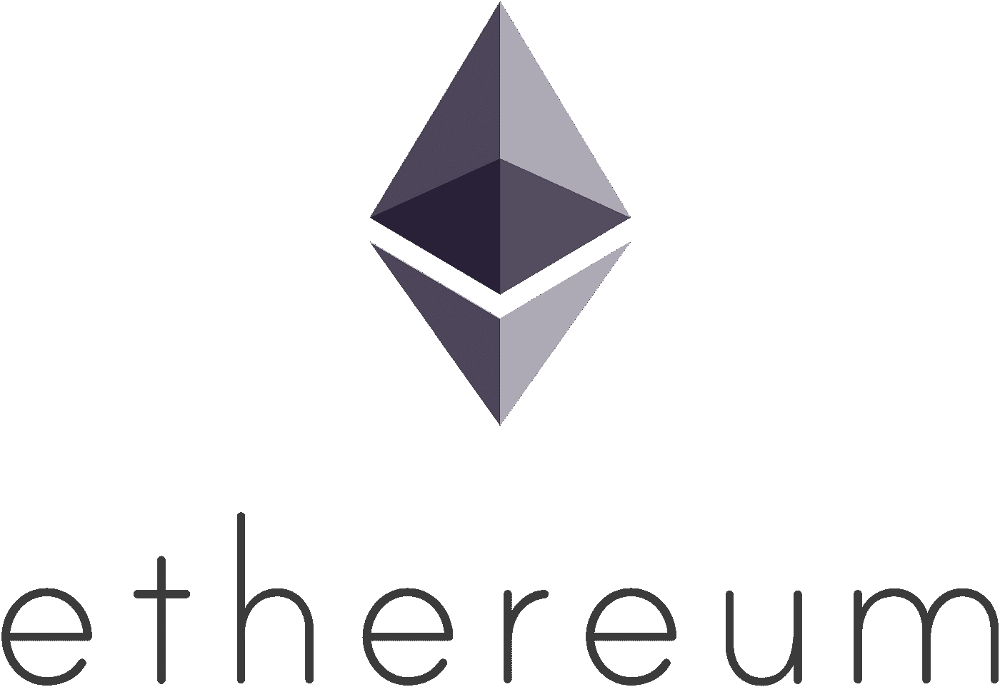
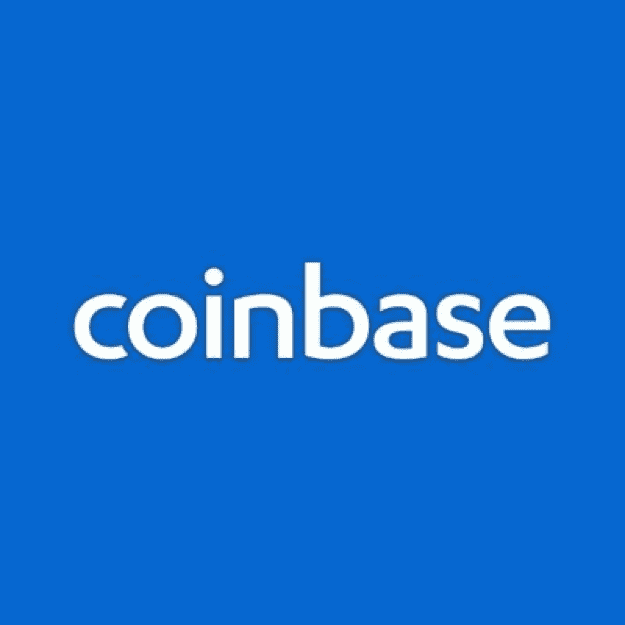
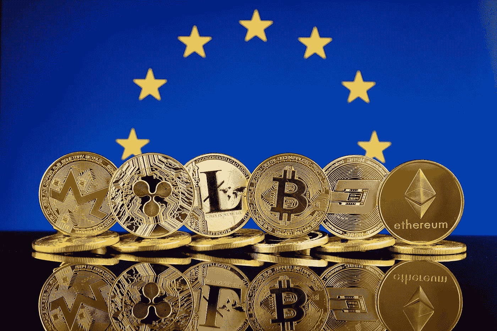

# DDI 区块链周刊(9 月 3 日—9 日)

> 原文：<https://medium.datadriveninvestor.com/ddi-blockchain-weekly-september-3rd-9th-30fefcc23d5e?source=collection_archive---------19----------------------->

对于加密多头来说，这是忘记的一周，因为周三市场崩溃，在不到 24 小时内损失了 400 亿美元。暴跌似乎是由高盛放弃开设加密交易部门的计划的消息引发的。尽管该银行出来称这些报道为“假新闻”，但市场继续下跌，尽管跌幅没有那么大。市场在本周结束时跌破 2000 亿美元，从而抹去了 8 月下半月取得的稳定收益。虽然几乎所有的加密都看到了红色，但眼睛特别集中在一个市场…

# 以太坊跌破 200 美元

以太坊经历了惨淡的一周，跌至 2017 年 7 月的水平。几个原因被吹捧为明显的下降。比特币核心开发者杰里米·鲁宾[建议](https://techcrunch.com/2018/09/02/the-collapse-of-eth-is-inevitable/) ETH 可以降为零，不仅在市场价格上，而且作为网络内的公用事业令牌，因为如果去中心化应用(dApps)和 ERC20 令牌可以在以太坊上运行，而不需要 ETH 来支付汽油费用，那么 ETH 就没有存在的价值。但以太坊创始人 Vitalik Buterin 对此做出了回应，他强调了机构群体正在讨论的两个提案，这两个提案要求在协议级别使用 ETH，这样天然气将在 ETH 中支付。

以太坊也可能在上周宣布 CBOE 将推出 ETH 期货合约后面临压力。随着去年 12 月芝加哥商业交易所和 CBOE 期货合约推出后比特币价格下跌，许多人认为以太坊可能遭受同样的命运。

# 对全球未来密码持有量的乐观声明

比特币基地首席执行官 Brian Armstrong 周六预测，未来五年内将有 10 亿人参与加密货币生态系统。在 TechCrunch Disrupt 上发表讲话时，阿姆斯特朗预计未来几年加密技术将强劲增长，全球对加密技术的兴趣和参与将从今天的 4000 万人增长到惊人的 10 亿人。他认为比特币基地将在这一增长中发挥巨大的影响力，因为他预计他的交易所在不久的将来会成为类似于纽约证券交易所的东西。但只有当新公司继续创造自己的代币时，它才会起作用，“每个开源项目、每个慈善机构、潜在的每个基金或这些新型的去中心化组织[和]应用程序，它们都将拥有自己的代币。”

也许阿姆斯特朗是对的——投资平台 SharesPost 进行的另一项研究发现，大多数加密用户和散户投资者计划在未来 12 个月内增加他们的数字资产持有量。根据 SharesPost 的数据，7 月份对 2，490 名散户投资者和 528 名个人认证和机构投资者进行了调查，“尽管今年加密货币的估值下降了 60%，但消费者和投资者继续对加密和区块链的长期前景持乐观态度。”调查还发现，70%的受访者在投资组合中持有价值不到 10 万美元的密码，而几乎相同比例的受访者表示希望年收入超过 10 万美元。

# 比特币基地 ETF 即将推出？

比特币基地也出现在新闻中，此前有报道称其正在与贝莱德就比特币交易所交易基金进行谈判。据[商业内幕](https://www.businessinsider.com/coinbase-is-exploring-a-bitcoin-etf-2018-9?IR=T)报道，由于其在 ETF 市场的丰富经验，比特币基地已经在世界上最大的资产管理公司(拥有超过 6 万亿美元的 AUM)的帮助下着手建立 ETF。不知道会谈进行了多长时间，但报道称，贝莱德尚未向比特币基地提出任何建议。

此前，比特币基地早些时候宣布，将为净资产“至少 100 万美元”的合格投资者推出一只加密货币指数基金。

# 国会称密码不受恐怖分子青睐

美国国会恐怖主义和非法金融小组委员会[最近的一次听证会声称](https://financialservices.house.gov/news/documentsingle.aspx?DocumentID=403893)加密技术并没有像通过传统金融机构那样被用于资助恐怖活动。听证会审议了恐怖分子转移资金的主要途径，包括金融机构、诸如哈瓦拉汇款系统等半正规方法以及密码。但是，根据国会的说法，虽然像基地组织和伊斯兰国这样的组织已经使用了加密技术，但他们并没有取得多大成功。

捍卫民主基金会(FDD)制裁和非法金融中心的分析主任 Yaya Fanusie 认为，大多数恐怖分子，特别是那些在“圣战战场”上的恐怖分子，正在无法使用加密技术的地区活动，因此，法定货币仍然是首选。然而，他警告说，专注于恐怖分子融资的美国政府机构应该在分析加密货币交易方面变得更有能力，“通过现在为恐怖分子越来越多地使用加密货币做准备，美国可以限制将数字货币市场变成非法金融庇护所的能力。"

# 欧盟官员就密码和 ico 监管发表意见

欧盟财政部长上周聚集在维也纳，同意他们不会急于对加密市场实施进一步的监管。相反，他们将等待欧洲当局分析得出的结论，然后再采取下一步措施。他们还强调了金融稳定委员会早些时候提出的观点，即加密货币不会威胁到金融系统。会议本身旨在确保欧盟监管机构就是否需要加密监管达成一致。德国财政部长奥拉夫·舒尔茨(Olaf Scholz)指出，这确保了政策制定者“处于能够采取行动的位置”爱尔兰的对等官员帕斯卡尔·多诺霍保证说，“欧盟将在这一领域谨慎行事。”

与此同时，欧盟立法者阿什利·福克斯(Ashley Fox)单独表示，对 ico 的新规定是使它们在区域集团内更“容易获得”的根本。福克斯周二召开了一次会议，讨论针对 ico 的拟议法规，特别是实施这些法规的个人和企业。欧洲议会成员的提案将把 ICO 收入限制在€800 万欧元，强制执行了解客户/反洗钱规则，并为初创公司提供进入整个欧盟的机会。“我的目标是给 ico 带来透明度，允许中介机构进行必要的尽职调查。其效果将是提供一部适用于整个 EU-的法律，为整个市场提供通行证。”

*原载于 2018 年 9 月 10 日*[*【www.datadriveninvestor.com】*](http://www.datadriveninvestor.com/2018/09/10/ddi-blockchain-weekly-september-3rd-9th/)*。*