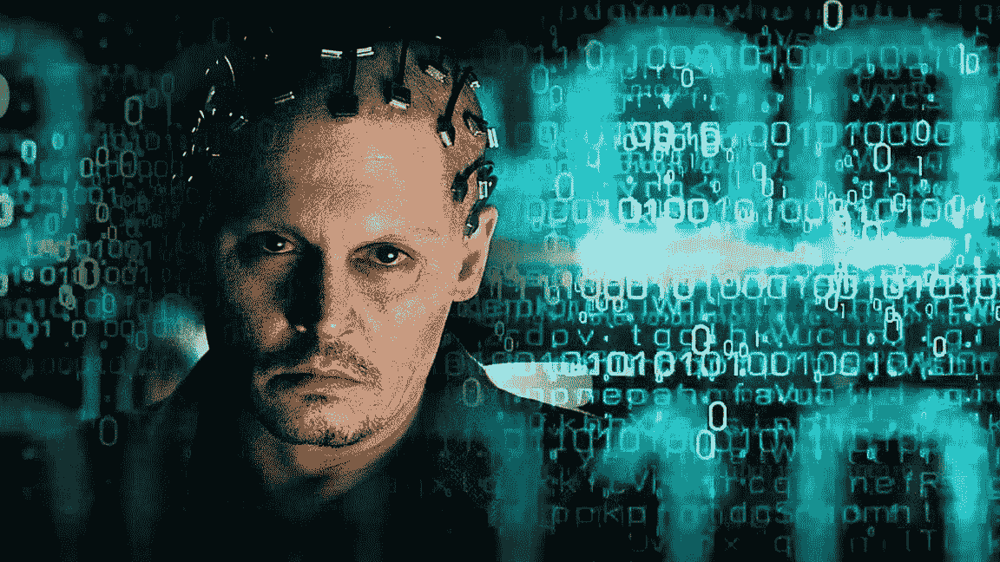

# DDI 连接

> 原文：<https://medium.datadriveninvestor.com/ddi-connect-ef95c6de3922?source=collection_archive---------20----------------------->

你好，亲爱的！

我们的一名成员正在研究一个巨大的问题，这个问题可能会彻底改变数字图像。作为一名经验丰富的摄影师和企业家，他与硅谷的传奇人物合作，创建了今天的家用科技巨头。他正在为他的项目寻找**的科技人才**和**的投资者**。

要与他联系，请发邮件至**projects@datadriveninvestor.com**给我们，我们将很乐意为您做介绍。DDI Connect 是一个特设的市场，它将 DDI 成员聚集在一起，共同构建现实世界的项目。无论你是需要一个网站开发者，一个投资者，还是你自己就是人才，DDI 团队都在这里免费为你牵线搭桥。​

期待拉开革命的序幕！

等到下次，屏然

## 周中伟大的阅读

​

# 超越的时代

好莱坞电影总是擅长提供对未来的一瞥——无论是太空旅行，先进的科学发现还是塑造我们整个社会的未来技术。其中一部这样的电影是《超越(2014)》——它基于人类在人工智能领域的领军人物创造的有感知能力的机器的帮助下永生的前提。

这部电影继续表明，虽然身体可以死亡，但大脑可以通过上传到一台强大的计算机而存活，在那里人可以作为一个数字身份永远存在！ [**【阅读更多】**](https://www.datadriveninvestor.com/2019/06/25/the-age-of-transcendence/)

# 欧洲央行行长:是“如何？”不是“谁？”​

欧洲央行(ECB)行长马里奥·德拉吉(Mario Draghi)将于今年晚些时候卸任，接替他的人选并不少。虽然他的继任者很重要，但他们在不确定的经济背景下支持经济活动并确保 2.0%左右的低通胀率和稳定通胀率的能力至关重要。

此外，任何一位总统都必须仔细考虑创造政策空间，以应对下一场危机，比如将利率从负区间移向零下限。 [**【阅读更多】**](https://www.datadriveninvestor.com/2019/06/25/the-age-of-transcendence/)

更多关于 [**科技**](https://www.datadriveninvestor.com/category/ai)**[**金融**](https://www.datadriveninvestor.com/category/investing-strategies/)**[**创业**](https://www.datadriveninvestor.com/category/startup)****