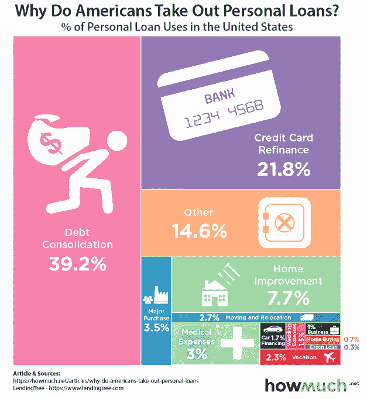
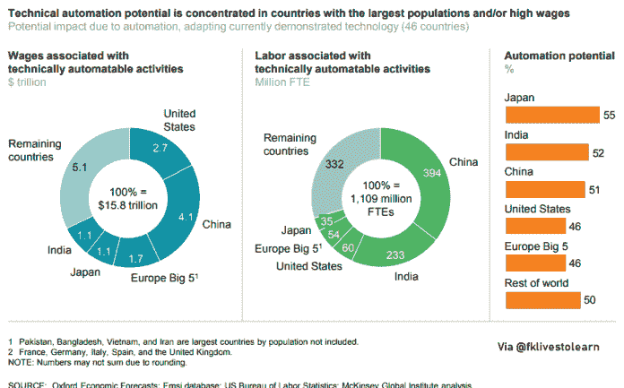

# [DDI]数据驱动的趋势和统计

> 原文：<https://medium.datadriveninvestor.com/ddi-data-driven-trend-statistics-85510c51efea?source=collection_archive---------10----------------------->

**DDI 为您带来值得关注的趋势&三月份的统计数据**

**涵盖话题:**

社交媒体，数字营销，内容营销。

金融、经济、市场、投资

区块链、加密货币、金融科技

工作场所、工作、生产力、技能

大数据、机器学习、人工智能、健康技术、自动化

通用、可再生能源、可持续发展、教育

[**【在浏览器中查看】**](https://www.datadriveninvestor.com/2019/04/07/data-driven-trends-statistics%e2%80%8a-%e2%80%8amar-2019/)

## 点击查看三月份的完整趋势和统计数据