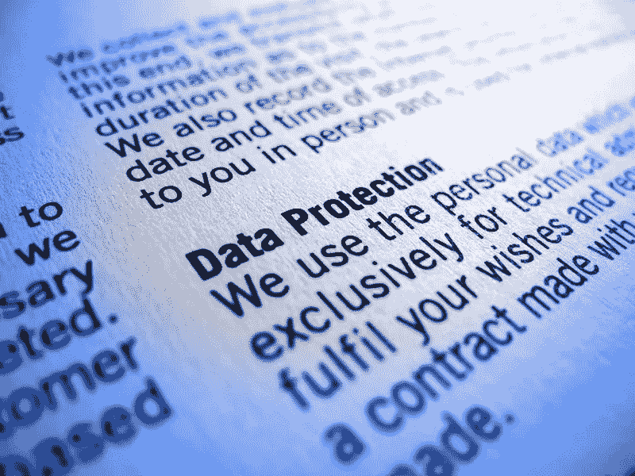
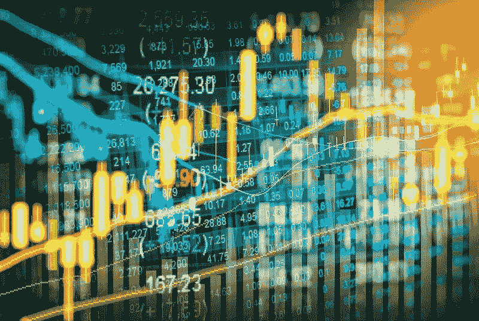

# DDI 编辑推荐

> 原文：<https://medium.datadriveninvestor.com/ddi-editors-pick-73e8b993ca29?source=collection_archive---------7----------------------->

## [隐私的经济性和便利性的权衡](https://www.datadriveninvestor.com/2019/04/11/privacy-and-convenience/)

由 [**陈良**](https://www.datadriveninvestor.com/author/justin/)

现在，我们正牢牢地处于数据的“淘金热”时代，与决定是否隐藏或披露我们的个人信息相关的经济学变得尤为重要。

随着企业能够获得更多关于其客户的数据，使用个人信息的经济利益*和*成本对于所有相关方——消费者、企业和整个社会—[,似乎都被放大了。**【阅读更多】**](https://www.datadriveninvestor.com/2019/04/11/privacy-and-convenience/)

## [社交证券交易所(SSE)是影响力投资的未来吗？](https://www.datadriveninvestor.com/2019/04/10/are-social-stock-exchanges-sse-future-of-impact-investing/)

由 [**费萨尔汗**](https://www.datadriveninvestor.com/author/faisal/)

私营部门的全球重点正转向集体社会福利&保护环境。

随着我们朝着实现可持续经济发展的目标迈进，这些问题已经占据了中心位置，在这种情况下，我们不仅需要考虑常规资本和制造资本的重要性，还需要考虑人力资本和自然资本的保护和提升。 [**【阅读更多】**](https://www.datadriveninvestor.com/2019/04/10/are-social-stock-exchanges-sse-future-of-impact-investing/)