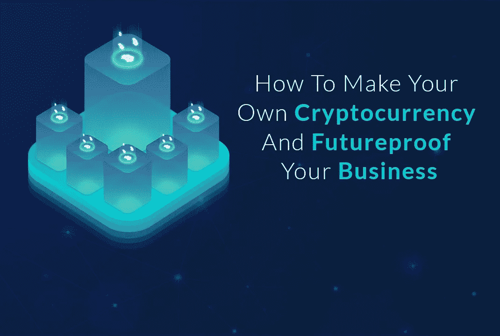

# DDI 编辑推荐

> 原文：<https://medium.datadriveninvestor.com/ddi-editors-pick-ccd933f4ac39?source=collection_archive---------12----------------------->

# 树立震撼你的世界的意识

吉姆·卡扎曼

科利尔说:“许多博客希望为自己或自己的企业建立知名度，或者个人博客可能希望为他们热衷的想法或主题建立知名度。”

“但默认情况下，如果你想要建立知名度，你就想要与不认识你的观众建立联系，”他说。“这就是为什么他们没有意识到，而你在努力提高意识。”如果博主专注，这种认可就不会发生...[【阅读更多】](https://www.datadriveninvestor.com/2019/04/03/build-awareness/)

# 如何创建自己的加密货币，让您的企业为未来做好准备

作者[帕雷什·萨加尔](https://www.datadriveninvestor.com/author/pareshsagar/)

你的企业真的需要加密货币吗？只要回答下面的问题，你就会清楚地了解到:
你的生意会在互联网上吗？你的收入更多来自数字支付而不是现金吗？
在线支付选项会增加您的用户群吗？你打算在商界多待几年吗？如果所有这些问题的答案都是“是”，那么您的企业需要一个...[【阅读更多】](https://www.datadriveninvestor.com/2019/03/25/how-to-create-your-own-cryptocurrency-and-make-your-business-ready-for-the-future/)