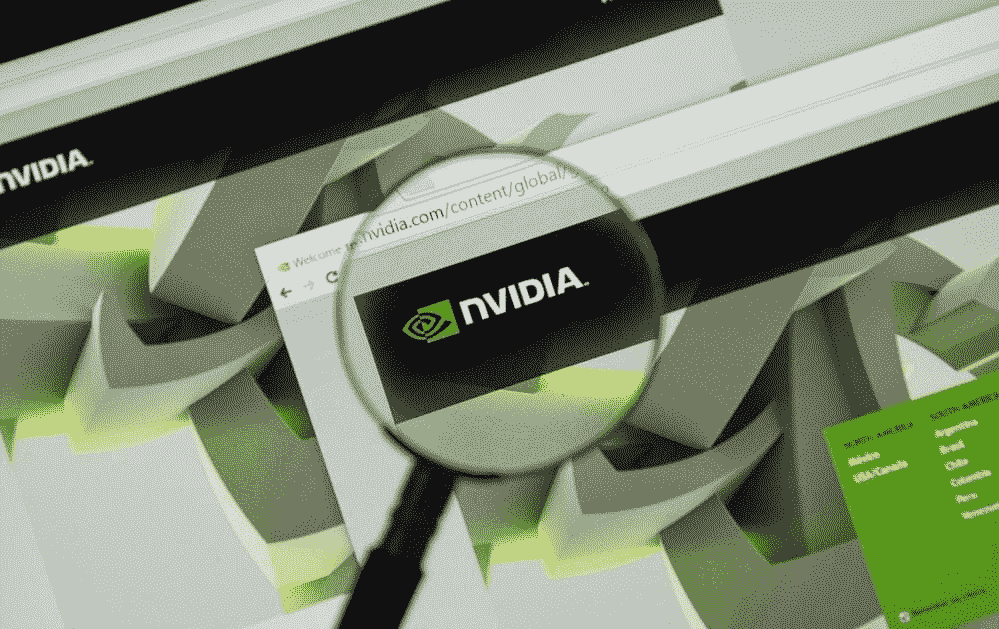

# DDI 独家见解

> 原文：<https://medium.datadriveninvestor.com/ddi-exclusive-insights-6a412e612a5b?source=collection_archive---------12----------------------->

# 利用 NVIDIA 从视频游戏中获利

由 [**丹尼尔·詹宁斯**](https://www.datadriveninvestor.com/2019/04/23/cash-in-on-video-games-with-nvidia/)

价值投资者可以从英伟达公司(纳斯达克股票代码:NVDA)的视频游戏中获利。事实上，NVIDIA 允许游戏玩家利用经典的价值投资策略。策略是收购那些制造业务运作和增长所需的组件或基础设施的公司。

NVIDIA 是一项价值投资，因为它生产显卡，图形处理器单元(GPU)游戏在其上运行。因此，无论什么游戏热门，英伟达的投资者都能赚钱。因此，如果 Apex 传奇比堡垒之夜吸引更多的玩家，这并不重要。解释一下，堡垒之夜和 Apex 传奇玩家都需要一台游戏机或电脑来玩游戏。 [**【阅读更多】**](https://www.datadriveninvestor.com/2019/04/23/cash-in-on-video-games-with-nvidia/)

# 生活在边缘

由 [**莫纳萨贝特**](https://www.datadriveninvestor.com/2019/03/22/living-life-on-the-edge/)

这是一个数据抓取！感觉每个行业的每个人都在试图生成、存储和处理更多的数据。尽管过去一年隐私泄露和数据误操作过多，消费者仍然非常乐意用他们的互动数据交换社交媒体和其他服务。一个又一个行业正在利用数据重新定义自己。

两个行业的例子说明了这一点。仅医疗保健行业就产生了全球高达 30%的数据，而且医疗保健行业产生的数据量还在快速增长。从可穿戴健康监测设备到药物管理传感器，再到基于人工智能的本地医疗图像分析平台，医疗保健正在依赖一切来驱动新数据，并通过它带来新的创收见解。 [**【阅读更多】**](https://www.datadriveninvestor.com/2019/03/22/living-life-on-the-edge/)